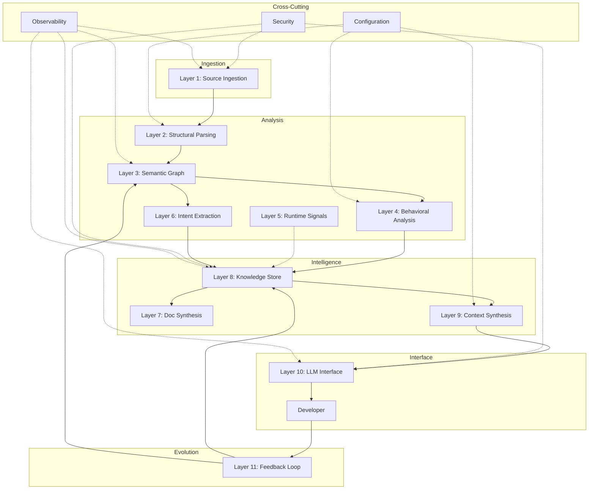

# **Reference Architecture: KnowCode**

## **0\. Guiding Principle (sets the tone)**

A codebase is deterministic. So, information extraction from it should be 100% local and 100% deterministic. Making it consumable by a human (to help one understand what the code is/ does) or an AI agent (to save the pricey tokens consumption of the frontier LLMs you set it to work with) should therefore be a simple, local-to-your-machine solution at negligible cost.

This is what drives KnowCode!

---

## **1\. Source Ingestion & Canonicalization Layer**

### **Purpose**

Ingest all raw artifacts that define or influence the codebase and normalize them into stable, traceable representations.

### **Responsibilities**

* Discover and ingest:
  * Source code
  * Build files
  * Configuration
  * Tests
  * Documentation
  * Version history metadata
* Normalize formats (e.g., line endings, encodings)
* Maintain identity and versioning of artifacts
* Track provenance (where did this come from, when, and why)
* **[HARDENED]** Content-addressable hashing (SHA-256) for delta detection
* **[HARDENED]** Streaming ingestion via VCS webhooks (push) or polling (pull)
* **[HARDENED]** Distinguish monorepo vs. polyrepo topology
* **[HARDENED]** Handle binary artifacts (compiled code, Docker images, WASM)

### **Inputs**

* Source repositories
* VCS metadata
* Documentation files
* Configuration manifests
* **[HARDENED]** Change events (file added/modified/deleted/renamed)
* **[HARDENED]** Webhook payloads (GitHub, GitLab, Bitbucket)

### **Outputs**

* Canonical artifact store
* Artifact metadata graph (file → repo → commit → author)
* **[HARDENED]** Delta artifact stream (incremental updates, not full snapshots)
* **[HARDENED]** Provenance chain with cryptographic verification

### **Downstream Consumers**

* Parsing & analysis layer
* Intent extraction layer

---

## **2\. Structural Parsing & Intermediate Representation Layer**

### **Purpose**

Convert raw code into **language-aware, lossless structural representations** suitable for higher-order reasoning.

### **Responsibilities**

* Parse source code into ASTs or equivalent IRs
* Preserve:
  * Symbol definitions
  * Scopes
  * Types
  * Control structures
* Maintain bidirectional mappings:
  * Source text ↔ structural nodes
* **[HARDENED]** Support language-agnostic intermediate representation
* **[HARDENED]** Detect cross-language boundaries (FFI, RPC, WASM)
* **[HARDENED]** Graceful degradation on parse errors (partial ASTs)
* **[HARDENED]** Track macro/metaprogramming expansion (Rust, C, Lisp)
* **[HARDENED]** Flag generated code vs. authored code (protobuf, codegen)

### **Inputs**

* Canonical source artifacts

### **Outputs**

* Parsed structural representations
* Symbol tables
* Source-to-structure mappings
* **[HARDENED]** Parse error entities (first-class, not silent failures)
* **[HARDENED]** Generated-code markers

### **Downstream Consumers**

* Semantic graph builder
* Static analysis
* Documentation synthesis

---

## **3\. Semantic Graph Construction Layer**

### **Purpose**

Build a **unified semantic graph** representing what the code *is*, *does*, and *depends on*.
This is the heart of the system.

### **Responsibilities**

* Create semantic entities:
  * Functions, classes, modules
  * Types, interfaces
  * APIs, schemas
  * Config keys, feature flags
* Establish relationships:
  * Call relationships
  * Import / dependency edges
  * Type usage
  * Data flow edges
  * Ownership / domain boundaries
* Encode semantic attributes:
  * Visibility
  * Mutability
  * Side effects
  * Error behavior
* **[HARDENED]** Schema versioning with migration strategy
* **[HARDENED]** Conflict resolution for parallel analysis
* **[HARDENED]** Temporal modeling (entity history, not just current state)
* **[HARDENED]** Confidence scores on all entities and edges
* **[HARDENED]** Entity lifecycle tracking (birth, deprecation, death)

### **Enhanced Entity Model**

```yaml
Entity:
  id: UUID
  kind: function | class | module | config_key | feature_flag | api_endpoint
  source_location: Location
  embeddings: vector (1536d)
  confidence: float (0.0-1.0)
  provenance: static_analysis | runtime_trace | llm_inference | human_annotation
  created_at: timestamp
  deprecated_at: timestamp?
  superseded_by: UUID?
```

### **Inputs**

* Structural representations
* Symbol tables

### **Outputs**

* Unified semantic graph
* Entity and relationship metadata
* **[HARDENED]** Versioned graph snapshots
* **[HARDENED]** Confidence-annotated edges

### **Downstream Consumers**

* Documentation generation
* Impact analysis
* Query & reasoning engines
* Context synthesis

---

---

## **4a. [NEW] Semantic Search & Indexing Layer (v2.1)**

### **Purpose**

Enable **retrieval-augmented generation (RAG)** by indexing code semantics in a high-dimensional vector space alongside traditional lexical search.

### **Responsibilities**

* **Chunking**: Break code into logical units (functions, classes, module headers)
* **Embedding**: Generate dense vector representations (config-driven: OpenAI or VoyageAI)
* **Vector Storage**: Persist vectors for fast nearest-neighbor search
* **Hybrid Retrieval**: Combine dense (vector) and sparse (BM25) search results
* **Reranking**: Upgrade to **Cross-Encoder** (e.g., ms-marco-MiniLM) for high-precision relevance scoring vs. simple cosine similarity.
* **Graph-Enhanced Query Expansion**: usage of the Semantic Graph to expand search terms (e.g. synonyms, child classes, interfaces)
* **[HARDENED]** Sliding window chunking with overlap
* **[HARDENED]** Real-time incremental indexing (Watch Mode)
* **[HARDENED]** Dependency-aware result expansion (Completeness)

### **Inputs**

* Code entities from Semantic Graph
* Raw source code

### **Outputs**

* FAISS Vector Index
* In-memory Chunk Repository
* Ranked search results

### **Downstream Consumers**

* API `/context/query` endpoint
* CLI `semantic-search` command
* Context Synthesis Layer

---

## **4\. Static Behavioral Analysis Layer**

### **Purpose**

Extract *behavioral meaning* that is not explicit in structure alone.

### **Responsibilities**

* Identify:
  * Control flow
  * Data flow
  * State transitions
  * Invariants and assumptions
* Derive:
  * Pre-conditions / post-conditions
  * Error propagation paths
  * Resource lifecycles
* **[HARDENED]** Analysis depth tiers (quick/shallow vs. deep/expensive)
* **[HARDENED]** Side effect classification: pure, IO, state-mutating, non-deterministic
* **[HARDENED]** Termination analysis (infinite loops, unbounded recursion)
* **[HARDENED]** Thread safety markers (unsafe patterns, lock requirements)
* **[HARDENED]** Memory ownership tracking (C/C++, Rust)

### **Inputs**

* Semantic graph
* Structural IRs

### **Outputs**

* Behavioral annotations attached to semantic graph
* Explicit control/data flow subgraphs
* **[HARDENED]** Complexity metrics (cyclomatic, cognitive)
* **[HARDENED]** Purity annotations (pure/impure/unknown)
* **[HARDENED]** Resource acquisition/release graph (RAII tracking)

### **Downstream Consumers**

* Debugging context synthesis
* Change impact reasoning
* Q\&A engine

---

## **5\. Runtime & Execution Signal Layer (Optional but Powerful)**

### **Purpose**

Augment static understanding with **ground truth about execution**.
Accuracy beats theory.

### **Responsibilities**

* Ingest:
  * Test execution traces
  * Logs
  * Runtime metrics
* Map runtime events back to semantic entities
* Capture:
  * Hot paths
  * Rare branches
  * Exception patterns
* **[HARDENED]** Define max overhead budget (<5% latency impact)
* **[HARDENED]** Adaptive sampling based on path frequency
* **[HARDENED]** Data sanitization for sensitive runtime values
* **[HARDENED]** OpenTelemetry-compatible trace format
* **[HARDENED]** Deterministic correlation IDs to semantic graph

### **Inputs**

* Execution traces
* Logs
* Runtime metadata

### **Outputs**

* Execution-annotated semantic graph
* Observed behavior overlays
* **[HARDENED]** Trace retention policies
* **[HARDENED]** Anonymized/redacted sensitive data

### **Downstream Consumers**

* Debugging workflows
* Behavior explanation
* Confidence scoring

---

## **6\. Intent & Rationale Extraction Layer**

### **Purpose**

Answer the hardest question in codebases: **"Why does this exist?"**

### **Responsibilities**

* Extract intent from:
  * Commit messages
  * PR descriptions
  * ADRs
  * Comments
* Associate intent with:
  * Code entities
  * Architectural decisions
* Track evolution of intent over time
* **[HARDENED]** Staleness detection (doc age vs. code modification time)
* **[HARDENED]** Intent conflict resolution with precedence rules
* **[HARDENED]** Implicit intent inference from code patterns
* **[HARDENED]** Organizational signals (CODEOWNERS, team boundaries)
* **[HARDENED]** Regulatory intent markers (HIPAA, PCI compliance)

### **Intent Source Ranking**

```
ADR > PR Description > Commit Message > Inline Comment > Inferred
```

### **Inputs**

* Version control metadata
* Documentation artifacts
* Semantic graph

### **Outputs**

* Intent annotations
* Decision-to-code mappings
* **[HARDENED]** Intent freshness score (0.0-1.0)
* **[HARDENED]** Unintentional behavior warnings (code ≠ docs)

### **Downstream Consumers**

* Documentation synthesis
* Q\&A
* Change risk analysis

---

## **7\. Documentation Synthesis Layer (Multi-Level)**

### **Purpose**

Generate **explainable, navigable, abstraction-aware documentation** directly from the semantic model.

### **Responsibilities**

* Produce documentation at multiple levels:
  * System architecture
  * Subsystem/module
  * Component
  * Function/class
* Ensure:
  * Consistency with actual code
  * Traceability back to source
* Keep docs incrementally up-to-date
* **[HARDENED]** Multiple output formats: Markdown, HTML, IDE tooltips, OpenAPI, AsyncAPI
* **[HARDENED]** Audience targeting: new engineers, domain experts, API consumers
* **[HARDENED]** Auto-generate "what changed since version X" summaries
* **[HARDENED]** Dead documentation detection and removal
* **[HARDENED]** Example synthesis from test cases

### **Abstraction Levels**

```
1. Executive    (1 paragraph per system)
2. Architectural (component interaction diagrams)
3. Module       (API contracts, dependencies)
4. Function     (signature, behavior, edge cases)
5. Code-inline  (contextual tooltips)
```

### **Inputs**

* Semantic graph
* Behavioral annotations
* Intent metadata

### **Outputs**

* Structured documentation artifacts
* Machine-readable documentation indices

### **Downstream Consumers**

* Human readers
* Local Q\&A
* Context synthesis

---

## **8\. Local Knowledge Store & Reasoning Substrate**

### **Purpose**

Provide a **local, authoritative knowledge base** for answering questions *without frontier LLMs*.

### **Responsibilities**

* Store:
  * Semantic graph
  * Documentation
  * Intent
  * Behavioral data
* Support:
  * Graph queries
  * Symbolic reasoning
  * Evidence-backed answers
* Provide explanations with traceability
* **[HARDENED]** Define query language (Cypher-like graph queries)
* **[HARDENED]** Indexing strategy for common query patterns
* **[HARDENED]** Storage backend specification (embedded vs. graph DB)
* **[HARDENED]** Team-wide replication vs. local-only modes
* **[HARDENED]** Cache invalidation on code changes

### **Supported Query Types**

```yaml
Queries:
  - kind: reachability
    example: "What functions can call X?"
  - kind: impact
    example: "What breaks if I delete Y?"
  - kind: dependency
    example: "What does Z depend on?"
  - kind: similarity
    example: "What functions are similar to W?"
  - kind: invariant
    example: "What assumptions does V make?"
```

### **Inputs**

* All enriched semantic artifacts

### **Outputs**

* Verified answers
* Supporting evidence paths

### **Downstream Consumers**

* Developer Q\&A interface
* Context distillation layer

---

## **9\. Task-Aware Context Synthesis Layer**

### **Purpose**

Create **high-signal, minimal context bundles** tailored to the developer's current task.

### **Responsibilities**

* Identify task intent (debug, refactor, extend, review)
* Traverse semantic graph selectively
* Synthesize:
  * Relevant entities
  * Key behaviors
  * Critical invariants
  * Known risks
* Produce compact, lossless summaries
* **[HARDENED]** Token budget allocation (e.g., max 8K context tokens)
* **[HARDENED]** Priority ranking when budget constrained
* **[HARDENED]** Context compression (summarization, deduplication, reference-by-ID)
* **[HARDENED]** Multi-turn conversation memory
* **[HARDENED]** Negative context (what to explicitly exclude)

### **Task-Specific Templates**

```yaml
debug:
  priority: [stack_trace, related_functions, recent_changes, known_bugs]
  exclude: [unrelated_modules, documentation]
  
refactor:
  priority: [code_structure, dependencies, tests, invariants]
  exclude: [implementation_details_of_dependencies]
  
extend:
  priority: [patterns_used, architecture_constraints, related_features]
  exclude: [deprecated_code]

review:
  priority: [changed_lines, test_coverage, impact_analysis, security_concerns]
  exclude: [unchanged_dependencies]
```

### **Inputs**

* Semantic graph
* Knowledge store
* Task metadata

### **Outputs**

* Task-specific context artifacts
* **[HARDENED]** Token usage reports
* **[HARDENED]** Context compression metrics

### **Downstream Consumers**

* Frontier LLM interface
* Human-in-the-loop workflows

---

## **10\. Frontier LLM Interface Layer**

### **Purpose**

Use frontier LLMs **only where they add leverage**, not as a crutch.

### **Responsibilities**

* Inject synthesized context
* Frame precise tasks/questions
* Consume minimal tokens
* Capture and ground responses
* **[HARDENED]** Model abstraction (OpenAI, Anthropic, local Ollama)
* **[HARDENED]** Cost tracking per query (tokens, dollars)
* **[HARDENED]** Latency SLAs with fallback strategy
* **[HARDENED]** Response validation against known constraints
* **[HARDENED]** Prompt injection prevention (sandboxed prompts)

### **Inputs**

* Task-specific context bundles

### **Outputs**

* Generated code
* Explanations
* Recommendations (always traceable)
* **[HARDENED]** Token usage metrics
* **[HARDENED]** Validation results (alignment with known facts)
* **[HARDENED]** Cost attribution per query

### **Downstream Consumers**

* Developer
* Knowledge store (optional feedback loop)

---

---
 
 ## **10a. [NEW] Agent & Configuration Layer**
 
 ### **Purpose**
 
 Provide a robust, configurable interface to external LLMs with failover, rate limiting, and multi-provider support.
 
 ### **Responsibilities**
 
 * **Configuration**: Load model priorities and settings from `aimodels.yaml` or `knowcode.yaml`.
 * **Model Selection**: Iterate through prioritized models.
 * **Failover**: Automatically retry with the next model on `429 ResourceExhausted` errors.
 * **Rate Limiting (New)**: Persistently track RPM (Requests Per Minute) and RPD (Requests Per Day) limit usage locally in `~/.knowcode/usage_stats.json` to avoid API bans.
 * **Multi-Provider Support**: 
   * **Google Gemini**: Native `google.genai` client.
   * **OpenAI/OpenRouter**: Generic `openai` client support (e.g. Mistral via OpenRouter).
 * **Reasoning Loop (ReAct)**: Dynamic capability to call tools (`list_files`, `find_references`, `search_history`) to disambiguate queries or explore before answering.
 * **Temporal Integration**: Query `TemporalAnalyzer` to answer "why" and "when" questions based on git history.
 * **Structured Output**: Support JSON/YAML schemas for automation tasks.
 * **Task-Aware Context**: Dynamically adjust context prioritization (debug vs. explain) based on user intent.
 
 ### **Inputs**
 
 * `aimodels.yaml` configuration
 * User query
 * Retrieved context bundle
 
 ### **Outputs**
 
 * LLM Answer
 * Updated usage statistics
 
 ### **Downstream Consumers**
 
 * `knowcode ask` command
 * External IDE agents via MCP (Layer 10b)
 
 ---

 ## **10b. [NEW] Tool Exposure Layer (MCP)**
 
 ### **Purpose**
 
 Expose KnowCode's intelligence capabilities as **callable tools** for external AI agents (e.g., IDE-integrated agents like Google's Antigravity) via the Model Context Protocol (MCP).
 
 ### **Responsibilities**
 
 * **MCP Server**: Run a compliant MCP server discoverable by IDE agents.
 * **Tool Registration**: Expose structured tools aligned with Layer 8 query types.
 * **Sufficiency Scoring**: Return confidence metrics so agents can decide whether to use external LLMs.
 * **Structured Responses**: JSON schemas for programmatic consumption.
 * **[HARDENED]** Tool versioning for backward compatibility.
 * **[HARDENED]** Rate limiting per-tool for resource protection.
 * **[HARDENED]** Telemetry for tool usage analytics.
 
 ### **Exposed Tools**
 
 ```yaml
 Tools:
   - name: search_codebase
     description: "Lexical search for code entities by name/pattern"
     parameters: { query: string, limit: int }
     returns: List of {id, name, qualified_name, kind, file, line}
     
   - name: get_entity_context
     description: "Token-budgeted context bundle with sufficiency score"
     parameters: { entity_id: string, max_tokens: int, task_type: explain|debug|extend|review|locate|general }
     returns: {entity_id, qualified_name, context_text, total_tokens, sufficiency_score, task_type}
     
   - name: trace_calls
     description: "Multi-hop call graph traversal"
     parameters: { entity_id: string, direction: callers|callees, depth: int }
     returns: List of {entity_id, qualified_name, kind, file, line, call_depth}

   - name: retrieve_context_for_query
     description: "Unified query→retrieval→context-bundle pipeline (same as `knowcode ask`) with evidence + sufficiency score"
     parameters: { query: string, task_type: auto|explain|debug|extend|review|locate|general, max_tokens: int, limit_entities: int, expand_deps: bool }
     returns: {context_text, total_tokens, sufficiency_score, retrieval_mode, evidence, selected_entities, task_type}
 
 # Planned (not yet exposed via MCP):
 # - get_impact: available via KnowledgeStore + REST API (/api/v1/impact/{entity_id})
 # - explain_flow: step-by-step execution trace
 ```
 
 ### **Inputs**
 
 * MCP tool invocation from external agent
 * Tool parameters
 
 ### **Outputs**
 
 * Structured JSON responses
 * Sufficiency scores for context adequacy
 * Token estimates for budget planning
 
 ### **Downstream Consumers**
 
 * External IDE agents (Antigravity, Cursor, etc.)
 * CI/CD pipelines
 * Automation scripts
 
 ---

 ## **11. Feedback, Validation & Evolution Layer**

### **Purpose**

Continuously improve accuracy and completeness over time.

### **Responsibilities**

* Capture:
  * Developer corrections
  * False assumptions
  * Knowledge gaps
* Validate:
  * Documentation vs reality
  * Static vs runtime behavior
* Trigger re-analysis where needed
* **[HARDENED]** Classify feedback: correction, enhancement, gap report, false positive
* **[HARDENED]** Confidence decay for unvalidated knowledge
* **[HARDENED]** A/B testing for analysis strategies
* **[HARDENED]** Metrics dashboard (accuracy over time, coverage gaps)
* **[HARDENED]** Human-in-loop escalation triggers

### **Inputs**

* Developer feedback
* LLM outputs
* Code changes

### **Outputs**

* Updated semantic model
* Confidence adjustments
* **[HARDENED]** Trend analytics

---

## **12\. Cross-Cutting Concerns [NEW]**

### **Security Model**

* Code access permissions (who can query what repositories/modules)
* Sensitive code detection (credentials, PII handlers, crypto keys)
* Audit logging for all queries and modifications
* Sandboxed LLM prompts to prevent injection attacks
* Data residency compliance (EU data stays in EU infrastructure)

### **Scalability Architecture**

* Maximum codebase size specification (lines of code, file count)
* Horizontal scaling strategy for large monorepos (>10M LOC)
* Partial analysis for PR-scoped understanding
* Background reprocessing vs. on-demand analysis trade-offs
* Sharding strategy for distributed graph storage

### **Observability**

* System metrics: latency (p50, p95, p99), throughput, queue depth
* Analysis coverage tracking per repository
* Knowledge freshness monitoring and alerting
* User engagement analytics (queries per day, satisfaction scores)
* Error rate dashboards with drill-down capability

### **Configuration Management**

* Language-specific parser configuration
* Analysis depth toggles (quick scan vs. deep analysis)
* Output format preferences per user/team
* Model selection preferences and cost limits
* Feature flags for experimental capabilities

---

# **High-Level Interaction Flow (Simplified)**

`Source Artifacts`  
   `↓`  
`Parsing & IR`  
   `↓`  
`Semantic Graph`  
   `↓`  
`Behavior + Intent + Runtime`  
   `↓`  
`Knowledge Store`  
   `↓`  
`Documentation & Local Q&A`  
   `↓`  
`Task-Aware Context Synthesis`  
   `↓`  
`Frontier LLM (minimal tokens)`

---

## **Enhanced Layer Interaction Diagram**



---

## **Why this architecture fits your stated priorities**

* **Accuracy** → grounded in structure, behavior, and execution; confidence-scored
* **Relevance** → task-aware synthesis, not blind retrieval; token-budgeted
* **Completeness** → intent + runtime + static analysis; lifecycle-tracked
* **Performance trade-offs accepted** → deeper analysis allowed; tiered depth
* **Production-Ready** → scalability, security, observability built-in
* **Trust** → provenance tracking, human-in-loop validation, audit logging

You've essentially defined a **code intelligence system**, not a chatbot with embeddings.

---

## **Implementation Status & Roadmap**

### **Phase 1: Foundation (COMPLETED)**
1. **[x] Source Scanning + Parsing (Layers 1-2)**: Scanner with gitignore support; parsers for Python (AST), JS/TS + Java (Tree-sitter), Markdown, YAML.
2. **[x] Unified Semantic Graph (Layer 3)**: Entity/relationship model with reference resolution (calls/imports/contains/inherits).
3. **[x] Local Knowledge Store (Layer 8)**: In-memory graph with JSON persistence and query helpers.
4. **[x] Token-Budgeted Context Synthesis (Layer 9)**: Priority-ordered sections with truncation handling.
5. **[x] Service Layer**: Shared business logic for CLI and API.

### **Phase 2: Intelligence Server & RAG (COMPLETED)**
6. **[x] FastAPI Server (Layer 10)**: Health, stats, search, context, semantic query, reload, entity details, callers/callees.
7. **[x] Semantic Search & Indexing (Layer 4a)**: Chunker (module header/imports/entities), config-driven embeddings (OpenAI or VoyageAI), FAISS vector store, hybrid BM25+vector retrieval (RRF), reranking, dependency expansion.
8. **[x] Indexer Persistence + CLI**: `index`/`semantic-search` commands with save/load.
9. **[x] Watch Mode**: Background indexer + filesystem monitor for incremental re-indexing.
10. **[x] CLI Workflows**: `analyze`, `query`, `context`, `export`, `stats`, `server`, `history`, `ask`.

### **Phase 3: Temporal & Runtime Signals (COMPLETED)**
11. **[x] Git History Ingestion (Temporal)**: Commit/author entities, authored/modified/changed_by relationships; surfaced via `--temporal` and `history`.
12. **[x] Coverage Signals (Layer 5)**: Cobertura ingestion with coverage report entities and covers/executed_by relationships.

### **Phase 4: Documentation Synthesis (PARTIAL)**
13. **[x] Markdown Export (MVP)**: CLI `export` produces an index-style Markdown doc (see `docs_test/index.md`).
14. **[ ] Multi-Level Doc Synthesis (Layer 7)**: Architecture/module/function narratives, change summaries, and freshness tracking.

### **Phase 5: Deep Analysis (NEXT)**
15. **[ ] Static Behavioral Analysis (Layer 4)**: Data flow, state transitions, side-effect classification.
16. **[ ] Intent Extraction (Layer 6)**: ADR/PR/commit intent linking beyond commit metadata.
17. **[ ] Confidence Scoring (Layer 3)**: Weighted edges/entities by evidence source.

### **Phase 6: Enterprise (FUTURE)**
18. **[ ] Security & RBAC**: Permissioned access and audit trails.
19. **[ ] Scalability**: Large monorepo support and distributed processing.
20. **[ ] Team Sharing**: Remote knowledge store sync and collaboration.

### **Phase 7: Agentic Capabilities (COMPLETED v2.2)**
21. **[x] Agent Architecture**: `Agent` class with configuration-driven model selection.
22. **[x] Multi-Provider Support**: Google Gemini and OpenRouter/OpenAI integration.
23. **[x] Rate Limiting**: Persistent RPM/RPD tracking and enforcement.
24. **[x] Query Classification**: 6 task types (explain, debug, extend, review, locate, general).
25. **[x] Smart Answer**: Local-first answering with configurable sufficiency threshold.
26. **[x] VoyageAI Reranking**: Cross-encoder reranking with signal-based fallback.

### **Phase 8: IDE Integration (COMPLETED v2.2)**
27. **[x] MCP Server (Layer 10b)**: Tool exposure via STDIO for IDE agents.
28. **[x] Core 4 Tools**: `search_codebase`, `get_entity_context`, `trace_calls`, `retrieve_context_for_query`.
29. **[x] Sufficiency Scoring**: Context confidence metrics for local-first answering.
30. **[x] Task-Specific Templates**: Debug/extend/review/explain/locate prioritization.
31. **[x] Multi-hop Queries**: `trace_calls(depth=N)` and `get_impact()` analysis.
32. **[x] Structured Responses**: JSON with `task_type` and `sufficiency_score`.

### **Supporting Tooling & QA (COMPLETED)**
- **[x] Tests**: Unit/integration/e2e coverage for parsing, indexing, retrieval, API, CLI, storage, and analysis.
- **[x] CI/CD**: Ruff linting, pytest + coverage, MkDocs build, and automated changelog generation (last-tag range + optional human summary input).
- **[x] Evaluation Utilities**: Retrieval-quality evaluation script (`scripts/evaluate.py`).

---

## **Primary Use-Cases**

### **Use-Case 1: Developer Q&A with Detailed Answers**

> As a developer, I want to ask questions about my codebase in plain English and get detailed, step-by-step answers with code snippets.

**Workflow**:
1. Developer asks: "Explain what happens when 'knowcode ask' runs"
2. System identifies question type (explanation)
3. Agent calls the unified retrieval kernel (`retrieve_context_for_query`) to retrieve ranked evidence + context bundles
4. Context synthesizer builds token-budgeted bundles (task-aware templates + sufficiency scoring)
5. LLM generates step-by-step explanation with code snippets

**Key Capabilities Required**:
- Query-type detection (Layer 10a)
- Task-specific templates (Layer 9)
- Multi-hop call graph traversal (Layer 8)
- ReAct tool-use for complex queries (Layer 10a)

### **Use-Case 2: IDE Agent Integration for Token Efficiency**

> When prompting an IDE agent (e.g., Antigravity), it invokes KnowCode tools to retrieve context locally, minimizing expensive external LLM token usage.

**Workflow**:
1. User prompts IDE agent
2. IDE agent invokes `retrieve_context_for_query` via MCP (single high-level call)
3. KnowCode returns the same context bundle + sufficiency score as CLI Q&A (consistent retrieval quality)
4. If score >= 0.8: Agent answers locally (zero external tokens)
5. If score < 0.8: Agent uses returned context with external LLM (controlled tokens)

**Key Capabilities Required**:
- MCP Server (Layer 10b)
- Sufficiency scoring (Layer 9)
- Structured tool responses (Layer 10b)
- Token budget reporting (Layer 9)
