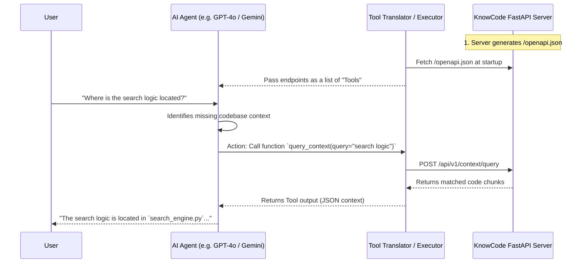
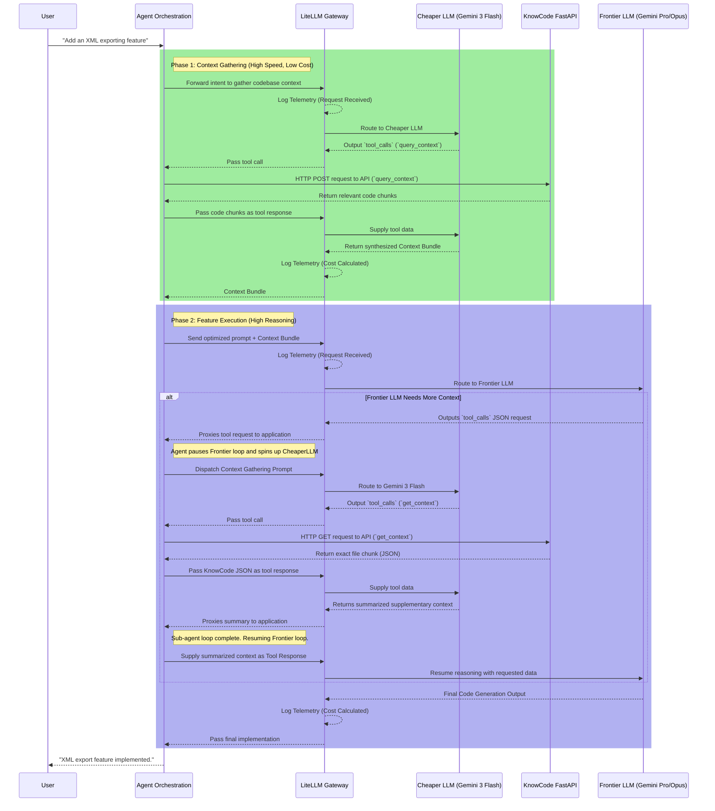

# Architecture Specification: High-Efficiency AI Agent Pipeline

## 1. Architectural Philosophy

This system is designed to maximize reasoning quality while strictly minimizing token waste. The core engine relies on the **Gemini 3 Flash API** (`gemini-3-flash-preview`). The system leverages Gemini's high-speed prefill, massive context window, and dynamic `thinking_level` configurations to handle routing, telemetry, and execution without incurring the heavy token taxes typical of agentic loops.

## 2. Tool Integration: OpenAPI-to-Function-Calling

To eliminate the severe "startup token burn" associated with dynamic tool discovery, this agent bypasses the standard Model Context Protocol (MCP) in favor of **Stateless OpenAPI-to-Function-Calling**.

| Feature                     | OpenAPI Function Calling (Selected Strategy)         | Model Context Protocol (MCP)                       |
| :-------------------------- | :--------------------------------------------------- | :------------------------------------------------- |
| **Architectural Style**     | Stateless, REST-based direct execution.              | Stateful, Client-Server (JSON-RPC).                |
| **Token Efficiency**        | **High.** Injects only strict, predefined schemas.   | **Low.** Dynamic discovery inflates context.       |
| **Infrastructure Overhead** | **Zero.** Uses existing application REST APIs.       | **High.** Requires dedicated MCP servers.          |
| **Execution Control**       | **Deterministic.** Host application handles routing. | **Autonomous.** Agent pulls resources dynamically. |

### 2.1 Design Rationale: Why bypass MCP?

While MCP is the emerging standard for agentic tool discovery, it introduces unavoidable "discovery overhead." In an MCP architecture, the agent must spend tokens and latency on an initial handshake to ask the MCP server, "What tools do you have?" and then read the full schema of every available tool before it even begins to solve the user's problem.

By utilizing **Stateless OpenAPI-to-Function-Calling**, the orchestrating application (the host) does the intelligent filtering _first_. The host parses the API spec and injects _only_ the specific tool schemas needed for the exact task into the LLM's initial payload. This eliminates discovery round-trips entirely, saving thousands of tokens per session and dramatically reducing Time-To-First-Action.

**Implementation Directive:** The host application must parse OpenAPI 3.x specifications into strict JSON schemas. Only the schemas explicitly required for the user's immediate intent should be injected into the Gemini 3 Flash payload.

## 3. Pre-Inference Strategy (Predictive Telemetry)

Token counting must occur _before_ the payload is dispatched to the Gemini API. This step must carry zero latency and zero financial cost.

- **Local Tokenization:** Utilize the native tokenizer within the `google-genai` SDK to calculate exact prompt sizes locally before execution.
- **Dynamic Routing & Budgeting:** Implement a middleware function. If the pre-calculated token count exceeds the defined budget or free-tier rate limit thresholds, the middleware must instantly trigger a semantic compression protocol (e.g., truncating older conversation history) before the network request is initiated.

## 4. Post-Inference Strategy (Empirical Telemetry)

Upon receiving the payload from the Gemini API, the system must parse the `usage_metadata` object as the ground truth for system analytics.

- **Latency Metrics:** The system must log both prefill and decode speeds.
  - **TTFT (Time To First Token):** Monitors prompt processing speed.
  - **TPOT (Time Per Output Token):** Monitors generation efficiency.
- **Output Truncation (Decode Optimization):** To aggressively suppress expensive output tokens, the system prompt must strictly enforce rigid output structures. The agent must be instructed to return **ONLY** required data (e.g., strict markdown tables or raw JSON objects). All conversational filler, intermediate analysis, or per-file narratives must be programmatically forbidden to prevent decode-phase token waste.

## 5. The AI Gateway: LiteLLM Integration

To manage the Gemini 3 Flash API efficiently, the architecture will utilize the **LiteLLM OSS Proxy** as the centralized AI Gateway. This standardizes all requests into the OpenAI format while natively managing Gemini's specific capabilities (like the `thinking_level` parameter).

LiteLLM provides built-in, zero-cost infrastructure for routing, exact token counting, and strict budget enforcement without requiring custom middleware.

### 5.1 Pre-Inference Control & Budgeting

Before a request ever reaches the Google GenAI endpoints, LiteLLM intercepts the payload to enforce strict economic parameters.

- **Hard Budget Caps:** The proxy must be configured with a strict `max_budget` for the API key. If an autonomous coding loop goes rogue, LiteLLM will intercept the request and return a `BudgetExceededError` before generating massive, unexpected token burns.
- **Token Cost Mapping:** LiteLLM natively uses model-specific tokenizers to calculate the exact size of the payload locally.
- **Tag-Based Tracking:** Every request dispatched by the agent must include a metadata tag (e.g., `tags: ["code-refactor", "frontend"]`). This allows for granular telemetry to see exactly which agentic tasks are consuming the most tokens over time.

### 5.2 Zero-Cost Fallback Routing

While the Gemini 3 Flash free tier is generous, hitting rate limits (RPM/TPM) during intense, multi-file generation tasks is a risk. LiteLLM will be configured with an automated fallback chain to maintain system uptime at zero marginal cost.

- **Primary Route:** `gemini/gemini-3-flash-preview` (Fastest TTFT, highest reasoning quality).
- **Fallback Route:** If Gemini returns a 429 (Rate Limit) or 500 error, LiteLLM's router must automatically seamlessly failover to a local open-source model (e.g., Llama 3 8B via Ollama).
- **Execution:** This self-healing architecture ensures the coding agent never crashes due to a temporary API bottleneck, sacrificing a slight degree of reasoning quality only when absolutely necessary to maintain zero-cost execution.

### 5.3 Unified Post-Inference Telemetry

LiteLLM standardizes the post-inference telemetry, making it easy to track exactly what the Gemini model consumed.

- The system must parse the unified `usage` object returned by LiteLLM.
- Crucially, the system will track the `response_cost` injected by LiteLLM into every response header, giving a real-time, exact USD calculation of the execution step.
- **Decode Optimization Reminder:** Even with LiteLLM handling the routing, the agent's system prompt must still enforce rigid data structures (like strict markdown tables or JSON) to suffocate the model's tendency to generate expensive, conversational output tokens.

### 5.4 Design Rationale: LiteLLM vs. Native Orchestration

LiteLLM is chosen strictly as a **Stateless Gateway and Telemetry Interceptor**, not as an Agent Orchestrator.
It was selected because building production-grade token counting, multi-model fallback routing, and strict budget enforcement from scratch requires thousands of lines of fragile middleware. LiteLLM handles this out-of-the-box.
**Crucial Distinction:** LiteLLM _does not_ execute tools or spawn sub-agents. When an LLM requests a tool call, LiteLLM simply proxies that JSON request back to your host application. The actual logic of "pausing the loop, hitting the KnowCode API, and returning the result" must live in your custom Agent Orchestrator code (as detailed in Section 7).

## 6. OpenAPI to Function-Calling Translation Engine

To eliminate the dynamic discovery cost associated with MCP, the host application must programmatically convert your existing backend OpenAPI 3.x specifications into the exact `tools` schema format expected by LiteLLM (which mirrors the standard OpenAI tool format and seamlessly translates it for Gemini 3 Flash).

### 6.1 Schema Extraction and Normalization

OpenAPI schemas contain metadata (like `discriminator`, `xml`, or `externalDocs`) that LLMs do not need. Passing these into the context window wastes input tokens. The extraction engine must perform the following normalizations:

1. **Dereferencing:** Resolve all `$ref` pointers in the OpenAPI document so the LLM receives a flat, fully inline JSON schema.
2. **Keyword Stripping:** Strip out OpenAPI-specific keys that are incompatible with strict JSON Schema standard formats (which most LLMs expect).
3. **Type Handling:** Convert OpenAPI paradigms like `nullable: true` into standard JSON schema union types (e.g., `type: ["string", "null"]`).

### 6.2 Recommended Tooling for Implementation

The coding agent should not write this conversion logic from scratch. It must integrate established open-source converters to maintain architectural quality:

- **TypeScript/Node.js Ecosystem:** Utilize `@samchon/openapi`. It is currently the state-of-the-art compiler for converting OpenAPI directly into LLM function-calling schemas with strict type safety.
- **Python Ecosystem:** Utilize a combination of `openapi-schema-to-json-schema` (for schema downgrading) and `jsonref` (to resolve the `$refs` before conversion).

### 6.3 Construction of the `tools` Payload

Once the OpenAPI paths are normalized into pure JSON Schema, the host application must map them into the LiteLLM `tools` array.

**Required Mapping Structure:**

- `name`: Map directly from the OpenAPI `operationId`. (Ensure it is restricted to alphanumeric characters and underscores).
- `description`: Map from the OpenAPI `summary` or `description`. **Optimization Tip:** Instruct the agent to programmatically compress these descriptions where possible. Verbose API documentation wastes input tokens.
- `parameters`: Inject the cleaned JSON Schema representing the request body and query parameters.

### 6.4 The Execution Loop via LiteLLM

1. **Pre-Inference Injection:** The host application selects _only_ the specific tool schemas strictly required for the current user intent and injects them into the LiteLLM request under the `tools` parameter.
2. **Inference (Gemini 3 Flash):** LiteLLM standardizes the payload and routes it. Gemini processes the prompt and returns a `tool_calls` response object containing the function name and a JSON string of generated arguments.
3. **Local Execution:** The host application parses the JSON arguments, executes the standard HTTP REST call to your backend API, and appends the raw response back to the conversation array as a `tool` message.
4. **Final Resolution:** Gemini analyzes the tool response and provides the final deterministic output back to the user.

### 6.5 The Economic Impact of Context Caching on "Overhead"

Because this architecture requires injecting "overhead elements" (System Prompts, formatting rules, and the selected OpenAPI Tool Schemas) into every single stateless API request, it relies heavily on **Context Caching** (supported by Gemini and Anthropic) to remain economically viable.

**How it works:**
The massive 10,000+ token block of system instructions and tool schemas is sent once. The API caches it on their servers. On every subsequent request in the agentic loop, the orchestrator only sends the cache identifier plus the new user message.

**The Financial Mechanics:**

1.  **Discounted Input Tokens:** APIs charge a "Base Input Token" rate and a heavily discounted "Cached Input Token" rate (often 50% to 90% cheaper). While the orchestrator mathematically sends the 10,000 tokens of overhead every time, the API applies the 90% discount to them because they hit the cache.
2.  **Extending Rate Limits (TPM):** For API keys with strict Input Tokens Per Minute (ITPM) limits (e.g., 30,000 ITPM), cached tokens _do not count_ towards this limit. This effectively removes the context overhead from the rate-limit math, allowing the agent to execute dozens of high-context tool calls per minute without triggering a `429 Too Many Requests` error.
3.  **Extending Fixed Budgets:** For accounts running on fixed financial limits (e.g., a $50/month hard cap configured in LiteLLM), the 50%-90% discount on cached reads acts as a massive throughput multiplier. An agent that would normally burn through its budget in 1,000 steps can safely execute 8,000+ steps because the static overhead is algorithmically discounted on every turn.

## 7. Implementing OpenAPI-to-Function-Calling Architecture with KnowCode

Integrating KnowCode to give AI agents intelligent codebase context involves translating KnowCode's REST API (FastAPI) into native "tools" or "functions" that the agent can autonomously call.

The core idea is straightforward: **Convert the OpenAPI schema automatically generated by KnowCode into a list of tools that modern LLMs (OpenAI, Anthropic, Gemini) natively understand.**

### 7.1 The Architecture Concept

The architecture consists of three main components:

1. **The KnowCode FastAPI Server**: Serves codebase intelligence endpoints and exposes its schema at `/openapi.json`.
2. **The Translator layer**: Takes the `openapi.json` and parses it into JSON Schema-formatted function definitions.
3. **The Agent Execution Loop**: The AI LLM decides to hit an endpoint (e.g., "I need context on the API handler"), and the execution loop makes the actual HTTP request to KnowCode and feeds the result back.

#### Example 1: Context Q&A Workflow



#### Example 2: Two-Tier Token Saving Architecture (Feature Implementation)



### 7.2 Step-by-Step Implementation

#### Step 1: Start the KnowCode API Server

KnowCode has a built-in FastAPI application (located in `src/knowcode/api/main.py`). When running, it automatically serves the OpenAPI standard schema.

```bash
# Start the KnowCode API server
uvicorn knowcode.api.main:create_app --factory --port 8000
# The OpenAPI spec is now available at http://127.0.0.1:8000/openapi.json
```

#### Step 2: Translate OpenAPI into Agent Tools

You map the valuable paths from the OpenAPI response into native LLM tool schemas.

Here is an example structure in Python using a standard payload (this can be automated using the tools mentioned in section 6.2 or done by frameworks like LangChain's `RequestsToolkit` or LlamaIndex's `OpenAPIToolSpec`):

```python
import requests

# 1. Fetch KnowCode's schema
openapi_spec = requests.get("http://127.0.0.1:8000/openapi.json").json()

# 2. Extract specific API endpoints to provide as Functions/Tools
tools = [
    {
        "type": "function",
        "function": {
            "name": "query_context",
            "description": "Execute semantic search and return relevant code chunks with context. Use this when searching for vague concepts.",
            "parameters": {
                "type": "object",
                "properties": {
                    "query": {"type": "string", "description": "The search query"},
                    "task_type": {"type": "string", "enum": ["explain", "debug", "extend", "review", "locate", "general"]}
                },
                "required": ["query"]
            }
        }
    },
    {
        "type": "function",
        "function": {
            "name": "get_context",
            "description": "Generates a synthesized context bundle for a specific codebase entity (e.g. function or class).",
            "parameters": {
                "type": "object",
                "properties": {
                    "target": {"type": "string", "description": "Entity ID or name to get context for"},
                    "max_tokens": {"type": "integer"}
                },
                "required": ["target"]
            }
        }
    }
]

# 3. Supply tools to the AI Agent via LiteLLM/Gemini
response = client.chat.completions.create(
    model="gemini/gemini-3-flash-preview",
    messages=[{"role": "user", "content": "How does the caching system work?"}],
    tools=tools
)
```

#### Step 3: Tool Execution Loop

If the LLM responds with a `tool_calls` request, your application invokes the corresponding KnowCode HTTP endpoint:

```python
import json

for tool_call in response.choices[0].message.tool_calls:
    if tool_call.function.name == "query_context":
        args = json.loads(tool_call.function.arguments)

        # Actually hit the KnowCode API
        api_res = requests.post(
            "http://127.0.0.1:8000/api/v1/context/query",
            json={"query": args["query"], "task_type": args.get("task_type", "general")}
        )

        # Append the HTTP response back into standard LLM memory
        messages.append({
            "role": "tool",
            "tool_call_id": tool_call.id,
            "content": api_res.text
        })
```

### 7.3 Highest Value KnowCode Endpoints for Agents

When implementing this, you shouldn't expose every endpoint unconditionally to the agent. Based on `api.py`, the best endpoints to translate into Function Tools natively are:

1. **`query_context`** (`POST /api/v1/context/query`): _Primary Discovery Tool._ Lets the agent search via natural language semantic search for topics it knows nothing about.
2. **`search`** (`GET /api/v1/search`): _Exact Symbol Lookup._ When the agent wants to find the exact file/line of a known function or class name.
3. **`get_context`** (`GET /api/v1/context`): _Deep Dive Tool._ Once the agent discovers an interesting Entity ID, it calls this to get a dense, token-capped context chunk tailored for LLM reasoning.
4. **`trace_calls`** (`GET /api/v1/trace_calls/{entity_id}`): _Dependency Mapping._ When stepping through a debug process, the agent uses this to find callers and callees.
