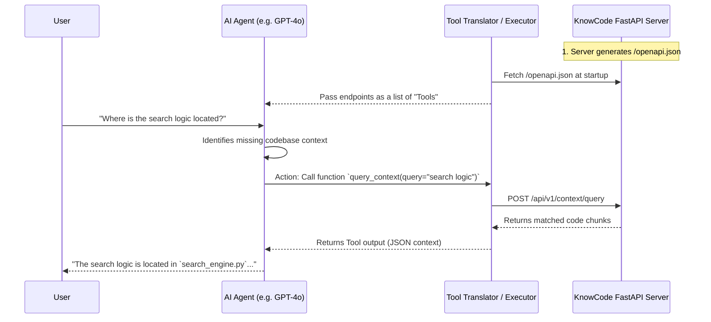

# Implementing OpenAPI-to-Function-Calling Architecture with KnowCode

> **Prefer MCP for IDE agents.** If you are integrating KnowCode into an IDE (Antigravity, Cursor, VS Code, Claude Desktop), use the MCP integration path instead: see [MCP_SETUP.md](MCP_SETUP.md) and [mcp-contract.md](mcp-contract.md). The OpenAPI function-calling approach described here is suited to custom agent frameworks that cannot use MCP.

Integrating KnowCode to give AI agents intelligent codebase context involves translating KnowCode's REST API (FastAPI) into native "tools" or "functions" that the agent can autonomously call.

The core idea is straightforward: **Convert the OpenAPI schema automatically generated by KnowCode into a list of tools that modern LLMs (OpenAI, Anthropic, Gemini) natively understand.**

## 1. The Architecture Concept

The architecture consists of three main components:

1. **The KnowCode FastAPI Server**: Serves codebase intelligence endpoints and exposes its schema at `/openapi.json`.
2. **The Translator layer**: Takes the `openapi.json` and parses it into JSON Schema-formatted function definitions.
3. **The Agent Execution Loop**: The AI LLM decides to hit an endpoint (e.g., "I need context on the API handler"), and the execution loop makes the actual HTTP request to KnowCode and feeds the result back.



## 2. Step-by-Step Implementation

### Step 1: Start the KnowCode API Server

KnowCode has a built-in FastAPI application (located in `src/knowcode/api/main.py`). When running, it automatically serves the OpenAPI standard schema.

```bash
# Start the KnowCode API server (recommended: use the CLI)
knowcode server --port 8000

# Or start directly with uvicorn (for development/customization)
uvicorn knowcode.api.main:create_app --factory --port 8000

# The OpenAPI spec is now available at http://127.0.0.1:8000/openapi.json
```

### Step 2: Translate OpenAPI into Agent Tools

You map the valuable paths from the OpenAPI response into native LLM tool schemas.

Here is an example structure in Python using the OpenAI SDK (this can be largely automated or done by frameworks like LangChain's `RequestsToolkit` or LlamaIndex's `OpenAPIToolSpec`):

```python
import requests

# 1. Fetch KnowCode's schema
openapi_spec = requests.get("http://127.0.0.1:8000/openapi.json").json()

# 2. Extract specific API endpoints to provide as Functions/Tools
tools = [
    {
        "type": "function",
        "function": {
            "name": "query_context",
            "description": "Execute semantic search and return relevant code chunks with context. Use this when searching for vague concepts.",
            "parameters": {
                "type": "object",
                "properties": {
                    "query": {"type": "string", "description": "The search query"},
                    "task_type": {"type": "string", "enum": ["explain", "debug", "extend", "review", "locate", "general"]}
                },
                "required": ["query"]
            }
        }
    },
    {
        "type": "function",
        "function": {
            "name": "get_context",
            "description": "Generates a synthesized context bundle for a specific codebase entity (e.g. function or class).",
            "parameters": {
                "type": "object",
                "properties": {
                    "target": {"type": "string", "description": "Entity ID or name to get context for"},
                    "max_tokens": {"type": "integer"}
                },
                "required": ["target"]
            }
        }
    }
]

# 3. Supply tools to the AI Agent
response = client.chat.completions.create(
    model="gpt-4o",
    messages=[{"role": "user", "content": "How does the caching system work?"}],
    tools=tools
)
```

### Step 3: Tool Execution Loop

If the LLM responds with a `tool_calls` request, your application invokes the corresponding KnowCode HTTP endpoint:

```python
for tool_call in response.choices[0].message.tool_calls:
    if tool_call.function.name == "query_context":
        args = json.loads(tool_call.function.arguments)

        # Actually hit the KnowCode API
        api_res = requests.post(
            "http://127.0.0.1:8000/api/v1/context/query",
            json={"query": args["query"], "task_type": args.get("task_type", "general")}
        )

        # Append the HTTP response back into standard LLM memory
        messages.append({
            "role": "tool",
            "tool_call_id": tool_call.id,
            "content": api_res.text
        })
```

## 3. Highest Value KnowCode Endpoints for Agents

When implementing this, you shouldn't expose every endpoint unconditionally to the agent. Based on `api.py`, the best endpoints to translate into Function Tools natively are:

1. **`query_context`** (`POST /api/v1/context/query`): _Primary Discovery Tool._ Lets the agent search via natural language semantic search for topics it knows nothing about.
2. **`search`** (`GET /api/v1/search`): _Exact Symbol Lookup._ When the agent wants to find the exact file/line of a known function or class name.
3. **`get_context`** (`GET /api/v1/context`): _Deep Dive Tool._ Once the agent discovers an interesting Entity ID, it calls this to get a dense, token-capped context chunk tailored for LLM reasoning.
4. **`trace_calls`** (`GET /api/v1/trace_calls/{entity_id}`): _Dependency Mapping._ When stepping through a debug process, the agent uses this to find callers and callees.
