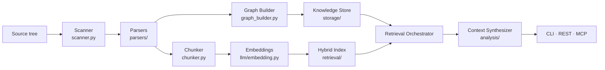

# Architecture

The current-state architecture of KnowCode, as implemented. For the
reasoning behind key structural choices, see the
[ADR index](adr/index.md); for forward-looking designs, see the
[architecture synthesis study](../research/knowcode-architecture-synthesis.md);
for the phased plan, see the
[roadmap](../roadmap.md).

## Guiding principle

A codebase is deterministic, so extracting information from it is 100% local
and 100% deterministic. Making it consumable by a human (understanding) or
an AI agent (saving frontier-LLM tokens) should be a local, negligible-cost
operation. LLMs appear only in optional features.

## Pipeline

Scan → parse → graph → store → index → retrieve → synthesize → serve.
A build publishes everything as one atomic **generation**; serving surfaces
read the current generation through leases.

## Components

| Component | Location | Responsibility |
|---|---|---|
| Scanner | `indexing/scanner.py` | File discovery honoring the root `.gitignore`; fixed supported-extension set |
| Parsers | `parsers/` | Python `ast`; tree-sitter for JS/TS/Java/Rust/Vue; custom Markdown/YAML/RST. Per-construct coverage: [parser matrix](parser-matrix.md) |
| Graph builder | `indexing/graph_builder.py` | Entities + relationships into a networkx graph; unresolved references stay visible (`unresolved::…`) |
| Knowledge store | `storage/knowledge_store.py`, `sqlite_knowledge_store.py` | In-memory graph with JSON/SQLite persistence; graph queries, tracing, impact |
| Chunker | `indexing/chunker.py`, `prose_chunker.py` | Entity-aligned code chunks (1000 chars/100 overlap); prototype heading-hierarchy prose chunking |
| Indexer | `indexing/indexer.py` | Embedding pipeline (batched across files, bounded concurrency, retry — `indexing/embedding_batch.py`), durable embedding cache (content-hash reuse), generation staging |
| Hybrid index | `retrieval/hybrid_index.py` | BM25 + dense retrieval fused by RRF (α=0.2 sparse-heavy) |
| Reranker | `retrieval/reranker.py` | VoyageAI cross-encoder; deterministic signal-based fallback |
| Orchestrator | `retrieval/orchestrator.py` | Exact/semantic/lexical routing, dependency expansion, dedup, budgets |
| Context synthesizer | `analysis/context_synthesizer.py` | Task-typed, token-budgeted bundles with sufficiency scoring |
| Service | `service.py` | The central `KnowCodeService` wiring everything; generation lifecycle; freshness |
| Watch pipeline | `indexing/monitor.py`, `watch_queue.py`, `background_indexer.py`, `file_updates.py`, `service_watch.py` | File-event monitoring, debounced incremental re-indexing, prepare/commit transactions |
| Surfaces | `cli/cli.py`, `api/`, `mcp/server.py` | CLI (16 commands), FastAPI server (12 endpoints, 2 rate-limit tiers), MCP stdio server (5 tools) |
| LLM layer | `llm/` | Provider clients (Google/OpenAI-compatible), failover + free-tier rate limiting, query classification, prompt contract |
| Analysis extras | `analysis/` | Preflight assessment, documentation synthesis, temporal/behavior signals |
| Doctor | `doctor.py`, `readiness.py` | Setup verification incl. live MCP handshake |
| Telemetry | `telemetry*.py` | Local aggregate-only JSONL (see ADR 5) |

## Key invariants

- **Identity:** entity IDs are `<resolved-file-identity>::<lexical-qualified-name>`;
  reference endpoints are internal / `external::` / `unresolved::` only
  ([ADR 1](adr/adr-0001-entity-and-file-identity.md)).
- **Generations:** artifacts publish all-or-nothing behind a `current.json`
  pointer; readers lease a generation; failed builds leave the previous
  generation searchable ([ADR 4](adr/adr-0004-complete-index-generations.md)).
- **Fail-closed artifacts:** legacy-schema artifacts (chunk schema 1, LanceDB
  schema 1, manifest schema 2) refuse to load with a rebuild instruction —
  never silently migrated ([ADR 7](adr/adr-0007-protocol-and-artifact-evolution-inventory.md)).
- **No hidden side effects:** query paths never auto-build or auto-analyze;
  missing artifacts are explicit errors.
- **Fail-fast extras:** commands requiring optional dependencies exit with
  an install hint (`utils/dependency_guard.py`).

## Subsystem deep dives

- [Indexing & generations](internals/indexing-generations.md) — build
  pipeline internals, staged publication, leases, incremental/watch updates.
- [Retrieval & synthesis](internals/retrieval-synthesis.md) — fusion math,
  reranking, orchestrator routing, budgeting, sufficiency.
- [Storage formats](internals/storage-formats.md) — schemas, versioning,
  backends (SQLite chunks, LanceDB/FAISS vectors), migration policy.

## Extension points

`protocols.py` defines the seams — `EmbeddingProviderProtocol`,
`VectorStoreProtocol`, `KnowledgeStoreProtocol`, `ChunkRepository` ABC.
Adding a vector backend or embedding provider means implementing the
protocol and registering in config; the contract versions and capability
checks are explicit ([ADR 7](adr/adr-0007-protocol-and-artifact-evolution-inventory.md)).

## Diagrams

Sequence and architecture diagrams (draw.io sources) live in
[diagrams/](../diagrams/README.md).
