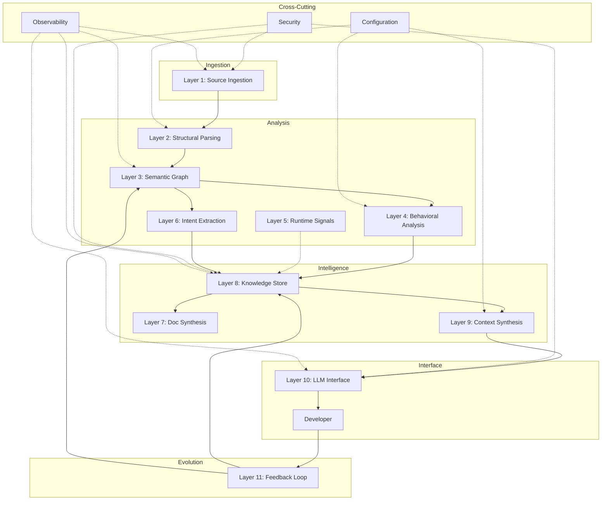

# **Detailed Architecture & Roadmap**

*Note: This document outlines the conceptual architecture of KnowCode, some of which looks ahead to future phases.*

---

## **1. Layered Architecture**

KnowCode follows a multi-layer design to ensure extensibility, maintainability, and scalability.

1.  **Ingestion Layer**: Source Code scanning, Parsing (AST/Tree-sitter).
2.  **Analysis Layer**: Structural building, Semantic graph construction.
3.  **Storage Layer**: Graph persistence, Vector storage.
4.  **Retrieval Layer**: Hybrid search (Lexical + Semantic).
5.  **Intelligence Layer**: Context synthesis, RAG orchestration.
6.  **Interface Layer**: CLI, REST API (FastAPI).

---

## **2. Component Interaction**

---

## **Implementation Status & Roadmap**

### **Phase 1: Foundation (COMPLETED)**
1. **[x] Source Scanning + Parsing (Layers 1-2)**: Scanner with gitignore support; parsers for Python (AST), JS/TS + Java (Tree-sitter), Markdown, YAML.
2. **[x] Unified Semantic Graph (Layer 3)**: Entity/relationship model with reference resolution (calls/imports/contains/inherits).
3. **[x] Local Knowledge Store (Layer 8)**: In-memory graph with JSON persistence and query helpers.
4. **[x] Token-Budgeted Context Synthesis (Layer 9)**: Priority-ordered sections with truncation handling.
5. **[x] Service Layer**: Shared business logic for CLI and API.

### **Phase 2: Intelligence Server & RAG (COMPLETED)**
6. **[x] FastAPI Server (Layer 10)**: Health, stats, search, context, semantic query, reload, entity details, callers/callees.
7. **[x] Semantic Search & Indexing (Layer 4a)**: Chunker (module header/imports/entities), config-driven embeddings (OpenAI or VoyageAI), FAISS vector store, hybrid BM25+vector retrieval (RRF), reranking, dependency expansion.
8. **[x] Indexer Persistence + CLI**: `index`/`semantic-search` commands with save/load.
9. **[x] Watch Mode**: Background indexer + filesystem monitor for incremental re-indexing.
10. **[x] CLI Workflows**: `analyze`, `query`, `context`, `export`, `stats`, `server`, `history`, `ask`.

### **Phase 3: Temporal & Runtime Signals (COMPLETED)**
11. **[x] Git History Ingestion (Temporal)**: Commit/author entities, authored/modified/changed_by relationships; surfaced via `--temporal` and `history`.
12. **[x] Coverage Signals (Layer 5)**: Cobertura ingestion with coverage report entities and covers/executed_by relationships.

### **Phase 4: Documentation Synthesis (PARTIAL)**
13. **[x] Markdown Export (MVP)**: CLI `export` produces an index-style Markdown doc.
14. **[ ] Multi-Level Doc Synthesis (Layer 7)**: Architecture/module/function narratives, change summaries, and freshness tracking.

### **Phase 5: Deep Analysis (NEXT)**
15. **[ ] Static Behavioral Analysis (Layer 4)**: Data flow, state transitions, side-effect classification.
16. **[ ] Intent Extraction (Layer 6)**: ADR/PR/commit intent linking beyond commit metadata.
17. **[ ] Confidence Scoring (Layer 3)**: Weighted edges/entities by evidence source.

### **Phase 6: Enterprise (FUTURE)**
18. **[ ] Security & RBAC**: Permissioned access and audit trails.
19. **[ ] Scalability**: Large monorepo support and distributed processing.
20. **[ ] Team Sharing**: Remote knowledge store sync and collaboration.

### **Phase 7: Agentic Capabilities (COMPLETED v2.2)**
21. **[x] Agent Architecture**: `Agent` class with configuration-driven model selection.
22. **[x] Multi-Provider Support**: Google Gemini and OpenRouter/OpenAI integration.
23. **[x] Rate Limiting**: Persistent RPM/RPD tracking and enforcement.
24. **[x] Query Classification**: 6 task types (explain, debug, extend, review, locate, general).
25. **[x] Smart Answer**: Local-first answering with configurable sufficiency threshold.
26. **[x] VoyageAI Reranking**: Cross-encoder reranking with signal-based fallback.

### **Phase 8: IDE Integration (COMPLETED v2.2)**
27. **[x] MCP Server (Layer 10b)**: Tool exposure via STDIO for IDE agents.
28. **[x] Core Tools**: `search_codebase`, `get_entity_context`, `trace_calls`.
29. **[x] Sufficiency Scoring**: Context confidence metrics for local-first answering.
30. **[x] Task-Specific Templates**: Debug/extend/review/explain/locate prioritization.
31. **[x] Multi-hop Queries**: `trace_calls(depth=N)` and `get_impact()` analysis.
32. **[x] Structured Responses**: JSON with `task_type` and `sufficiency_score`.
