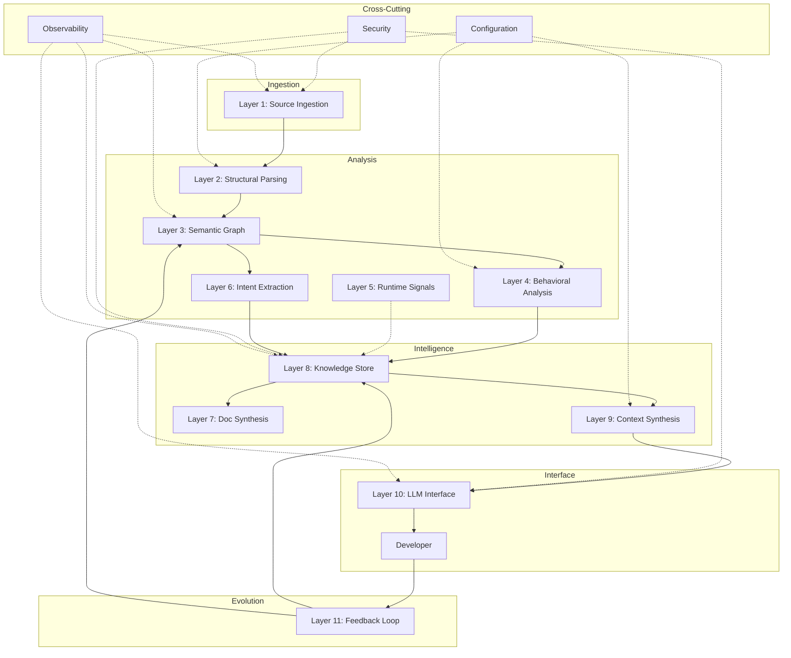

# **Detailed Architecture & Roadmap**

*Note: This document outlines the conceptual architecture of KnowCode, some of which looks ahead to future phases.*

---

## **1. Layered Architecture**

KnowCode follows a multi-layer design to ensure extensibility, maintainability, and scalability.

1.  **Ingestion Layer**: Source Code scanning, Parsing (AST/Tree-sitter).
2.  **Analysis Layer**: Structural building, Semantic graph construction.
3.  **Storage Layer**: Graph persistence, Vector storage.
4.  **Retrieval Layer**: Hybrid search (Lexical + Semantic).
5.  **Intelligence Layer**: Context synthesis, RAG orchestration.
6.  **Interface Layer**: CLI, REST API (FastAPI).

---

## **2. Component Interaction**

```mermaid
flowchart TB
    subgraph Ingestion
        L1[Layer 1: Source Ingestion]
    end
    
    subgraph Analysis
        L2[Layer 2: Structural Parsing]
        L3[Layer 3: Semantic Graph]
        L4[Layer 4: Behavioral Analysis]
        L5[Layer 5: Runtime Signals]
        L6[Layer 6: Intent Extraction]
    end
    
    subgraph Intelligence
        L7[Layer 7: Doc Synthesis]
        L8[Layer 8: Knowledge Store]
        L9[Layer 9: Context Synthesis]
    end
    
    subgraph Interface
        L10[Layer 10: LLM Interface]
        DEV[Developer]
    end
    
    subgraph Evolution
        L11[Layer 11: Feedback Loop]
    end
    
    subgraph Cross-Cutting
        SEC[Security]
        OBS[Observability]
        CFG[Configuration]
    end
    
    L1 --> L2
    L2 --> L3
    L3 --> L4
    L3 --> L6
    L4 --> L8
    L5 -.-> L8
    L6 --> L8
    L8 --> L7
    L8 --> L9
    L9 --> L10
    L10 --> DEV
    DEV --> L11
    L11 --> L8
    L11 --> L3
    
    SEC -.-> L1 & L8 & L10
    OBS -.-> L1 & L3 & L8 & L10
    CFG -.-> L2 & L4 & L9
```

---

## **Implementation Status & Roadmap**

### **Phase 1: Foundation (COMPLETED)**
1. **[x] Source Scanning + Parsing (Layers 1-2)**: Scanner with gitignore support; parsers for Python (AST), JS/TS + Java (Tree-sitter), Markdown, YAML.
2. **[x] Unified Semantic Graph (Layer 3)**: Entity/relationship model with reference resolution (calls/imports/contains/inherits).
3. **[x] Local Knowledge Store (Layer 8)**: In-memory graph with JSON persistence and query helpers.
4. **[x] Token-Budgeted Context Synthesis (Layer 9)**: Priority-ordered sections with truncation handling.
5. **[x] Service Layer**: Shared business logic for CLI and API.

### **Phase 2: Intelligence Server & RAG (COMPLETED)**
6. **[x] FastAPI Server (Layer 10)**: Health, stats, search, context, semantic query, reload, entity details, callers/callees.
7. **[x] Semantic Search & Indexing (Layer 4a)**: Chunker (module header/imports/entities), config-driven embeddings (OpenAI or VoyageAI), FAISS vector store, hybrid BM25+vector retrieval (RRF), reranking, dependency expansion.
8. **[x] Indexer Persistence + CLI**: `index`/`semantic-search` commands with save/load.
9. **[x] Watch Mode**: Background indexer + filesystem monitor for incremental re-indexing.
10. **[x] CLI Workflows**: `analyze`, `query`, `context`, `export`, `stats`, `server`, `history`, `ask`.

### **Phase 3: Temporal & Runtime Signals (COMPLETED)**
11. **[x] Git History Ingestion (Temporal)**: Commit/author entities, authored/modified/changed_by relationships; surfaced via `--temporal` and `history`.
12. **[x] Coverage Signals (Layer 5)**: Cobertura ingestion with coverage report entities and covers/executed_by relationships.

### **Phase 4: Documentation Synthesis (PARTIAL)**
13. **[x] Markdown Export (MVP)**: CLI `export` produces an index-style Markdown doc.
14. **[ ] Multi-Level Doc Synthesis (Layer 7)**: Architecture/module/function narratives, change summaries, and freshness tracking.

### **Phase 4.5: Architectural Hardening (PARTIAL)**
15. **[x] Dependency Modularisation (AD-1)**: Optional extras (`server`, `search`, `llm`, `watch`, `all`) with lightweight core install.
16. **[x] Side-Effect-Free Query Paths (AD-2)**: Retrieval and MCP read tools fail fast on missing prerequisites; no auto analyze/index side effects.
17. **[x] Schema Versioning (AD-3)**: Persisted artifact schema versioning + migration shim across store/index/vector metadata.
18. **[x] Data Model Fixes (AD-4)**: Metadata fields move from `dict[str, str]` to `dict[str, Any]`.
19. **[x] Configuration Hardening (AD-5)**: Logging-based config warnings + strict server/MCP validation + YAML key validation.
20. **[x] Service Layer Decomposition (AD-6)**: Retrieval orchestrator + protocol interfaces.
21. **[x] Entity Identity Resilience (AD-7)**: Add `content_hash` for rename-resilient correlation.

### **Phase 5: Deep Analysis (NEXT)**
22. **[ ] Static Behavioral Analysis (Layer 4)**: Data flow, state transitions, side-effect classification.
23. **[ ] Intent Extraction (Layer 6)**: ADR/PR/commit intent linking beyond commit metadata.
24. **[ ] Confidence Scoring (Layer 3)**: Weighted edges/entities by evidence source.

### **Phase 6: Enterprise (FUTURE)**
25. **[ ] Security & RBAC**: Permissioned access and audit trails.
26. **[ ] Scalability**: Large monorepo support and distributed processing.
27. **[ ] Team Sharing**: Remote knowledge store sync and collaboration.

### **Phase 7: Agentic Capabilities (COMPLETED v2.2)**
28. **[x] Agent Architecture**: `Agent` class with configuration-driven model selection.
29. **[x] Multi-Provider Support**: Google Gemini and OpenRouter/OpenAI integration.
30. **[x] Rate Limiting**: Persistent RPM/RPD tracking and enforcement.
31. **[x] Query Classification**: 6 task types (explain, debug, extend, review, locate, general).
32. **[x] Smart Answer**: Local-first answering with configurable sufficiency threshold.
33. **[x] VoyageAI Reranking**: Cross-encoder reranking with signal-based fallback.

### **Phase 8: IDE Integration (COMPLETED v2.2)**
34. **[x] MCP Server (Layer 10b)**: Tool exposure via STDIO for IDE agents.
35. **[x] Core Tools**: `search_codebase`, `get_entity_context`, `trace_calls`.
36. **[x] Sufficiency Scoring**: Context confidence metrics for local-first answering.
37. **[x] Task-Specific Templates**: Debug/extend/review/explain/locate prioritization.
38. **[x] Multi-hop Queries**: `trace_calls(depth=N)` and `get_impact()` analysis.
39. **[x] Structured Responses**: JSON with `task_type` and `sufficiency_score`.

### **Phase 8.5: Eval Harness Hardening (NEXT)**
40. **[ ] Decouple eval metadata from response verbosity**: The short-term eval harness workaround uses `verbosity="diagnostic"` so scoring can read `selected_entities`. The long-term fix is to separate context summarization from response projection, so internal evaluators can score ranking metadata while still exercising the production-like minimal retrieval path.
41. **[ ] Fix routing accounting in eval scoring**: `tests/eval/harness/scorer.py` currently infers `routed_local` from `retrieval_result["source"]`, but `retrieve_context_for_query()` does not return `source`. Near-term, derive `would_route_local` from the configured sufficiency threshold plus non-empty context. Long-term, either run routing evals through `Agent.smart_answer()` or expose the route decision explicitly in an internal-only retrieval/eval API.
