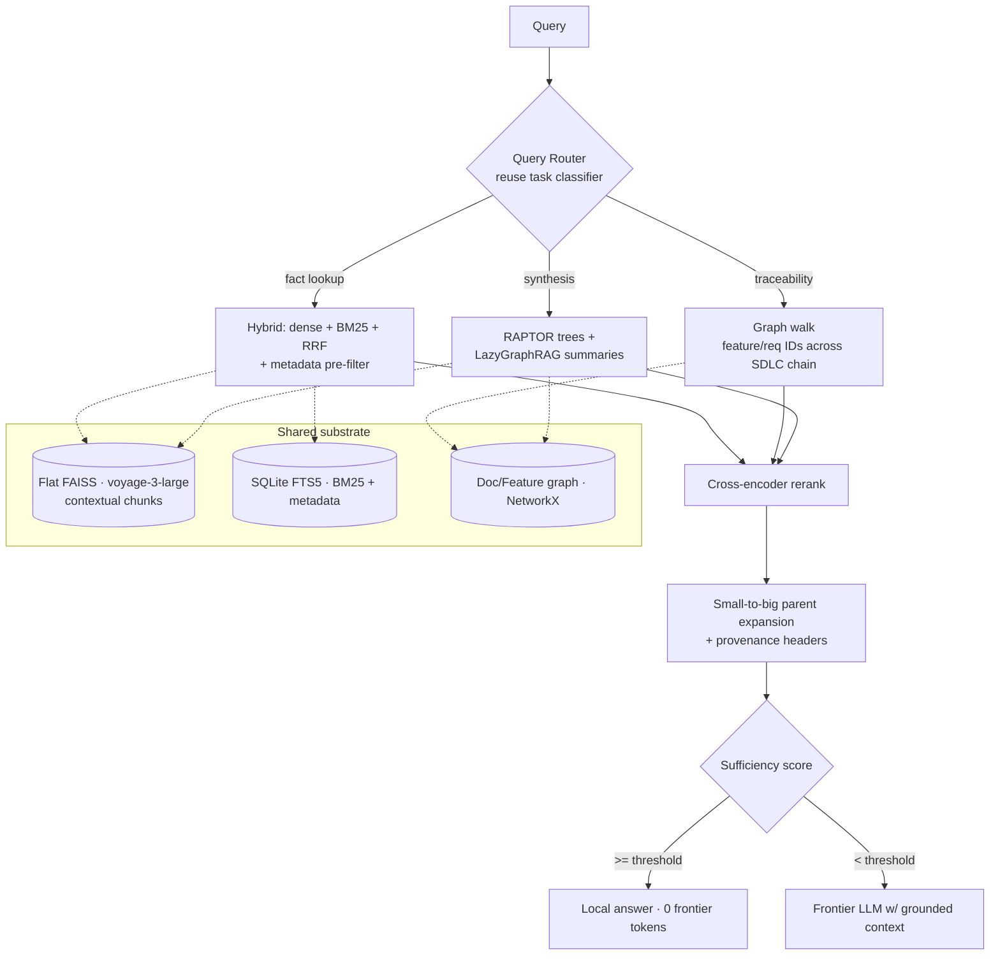

# KnowCode — SDLC Document-Collateral Retrieval Strategy

*Consolidated from design discussion (June 2026). Scope: extending KnowCode's retrieval substrate from **code** to **SDLC prose collateral** — Problem Statements, User Personas, PRDs, Architecture/HLD/LLD, Release Notes, User/Installation Guides, Support Manuals, Marketing Brochures, Product Feature Catalogs, Client Case Studies, Whitepapers — to maximize semantic-search and RAG quality over thousands of templated markdown documents, each thousands of lines long.*

> **Status:** Design proposal — not yet implemented
> **Owner:** Solo
> **Companion to:** [`reference_architecture.md`](../architecture/reference_architecture.md) · [`knowcode-architecture-synthesis.md`](./knowcode-architecture-synthesis.md) · [`retrieval-evals.md`](../retrieval-evals.md)
> **`[ASPIRATIONAL]`** items are target design, not shipped features — consistent with the `[HARDENED]` convention in the reference architecture.

---

## 0. Operating Constraints & Core Principle

**The four decisions that shaped this design** (from the requirements interview):

| Decision | Choice | Consequence |
|---|---|---|
| Deployment / privacy | **Hybrid** | Local storage + index; hosted embedding/rerank APIs for non-sensitive collateral; **local models for confidential docs** (PRDs, LLDs). LLM-in-the-loop indexing is permitted. |
| Primary consumer | **LLM / agent RAG** | Optimize **recall + context sufficiency + token budget**, not human-facing precision@k UX. Feeds the existing sufficiency-score → local-vs-frontier gate. |
| Query patterns | **All three** — fact lookup, cross-doc traceability, synthesis/comparison | Forces an **adaptive query router** over a shared substrate, not a single retrieval path. |
| Corpus structure | **Highly templated + rich frontmatter** | Structure is exploitable: section-aware chunking, metadata-filtered hybrid, mechanical cross-doc linking by `feature_id`/`requirement_id`. |

**The organizing principle: scale is not the constraint — quality is.**

- ~5,000 docs × ~3,000 lines ≈ **100–200M tokens ≈ ~500K chunks**. A flat FP32 index at 1024-dim is ~2 GB resident. It fits in RAM on a developer laptop.
- **Therefore the entire DiskANN/Vamana + RaBitQ machinery from [`knowcode-architecture-synthesis.md`](./knowcode-architecture-synthesis.md) is out of scope here.** Keep an exact flat index (zero quantization recall loss). Spend the whole complexity budget on retrieval quality: chunking, embeddings, context preservation, metadata, the document graph, and reranking.

**The prose analogue of "the source tree is authoritative": *document structure is the oracle of first resort.*** Because the corpus is templated, headings, frontmatter, and feature/requirement IDs are mechanically reliable signals — they are exploited *before* any embedding similarity is trusted, exactly as the code system trusts the AST before the vector arm.

---

## 1. Current Solution (As-Built, code-tuned)

What exists today is built for code and inherits the wrong defaults for prose.

### 1.1 Retrieval
- **Embedding:** `voyage-code-3` (1024-dim, **code-specialized**), correct asymmetric `document`/`query` input types.
- **Dense arm:** FAISS `IndexFlatIP` — exact, brute-force, RAM-resident.
- **Sparse arm:** in-flight migration to **SQLite FTS5 BM25 + WAL** (P0 of the code re-arch; replaces the placeholder set-intersection arm).
- **Fusion:** RRF (K=60, `alpha=0.5`) — tuned against the *old* sparse arm.
- **Rerank:** VoyageAI cross-encoder with signal-based fallback.
- **Expansion:** dependency-aware expansion over the NetworkX semantic graph (call/import/contains/inherits).

### 1.2 Eval (the discipline to preserve)
- Golden set `golden_v1.0.json` (60 queries), three-role **Author / Oracle / Adversary** pipeline, mechanical validation gate.
- Gates: Mean MRR ≥ 0.40, Recall@10 ≥ 0.50, File-Coverage@5 ≥ 0.50, easy-query P@1 = 1.0, LOCATE MRR ≥ 0.60, no zero-recall task type.
- **Known finding:** `sufficiency_score` is over-confident on the code corpus — `answer_correctness@0.8 = 0.571` across 7 routed records. Any prose port must re-measure this, not assume it.

### 1.3 What carries over (≈70% of the investment)
FAISS flat index · SQLite FTS5 BM25 · RRF (re-tuned) · VoyageAI rerank (upgraded) · NetworkX graph (extended) · task-type classifier (→ router) · three-role golden pipeline · sufficiency-score gate (re-calibrated).

---

## 2. Gaps for Prose (Gap Register)

| # | Gap | Category | Consequence |
|---|---|---|---|
| **D1** | `voyage-code-3` is code-specialized | Embedding/Quality | Wrong vector space for natural-language collateral; recall craters on prose intent |
| **D2** | Symbol/AST chunking doesn't apply; fixed windows would shred templated structure | Chunking/Quality | Splits tables, mixes unrelated sections, destroys the structure signal the corpus hands you for free |
| **D3** | Chunks lose document context | Context/Recall | A section of a 3,000-line PRD is ambiguous out of context; the dominant prose failure mode |
| **D4** | No metadata layer (`doc_type`, `product`, `version`, `audience`, `status`, dates) | Filtering/Precision | Cannot filter, cannot answer comparison/synthesis ("release notes v2 vs v3", "all healthcare case studies") |
| **D5** | Graph models code entities, not doc/feature/requirement entities | Graph/Capability | No cross-doc traceability — the highest-value query class is structurally unanswerable |
| **D6** | RRF/`alpha` tuned for identifier-heavy code | Fusion/Quality | Prose has less exact-token signal; blend optimum shifts dense-heavier |
| **D7** | No synthesis/abstraction layer | Synthesis/Capability | "Summarize" / "what changed" require map-reduce over many chunks; flat top-k can't |
| **D8** | Reranker + sufficiency-score calibrated on code | Eval/Calibration | Unknown behavior on prose; the 0.8 over-confidence finding may differ in sign and size |
| **D9** | No prose golden set | Eval/Process | No measurement, no regression gate, no calibration target for D1–D8 |

---

## 3. Candidate Solution Approaches

### 3.1 Structure-aware parent-child chunking *(fixes D2, D3)*
- Chunk on the **templated heading hierarchy** (H1→H2→H3), never fixed token windows. Keep tables, fenced code, mermaid, and lists **atomic**.
- **Small-to-big / parent-document retrieval:** embed the small leaf section (precision); return the parent section or whole doc (context).
- **Per-doc-type section schema:** tag each chunk with its canonical role from the template (a PRD `Non-Goals` ≠ `Requirements`) → enables section-targeted retrieval and is the join key for the graph (§3.5).
- Reuse and extend the existing markdown parser (already emits structural entities).

### 3.2 Prose embedding tier *(fixes D1)*
- **Cloud (non-sensitive):** `voyage-3-large` — top RAG tier, *same Voyage SDK already wired in* (minimal change). Alternatives: `Cohere embed-v4` (multimodal — diagrams/screenshots as images), `Gemini Embedding` (top MTEB).
- **Local (confidential PRDs/LLDs):** `Qwen3-Embedding` (8B/4B) — SOTA open weights, Matryoshka truncation, on-machine.
- One vector space per tier; tag chunk provenance with the embedding model. Do **not** mix embedders in one index.

### 3.3 Context preservation *(fixes D3 — the recall multiplier)*
- **Contextual Retrieval (Anthropic):** prepend a 50–100-token LLM-generated blurb to each chunk before embedding ("This is the rate-limiting section of the v2 Atlas PRD, which specifies…"). ~35% fewer retrieval failures (49% paired with contextual BM25). **Prompt-cache the doc**, generate per-chunk context → ~$1/M doc-tokens; run context generation on the **local model** for sensitive docs.
- **Cheaper zero-LLM alternatives:** `voyage-context-3` contextualized-chunk embeddings, or **late chunking** (embed the long doc, pool per-chunk). Less lift than full contextual retrieval; no per-chunk LLM call.

### 3.4 Metadata-filtered hybrid *(fixes D4, D6)*
- Reuse the in-flight SQLite FTS5 store; add columns `doc_type, product, version, date, audience, status, feature_id`. **Filter-then-search** collapses the candidate set before ANN — large precision win and the backbone of every synthesis/comparison query.
- Keep BM25 in the blend (prose still has exact tokens dense misses — product names, version strings, error codes, acronyms). **Re-tune RRF weights dense-heavier than the code config; measure, don't guess.**

### 3.5 Document / traceability graph *(fixes D5 — the moat)*
Extend NetworkX; do not rebuild. See §5 for the schema. Auto-builds a **requirements-traceability matrix** so "trace Feature X" is a graph walk, not a vector search. 2026 research in this exact space: **SAGE** (structure-aware graph expansion over heterogeneous data), **Orion-RAG** (path-aligned hybrid).

### 3.6 Reranking, prose-grade *(fixes D8 partial)*
- Retrieve top-100–200 → rerank → top-k; the p99 budget makes this near-free and it's the #1 precision lever after chunking.
- Models (Feb 2026 ELO leaders): `Zerank-2`, `Cohere Rerank 4 Pro`; stay in-house with `Voyage rerank-2.5` (`-lite` halves latency). Local/sensitive: `bge-reranker-v2-m3`.
- **Skip ColBERT** — 2026 consensus: bi-encoder + cross-encoder is simpler and quality-equivalent for this.

### 3.7 Synthesis & abstraction *(fixes D7)*
- **RAPTOR:** recursively cluster+summarize chunks into a per-doc (and per-collection) tree; retrieve at the right altitude. Natural fit for thousand-line docs and the existing Layer-7 abstraction-levels ambition.
- **LazyGraphRAG (Microsoft 2025):** community summaries + map-reduce over the graph, built at query time at ~0.1% of full-GraphRAG indexing cost. Fits the cost-aware hybrid posture.

### 3.8 Query router + gated agentic loop *(ties it together)*
- Reuse the task classifier as a **query router** (adaptive routing — match query complexity to pipeline complexity). Keep the cheap path cheap: agentic retrieval is waste on simple factual queries.
- Hard multi-hop: HyDE, multi-query/RAG-Fusion, decomposition; controlled-vocab expansion from the Feature Catalog/glossary. Wrap in **Self-RAG / Corrective-RAG gated by sufficiency score**: retrieve → grade → re-retrieve → escalate to frontier LLM only when score < threshold.

---

## 4. Recommendations & Prioritization

Prioritized by **leverage ÷ effort**, sequenced so each ships independently. The existing three-index seams (vector / FTS / graph) make these decoupled migrations, exactly as in the code re-arch.

| Priority | Action | Impact | Effort | Closes |
|---|---|---|---|---|
| **P0** | Structure-aware parent-child chunking + per-doc-type section schema | ★★★ | Low | D2, D3 |
| **P1** | Prose embedding tier (`voyage-3-large` cloud / `Qwen3-Embedding` local) + contextual retrieval | ★★★ | Low–Med | D1, D3 |
| **P2** | Metadata-filtered hybrid (reuse SQLite FTS5) + re-tuned RRF + prose reranker | ★★★ | Low | D4, D6, D8 |
| **P3** | Document / traceability graph (extend NetworkX) | ★★★ | Med–High | D5 |
| **P4** | Query router (reuse classifier) + adaptive paths | ★★ | Med | binds P0–P5 |
| **P5** | Synthesis layer — RAPTOR + LazyGraphRAG | ★★ | High | D7 |
| **X-cut** | **Prose golden set** + metrics + sufficiency re-calibration (§6) | — | Med | D8, D9 |
| **X-cut** | Agentic/iterative retrieval gated by sufficiency | ★ | Med | hard multi-hop |

**Why P0 first.** Structure-aware chunking is the largest single prose-quality lever and unblocks everything downstream (the section schema is the graph's join key). **Why P1–P2 next.** They capture most achievable discovery quality before any graph work — the 2026 field's own top-five ordering is chunking → hybrid → rerank → query-transform → eval. **Why the graph (P3) is the differentiator despite higher effort.** It is the one capability flat RAG can never replicate and it serves all three query classes (entry-point for fact lookup, traversal for traceability, subgraph scoping for synthesis).

**If you do only five things:** P0 chunking · P1 prose embedder · P1 contextual retrieval · P2 metadata-hybrid + reranker · P3 the graph — then prove all five on the prose golden set before tuning.

---

## 5. The Document / Traceability Graph (schema)

Extend the existing entity/relationship model. New entity kinds and edges:

```yaml
# New entity kinds (alongside code function|class|module|...)
DocEntity:
  kinds: [document, section, feature, requirement, persona,
          component, release, decision, client]
  source_location: { file, heading_path, line_range }
  doc_type: problem_statement | prd | architecture | hld | lld |
            release_notes | user_guide | install_guide | support_manual |
            brochure | feature_catalog | case_study | whitepaper
  metadata: { product, version, date, audience, status, feature_id, requirement_id }
  embeddings: vector            # contextualized chunk embedding
  content_hash: sha256          # rename/edit-resilient identity (reuse AD-7 pattern)

# New edges
Edges:
  structural:  document --contains--> section
  explicit:    section  --links_to--> {section|document}      # markdown links, ticket IDs
               document --implements--> requirement            # from frontmatter
               document --supersedes--> document               # version lineage
  derived:     {prd,hld,lld,release} --traces--> feature       # mechanical via feature_id
               requirement --satisfied_by--> component         # PRD→HLD join
               component --detailed_in--> section              # HLD→LLD join
               feature --documented_in--> {guide,case_study}   # downstream collateral
```

**Traceability walk (the headline capability):**
```
Problem Statement → PRD requirement → HLD component → LLD module
                  → Release Note → User Guide → Support article
```
Because the corpus is templated, the `feature_id`/`requirement_id` joins are **mechanical**, not LLM-inferred — the same "structure is the oracle" guarantee that makes the code AST trustworthy. Entity-link doc mentions to canonical nodes in the **Feature Catalog / Persona list**; that linkage doubles as the controlled vocabulary for query expansion (§3.8).

---

## 6. Evaluation Plan (prose golden set)

Reuse the three-role Author / Oracle / Adversary pipeline verbatim; the **Oracle reads documents instead of code**, and the mechanical gate resolves `(doc_id, heading_path, line_range)` and `feature_id` joins instead of AST symbols.

**Stratification:** `doc_type × query_type × difficulty`, where `query_type ∈ {fact_lookup, traceability, synthesis}` (replacing the code task types). Traceability and synthesis strata must be present from Phase 1 — they are where flat RAG fails and where the graph earns its keep.

**Record schema additions** (extend the existing `GoldenLabel`):
```json
{
  "query_type": "traceability",
  "expected_doc_spans": [{"doc_id": "...", "heading_path": "PRD > Requirements > Rate Limiting", "line_range": [..]}],
  "expected_trace_path": ["feature:atlas-ratelimit", "prd:...", "hld:...", "release:..."],
  "must_mention_facts": ["..."],
  "must_not_mention_facts": ["..."]
}
```

**Metrics (RAG-consumer-tuned):**
- Retrieval: **recall@k is primary** (a missed chunk = a wrong generated answer), plus nDCG@10, MRR.
- Traceability: **path-completeness** — fraction of the expected trace path recovered.
- Generation: **faithfulness / groundedness + citation accuracy** (RAGAS-style) over the assembled context.
- **Re-calibrate `sufficiency_score`** against prose answer-correctness; publish the reliability diagram. Do not port the 0.8 threshold — re-measure (the code finding was *over*-confident; prose may differ in sign).

**Field target to beat:** advanced RAG ≈ **63% factual accuracy vs ≈ 44% naive** (2026). The ladder in §4 is *how*; this harness is *how you prove* each rung.

---

## 7. Mapping onto the Reference Architecture

This reuses the existing layered design — it is an extension, not a parallel system.

| Layer | Extension for prose collateral |
|---|---|
| L1 Ingestion | Frontmatter + doc-type detection; provenance per document/version |
| L2 Parsing | Markdown heading-tree + table/code/diagram preservation (extend existing markdown parser) |
| L3 Semantic Graph | New doc/feature/requirement entities + traceability edges (§5) |
| **L4a Search/Index** | Prose embedder, parent-child chunks, contextual retrieval, metadata-filtered hybrid, re-tuned RRF, prose reranker |
| L7 Doc Synthesis | RAPTOR trees feed multi-level summaries (Executive→…→Section) |
| L9 Context Synthesis | Small-to-big assembly, per-chunk provenance headers (`[PRD v2 · §Rate Limiting · 2026-03]`), token budget |
| L10a/b Agent + MCP | Query router; new tools — `trace_feature`, `compare_docs`, `summarize_collection`; sufficiency re-calibrated |
| L11 Feedback | Prose golden set + drift detection (§6) |



---

## 8. Key Techniques & References

- **Contextual Retrieval** — Anthropic (Sept 2024). Per-chunk LLM context prefix; ~35%/49% fewer retrieval failures; prompt-cache to amortize.
- **Late Chunking** — Jina (2024). Long-context embed-then-pool; zero-LLM context preservation.
- **Parent-document / small-to-big retrieval** — embed small, return big; standard 2026 production pattern.
- **RAPTOR** — recursive clustering + abstractive summary tree; multi-altitude retrieval over long docs.
- **GraphRAG / LazyGraphRAG** — Microsoft (2024 / 2025). Community summaries; Lazy variant at ~0.1% indexing cost.
- **SAGE** (arXiv:2602.16964) — structure-aware graph expansion for heterogeneous data. **Orion-RAG** (arXiv:2601.04764) — path-aligned hybrid retrieval. Both directly relevant to the §5 graph.
- **Embedders (2026):** `voyage-3-large`, `Cohere embed-v4` (multimodal), `Gemini Embedding` (MTEB-top), `Qwen3-Embedding` (SOTA open, MRL).
- **Rerankers (2026):** `Zerank-2`, `Cohere Rerank 4 Pro`, `Voyage rerank-2.5`/`-lite`, `bge-reranker-v2-m3` (open).
- **Hybrid + RRF, Self-RAG, Corrective-RAG (CRAG), HyDE, RAG-Fusion** — query-adaptive retrieval orchestration.

---

*Sequencing in one line: **P0 chunking → P1 prose embedder + contextual retrieval → P2 metadata-hybrid + reranker** (most quality-per-effort), then **P3 the traceability graph** (the differentiator), then **P4 router → P5 synthesis**. Stand up the prose golden set in parallel and validate every rung on it — scale was never the problem; measured quality is the whole game.*
