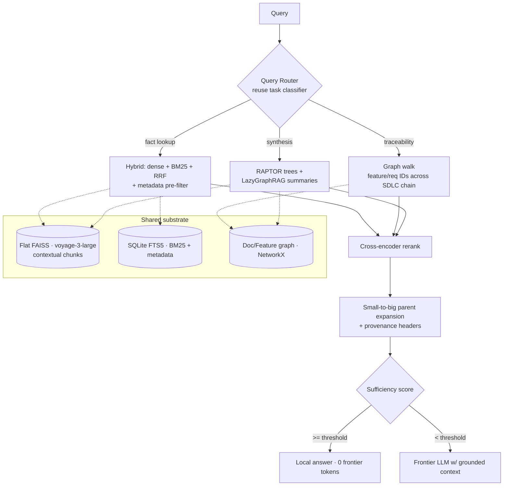

# KnowCode — SDLC Document-Collateral Retrieval Strategy

*Consolidated from design discussion (June 2026). Scope: extending KnowCode's retrieval substrate from **code** to **SDLC prose collateral** — Problem Statements, User Personas, PRDs, Architecture/HLD/LLD, Release Notes, User/Installation Guides, Support Manuals, Marketing Brochures, Product Feature Catalogs, Client Case Studies, Whitepapers — to maximize semantic-search and RAG quality over thousands of templated markdown documents, each thousands of lines long.*

> **Status:** P0 shipped (`src/knowcode/indexing/prose_chunker.py`). P1–P5 unbuilt. P-1 done: the eval harness in [`knowcode-evals`](https://github.com/deepakdgupta1/knowcode-evals) was re-bound to `7e9ca96` on 2026-09-09, and it now measures a **large retrieval regression on the code corpus**. Read §6.1 before starting P1.
> **Owner:** Solo
> **Companion to:** reference_architecture.md (archived) · [`knowcode-architecture-synthesis.md`](./knowcode-architecture-synthesis.md) · [`Testing & Evaluation`](../engineering/testing.md)
> **`[ASPIRATIONAL]`** items are target design, not shipped features — consistent with the `[HARDENED]` convention in the reference architecture.

---

## 0. Operating Constraints & Core Principle

**The four decisions that shaped this design** (from the requirements interview):

| Decision | Choice | Consequence |
|---|---|---|
| Deployment / privacy | **Hybrid** | Local storage + index; hosted embedding/rerank APIs for non-sensitive collateral; **local models for confidential docs** (PRDs, LLDs). LLM-in-the-loop indexing is permitted. |
| Primary consumer | **LLM / agent RAG** | Optimize **recall + context sufficiency + token budget**, not human-facing precision@k UX. Feeds the existing sufficiency-score → local-vs-frontier gate. |
| Query patterns | **All three** — fact lookup, cross-doc traceability, synthesis/comparison | Forces an **adaptive query router** over a shared substrate, not a single retrieval path. |
| Corpus structure | **Highly templated + rich frontmatter** | Structure is exploitable: section-aware chunking, metadata-filtered hybrid, mechanical cross-doc linking by `feature_id`/`requirement_id`. |

**The organizing principle: scale is not the constraint — quality is.**

- ~5,000 docs × ~3,000 lines ≈ **100–200M tokens ≈ ~500K chunks**. A flat FP32 index at 1024-dim is ~2 GB resident. It fits in RAM on a developer laptop.
- **Therefore the entire DiskANN/Vamana + RaBitQ machinery from [`knowcode-architecture-synthesis.md`](./knowcode-architecture-synthesis.md) is out of scope here.** Keep an exact flat index (zero quantization recall loss). Spend the whole complexity budget on retrieval quality: chunking, embeddings, context preservation, metadata, the document graph, and reranking.

**The prose analogue of "the source tree is authoritative": *document structure is the oracle of first resort.*** Because the corpus is templated, headings, frontmatter, and feature/requirement IDs are mechanically reliable signals — they are exploited *before* any embedding similarity is trusted, exactly as the code system trusts the AST before the vector arm.

---

## 1. Current Solution (As-Built, code-tuned)

What exists today is built for code and inherits the wrong defaults for prose.

### 1.1 Retrieval
- **Embedding:** `voyage-code-3` (1024-dim, **code-specialized**), correct asymmetric `document`/`query` input types.
- **Dense arm:** FAISS `IndexFlatIP` — exact, brute-force, RAM-resident.
- **Sparse arm:** in-flight migration to **SQLite FTS5 BM25 + WAL** (P0 of the code re-arch; replaces the placeholder set-intersection arm).
- **Fusion:** RRF (K=60, `alpha=0.5`) — tuned against the *old* sparse arm.
- **Rerank:** VoyageAI cross-encoder with signal-based fallback.
- **Expansion:** dependency-aware expansion over the NetworkX semantic graph (call/import/contains/inherits).

### 1.2 Eval (the discipline to preserve)
- Golden set `golden_v1.0.json` (60 queries), three-role **Author / Oracle / Adversary** pipeline, mechanical validation gate.
- Gates: Mean MRR ≥ 0.40, Recall@10 ≥ 0.50, File-Coverage@5 ≥ 0.50, easy-query P@1 = 1.0, LOCATE MRR ≥ 0.60, no zero-recall task type.
- **Known finding:** `sufficiency_score` is over-confident on the code corpus — `answer_correctness@0.8 = 0.571` across 7 routed records. Any prose port must re-measure this, not assume it.

### 1.3 What carries over (≈70% of the investment)
FAISS flat index · SQLite FTS5 BM25 · RRF (re-tuned) · VoyageAI rerank (upgraded) · NetworkX graph (extended) · task-type classifier (→ router) · three-role golden pipeline · sufficiency-score gate (re-calibrated).

---

## 2. Gaps for Prose (Gap Register)

| # | Gap | Category | Consequence |
|---|---|---|---|
| **D1** | `voyage-code-3` is code-specialized | Embedding/Quality | Wrong vector space for natural-language collateral; recall craters on prose intent |
| **D2** | Symbol/AST chunking doesn't apply; fixed windows would shred templated structure | Chunking/Quality | Splits tables, mixes unrelated sections, destroys the structure signal the corpus hands you for free |
| **D3** | Chunks lose document context | Context/Recall | A section of a 3,000-line PRD is ambiguous out of context; the dominant prose failure mode |
| **D4** | No metadata layer (`doc_type`, `product`, `version`, `audience`, `status`, dates) | Filtering/Precision | Cannot filter, cannot answer comparison/synthesis ("release notes v2 vs v3", "all healthcare case studies") |
| **D5** | Graph models code entities, not doc/feature/requirement entities | Graph/Capability | No cross-doc traceability — the highest-value query class is structurally unanswerable |
| **D6** | RRF/`alpha` tuned for identifier-heavy code | Fusion/Quality | Prose has less exact-token signal; blend optimum shifts dense-heavier |
| **D7** | No synthesis/abstraction layer | Synthesis/Capability | "Summarize" / "what changed" require map-reduce over many chunks; flat top-k can't |
| **D8** | Reranker + sufficiency-score calibrated on code | Eval/Calibration | Unknown behavior on prose; the 0.8 over-confidence finding may differ in sign and size |
| **D9** | No prose golden set | Eval/Process | No measurement, no regression gate, no calibration target for D1–D8 |
| **D10** | Retrieval has no score floor | Precision/Trust | `orchestrator._retrieve_context` takes the top `limit_entities` by rank whatever they score. The system cannot answer "not in this corpus"; an off-corpus query returns its nearest neighbour at full confidence |
| **D11** | `sufficiency_score` never sees the query | Eval/Calibration | `_calculate_sufficiency` scores template completeness of the assembled bundle. A perfectly assembled bundle about the wrong document scores ~0.96. Re-calibrating the 0.8 threshold (D8) cannot repair a score with no query term in it |
| **D12** | Frontmatter is assumed populated, never verified | Metadata/Trust | §0 treats rich frontmatter as given. Where ingestion defaults a field instead of deriving it, every metadata-weighted signal degenerates to a constant and the ranker silently loses that dimension |
| **D13** | `supersedes` is a graph edge (§5), not a ranking rule | Freshness/Correctness | A superseded PRD draft ranks equal to the current one and can answer as if current. Version lineage is modelled but never consulted at retrieval time |
| **D14** | No per-document normalization over a size-skewed corpus | Recall/Fairness | Chunk count is not evidence quality. A 3,000-line PRD outranks a one-page release note on volume alone, and small high-value collateral becomes unreachable |
| **D15** | ~~The `knowcode-evals` harness has drifted from HEAD~~ **Re-bound 2026-09-09.** Candidate generation misses half the corpus | Eval/Quality | Four of five gates fail. 67 of 139 expected entities never surface within 50 candidates over 345 indexed files, which corpus growth (155 → 338 files) does not explain. `sufficiency_score` rose `0.545 → 0.666` on identical records while accuracy halved, at an unchanged 0.8 threshold. The corpus is still `agent_curated_pending_human_review` and `routing_policy.sufficiency_threshold` still ships without a blessed policy |

### 2.1 Where D10–D15 came from

D1–D9 were derived from this corpus. D10–D15 come from auditing a shipped sibling system, the `gpt-actions-rag` RFP knowledge base in `docs/research/gpt-actions-rag/`. It solves the same shape of problem, grounded answers over templated business prose with citations, and it has been running against a real corpus long enough for its failure modes to surface. Reading them off a live system is cheaper than rediscovering them at P2.

The audit ran the system against its own ten-document corpus. Four findings transfer directly:

- **It cannot abstain.** Its relevance floor is a character-trigram Jaccard that is never zero between two English texts, so every query retrieves something. A question about Martian ground stations returned four sources at high scores and an answer about key rotation. KnowCode's orchestrator has the same structure and no floor at all, which is **D10**.
- **Its confidence measures the machinery, not the evidence.** It reports the score margin between hit one and hit two. Across five probes, nonsense scored 0.72 and a correct answer scored 0.74. `sufficiency_score` has the same defect in a different disguise, so it is **D11**. Note the known code-corpus finding in §1.2, `answer_correctness@0.8 = 0.571`. That is not a mis-set threshold, it is a score that cannot express the thing being thresholded.
- **Its governance metadata was defaulted at ingest, not derived.** All ten documents carried `doc_type=rfp_library`, `approved=True`, `source_priority=70`. Four of the eight ranking signals were therefore constants, and the pricing and legal risk gate could never fire. The dates were ingest dates, though the filenames carried real ones. This is **D12**, and the version halves of those same filenames give **D13**.
- **One document ate the corpus.** Two spreadsheets held 96.5% of 6,846 chunks. All five probes drew their entire top-3 from one of them, and the eight curated narrative documents holding the remaining 3.5% appeared in none of them. That is **D14**, and prose collateral has the same skew between a 3,000-line PRD and a one-page release note.

The fifth lesson is the one this repository already learned. That system has no tests and no eval, and every constant in its scoring product was hand-tuned against documents nobody can re-run. KnowCode built the harness that avoids exactly that and now keeps it in [`knowcode-evals`](https://github.com/deepakdgupta1/knowcode-evals). What remains is that the harness and the running code have drifted apart, which is **D15**.

---

## 3. Candidate Solution Approaches

### 3.1 Structure-aware parent-child chunking *(fixes D2, D3)*
- Chunk on the **templated heading hierarchy** (H1→H2→H3), never fixed token windows. Keep tables, fenced code, mermaid, and lists **atomic**.
- **Small-to-big / parent-document retrieval:** embed the small leaf section (precision); return the parent section or whole doc (context).
- **Per-doc-type section schema:** tag each chunk with its canonical role from the template (a PRD `Non-Goals` ≠ `Requirements`) → enables section-targeted retrieval and is the join key for the graph (§3.5).
- Reuse and extend the existing markdown parser (already emits structural entities).

### 3.2 Prose embedding tier *(fixes D1)*
- **Cloud (non-sensitive):** `voyage-3-large` — top RAG tier, *same Voyage SDK already wired in* (minimal change). Alternatives: `Cohere embed-v4` (multimodal — diagrams/screenshots as images), `Gemini Embedding` (top MTEB).
- **Local (confidential PRDs/LLDs):** `Qwen3-Embedding` (8B/4B) — SOTA open weights, Matryoshka truncation, on-machine.
- One vector space per tier; tag chunk provenance with the embedding model. Do **not** mix embedders in one index.

### 3.3 Context preservation *(fixes D3 — the recall multiplier)*
- **Contextual Retrieval (Anthropic):** prepend a 50–100-token LLM-generated blurb to each chunk before embedding ("This is the rate-limiting section of the v2 Atlas PRD, which specifies…"). ~35% fewer retrieval failures (49% paired with contextual BM25). **Prompt-cache the doc**, generate per-chunk context → ~$1/M doc-tokens; run context generation on the **local model** for sensitive docs.
- **Cheaper zero-LLM alternatives:** `voyage-context-3` contextualized-chunk embeddings, or **late chunking** (embed the long doc, pool per-chunk). Less lift than full contextual retrieval; no per-chunk LLM call.

### 3.4 Metadata-filtered hybrid *(fixes D4, D6)*
- Reuse the in-flight SQLite FTS5 store; add columns `doc_type, product, version, date, audience, status, feature_id`. **Filter-then-search** collapses the candidate set before ANN — large precision win and the backbone of every synthesis/comparison query.
- Keep BM25 in the blend (prose still has exact tokens dense misses — product names, version strings, error codes, acronyms). **Re-tune RRF weights dense-heavier than the code config; measure, don't guess.**

### 3.5 Document / traceability graph *(fixes D5 — the moat)*
Extend NetworkX; do not rebuild. See §5 for the schema. Auto-builds a **requirements-traceability matrix** so "trace Feature X" is a graph walk, not a vector search. 2026 research in this exact space: **SAGE** (structure-aware graph expansion over heterogeneous data), **Orion-RAG** (path-aligned hybrid).

### 3.6 Reranking, prose-grade *(fixes D8 partial)*
- Retrieve top-100–200 → rerank → top-k; the p99 budget makes this near-free and it's the #1 precision lever after chunking.
- Models (Feb 2026 ELO leaders): `Zerank-2`, `Cohere Rerank 4 Pro`; stay in-house with `Voyage rerank-2.5` (`-lite` halves latency). Local/sensitive: `bge-reranker-v2-m3`.
- **Skip ColBERT** — 2026 consensus: bi-encoder + cross-encoder is simpler and quality-equivalent for this.

### 3.7 Synthesis & abstraction *(fixes D7)*
- **RAPTOR:** recursively cluster+summarize chunks into a per-doc (and per-collection) tree; retrieve at the right altitude. Natural fit for thousand-line docs and the existing Layer-7 abstraction-levels ambition.
- **LazyGraphRAG (Microsoft 2025):** community summaries + map-reduce over the graph, built at query time at ~0.1% of full-GraphRAG indexing cost. Fits the cost-aware hybrid posture.

### 3.8 Query router + gated agentic loop *(ties it together)*
- Reuse the task classifier as a **query router** (adaptive routing — match query complexity to pipeline complexity). Keep the cheap path cheap: agentic retrieval is waste on simple factual queries.
- Hard multi-hop: HyDE, multi-query/RAG-Fusion, decomposition; controlled-vocab expansion from the Feature Catalog/glossary. Wrap in **Self-RAG / Corrective-RAG gated by sufficiency score**: retrieve → grade → re-retrieve → escalate to frontier LLM only when score < threshold.

---

## 4. Recommendations & Prioritization

Prioritized by **leverage ÷ effort**, sequenced so each ships independently. The existing three-index seams (vector / FTS / graph) make these decoupled migrations, exactly as in the code re-arch.

| Priority | Action | Impact | Effort | Closes |
|---|---|---|---|---|
| **P0** | Structure-aware parent-child chunking + per-doc-type section schema | ★★★ | Low | D2, D3 |
| **P1** | Prose embedding tier (`voyage-3-large` cloud / `Qwen3-Embedding` local) + contextual retrieval | ★★★ | Low–Med | D1, D3 |
| **P2** | Metadata-filtered hybrid (reuse SQLite FTS5) + re-tuned RRF + prose reranker | ★★★ | Low | D4, D6, D8 |
| **P3** | Document / traceability graph (extend NetworkX) | ★★★ | Med–High | D5 |
| **P4** | Query router (reuse classifier) + adaptive paths | ★★ | Med | binds P0–P5 |
| **P5** | Synthesis layer — RAPTOR + LazyGraphRAG | ★★ | High | D7 |
| **P-1** | ~~Re-bind `knowcode-evals` to HEAD~~ **DONE 2026-09-09.** Now: fix the ranking regression it exposed | ★★★ | Low → Med | D15 |
| **P1.5** | **Trust gate.** Retrieval score floor + query-aware sufficiency, both calibrated on the re-bound set | ★★★ | Low | D10, D11 |
| **P2+** | Metadata coverage assertion at ingest; supersession as a rank rule; per-document normalization | ★★ | Low–Med | D12, D13, D14 |
| **X-cut** | **Prose golden set** + metrics + sufficiency re-calibration (§6) | — | Med | D8, D9 |
| **X-cut** | Agentic/iterative retrieval gated by sufficiency | ★ | Med | hard multi-hop |

**Why P0 first.** Structure-aware chunking is the largest single prose-quality lever and unblocks everything downstream (the section schema is the graph's join key). **Why P1–P2 next.** They capture most achievable discovery quality before any graph work — the 2026 field's own top-five ordering is chunking → hybrid → rerank → query-transform → eval. **Why the graph (P3) is the differentiator despite higher effort.** It is the one capability flat RAG can never replicate and it serves all three query classes (entry-point for fact lookup, traversal for traceability, subgraph scoping for synthesis).

**Why P-1 preceded everything, and what it found.** P1 and P2 are tuning exercises. Every one of them sets a weight, a threshold, or a blend ratio, and none of those numbers means anything without a set to measure against. Re-binding took hours and immediately paid for itself: it exposed a halving of mean MRR that no one had noticed across 186 commits, because the only thing watching was a shape test that could not fail. Fix that regression before P1, or every prose number inherits a broken code ranker. The sibling audit in §2.1 is what an untested scoring product looks like after a year, and §6.1 is what a briefly unwatched one looks like after three months.

**Why P1.5 sits between the embedder and the hybrid.** D10 and D11 are each a small change in one function, and together they decide whether the system is allowed to say "I do not have this." Land them while the retrieval surface is still simple. Retrofitting an abstention contract after the router (P4) and the synthesis layer (P5) means threading it through three more paths.

**If you do only five things:** P-1 re-bind the harness · P0 chunking · P1 prose embedder · P1 contextual retrieval · P1.5 the trust gate. Then prove each on the prose golden set before tuning anything.

---

## 5. The Document / Traceability Graph (schema)

Extend the existing entity/relationship model. New entity kinds and edges:

```yaml
# New entity kinds (alongside code function|class|module|...)
DocEntity:
  kinds: [document, section, feature, requirement, persona,
          component, release, decision, client]
  source_location: { file, heading_path, line_range }
  doc_type: problem_statement | prd | architecture | hld | lld |
            release_notes | user_guide | install_guide | support_manual |
            brochure | feature_catalog | case_study | whitepaper
  metadata: { product, version, date, audience, status, feature_id, requirement_id }
  embeddings: vector            # contextualized chunk embedding
  content_hash: sha256          # rename/edit-resilient identity (reuse AD-7 pattern)

# New edges
Edges:
  structural:  document --contains--> section
  explicit:    section  --links_to--> {section|document}      # markdown links, ticket IDs
               document --implements--> requirement            # from frontmatter
               document --supersedes--> document               # version lineage
  derived:     {prd,hld,lld,release} --traces--> feature       # mechanical via feature_id
               requirement --satisfied_by--> component         # PRD→HLD join
               component --detailed_in--> section              # HLD→LLD join
               feature --documented_in--> {guide,case_study}   # downstream collateral
```

**Traceability walk (the headline capability):**
```
Problem Statement → PRD requirement → HLD component → LLD module
                  → Release Note → User Guide → Support article
```
Because the corpus is templated, the `feature_id`/`requirement_id` joins are **mechanical**, not LLM-inferred — the same "structure is the oracle" guarantee that makes the code AST trustworthy. Entity-link doc mentions to canonical nodes in the **Feature Catalog / Persona list**; that linkage doubles as the controlled vocabulary for query expansion (§3.8).

---

## 6. Evaluation Plan (prose golden set)

Reuse the three-role Author / Oracle / Adversary pipeline verbatim; the **Oracle reads documents instead of code**, and the mechanical gate resolves `(doc_id, heading_path, line_range)` and `feature_id` joins instead of AST symbols.

**Stratification:** `doc_type × query_type × difficulty`, where `query_type ∈ {fact_lookup, traceability, synthesis}` (replacing the code task types). Traceability and synthesis strata must be present from Phase 1 — they are where flat RAG fails and where the graph earns its keep.

**Record schema additions** (extend the existing `GoldenLabel`):
```json
{
  "query_type": "traceability",
  "expected_doc_spans": [{"doc_id": "...", "heading_path": "PRD > Requirements > Rate Limiting", "line_range": [..]}],
  "expected_trace_path": ["feature:atlas-ratelimit", "prd:...", "hld:...", "release:..."],
  "must_mention_facts": ["..."],
  "must_not_mention_facts": ["..."]
}
```

**Metrics (RAG-consumer-tuned):**
- Retrieval: **recall@k is primary** (a missed chunk = a wrong generated answer), plus nDCG@10, MRR.
- Traceability: **path-completeness** — fraction of the expected trace path recovered.
- Generation: **faithfulness / groundedness + citation accuracy** (RAGAS-style) over the assembled context.
- **Re-calibrate `sufficiency_score`** against prose answer-correctness; publish the reliability diagram. Do not port the 0.8 threshold — re-measure (the code finding was *over*-confident; prose may differ in sign).

**Field target to beat:** advanced RAG ≈ **63% factual accuracy vs ≈ 44% naive** (2026). The ladder in §4 is *how*; this harness is *how you prove* each rung.

### 6.1 The harness lives in `knowcode-evals` and has drifted from HEAD

The harness is not in this repository. It owns the golden datasets, the scorer, calibration, and the evaluation docs, and it lives in [`knowcode-evals`](https://github.com/deepakdgupta1/knowcode-evals). KnowCode consumes its policy artifacts and produces none of its own, as [`routing_policy.py`](../../src/knowcode/routing_policy.py) states. `docs/roadmap.md` and `docs/engineering/testing.md` carry the same pointer. Look there first. The `tests/eval/` path in this repository holds nothing but stale `__pycache__`, which reads like a deleted harness and is not one.

The prose scaffold survived the split intact and sits at `tests/eval/prose/` in that repository, holding `phase1_plan.json`, `golden_v0.schema.json`, and three placeholder records. Its own README marks it **SPEC ONLY, awaiting corpus**. Nothing there runs in CI because no prose corpus exists yet. D9 stands exactly as written.

**The re-bind ran on 2026-09-09 (P-1 complete).** The golden set was authored at `2ae419e` and is now bound to `7e9ca96`. Three things were wrong and are fixed in `knowcode-evals`. The harness resolved its KnowCode checkout by walking up three parents, which pointed at the evals repo itself after the split; it now takes `KNOWCODE_REPO`. Eight records had labels that no longer resolved, five re-pointed to renamed symbols and two retired because every entity they name moved into `knowcode-evals`. KnowCode's entity IDs became module-qualified (`markdown_parser.MarkdownParser`), which silently zeroed every entity metric until the scorer learned to strip the qualifier.

**Retrieval has measurably regressed on the code corpus.** Over the 58 active records against `7e9ca96`, four of five gates fail.

| Metric | Gate | `2ae419e` | `7e9ca96` | |
|---|---|---|---|---|
| mean MRR | ≥ 0.40 | 0.693 | **0.344** | FAIL |
| mean Recall@10 | ≥ 0.50 | 0.684 | **0.462** | FAIL |
| mean file coverage@5 | ≥ 0.50 | 0.761 | 0.622 | PASS |
| mean precision@1 | — | 0.517 | 0.190 | |
| local routing rate | — | 0.117 | 0.241 | |

On the 58 records common to both runs the figures are 0.682 then 0.344 for MRR, and 0.500 then 0.190 for precision@1.

**One confound governs how much of that delta is code.** Indexable source files went 155 at `2ae419e` to 338 at `7e9ca96`, so the corpus more than doubled between measurements. A doubled candidate pool depresses MRR and recall@10 by itself. The headline delta is therefore not a clean regression measurement.

**The part corpus growth cannot explain is the failure mode.** Widening retrieval to 50 candidates lifts recall only from 0.462 to 0.632. Sixty-seven of 139 expected entities never surface at all, out of 345 indexed files. Of the 72 that do, median rank is 5 and 39 sit in the top 5. Ranking is healthy for what it finds, and **candidate generation is what fails**. Blend mistuning is ruled out: `alpha` is the dense weight, and sweeping it yields MRR 0.344 at 0.2, 0.137 at 0.5, and 0.000 at 0.8, so the current sparse-heavy setting is already near-best. The open hypothesis is that the dense arm is not merely unhelpful but broken, since a clean 0.000 is collapse rather than degradation while the vector store holds 7,474 vectors.

**The sufficiency finding is the robust one, and it is D11 measured rather than argued.** `sufficiency_score` rose 0.545 to 0.666 on identical records while accuracy halved, with `sufficiency_threshold` unchanged at 0.8 at both commits. Corpus growth makes the task harder, so a working confidence signal should have fallen. This one rose. A score that moves opposite to correctness cannot be repaired by moving its threshold, which is precisely the distinction between D8 and D11.

**The corpus is still calibration-only, and the threshold it should have blessed is still shipping.** The dataset carries `dataset_status: agent_curated_pending_human_review`, it is not a locked holdout, and no blessed `machine-verification.json` policy has been issued from it. `routing_policy.sufficiency_threshold` is live regardless. That is the §2.1 pattern in its milder form. The gate runs ahead of its evidence rather than without it.

P1 now starts from a working instrument and a known-bad number. Fix the ranking regression before tuning anything prose-side, or every prose measurement inherits it.

### 6.2 Metrics the sibling audit adds

Three metrics that D9's original plan did not carry. Each one exists because the audited system passed every check it had and still failed in the field.

- **Abstention rate on off-corpus queries.** Stratify a deliberate off-corpus slice into the golden set, queries whose answer is provably absent. The metric is the fraction correctly refused. Without this slice a retrieval system scores well by answering everything, which is exactly how the audited system reached production. Target it before tuning recall, because recall and abstention trade against each other and only measuring one of them hides the trade.
- **Sufficiency reliability, not sufficiency accuracy.** Bin predicted `sufficiency_score` against observed answer-correctness and publish the diagram. A score whose bins are flat is not mis-calibrated, it is uninformative, and no threshold rescues it. This is the check that distinguishes D8 (wrong threshold) from D11 (wrong score).
- **Source concentration.** Per query, the share of the returned context drawn from a single document, and across the set, the fraction of the corpus that is ever reachable in a top-k. In the audited corpus, 8 of 10 documents never surfaced across five probes, and no metric it collected would have said so.

---

## 7. Mapping onto the Reference Architecture

This reuses the existing layered design — it is an extension, not a parallel system.

| Layer | Extension for prose collateral |
|---|---|
| L1 Ingestion | Frontmatter + doc-type detection; provenance per document/version |
| L2 Parsing | Markdown heading-tree + table/code/diagram preservation (extend existing markdown parser) |
| L3 Semantic Graph | New doc/feature/requirement entities + traceability edges (§5) |
| **L4a Search/Index** | Prose embedder, parent-child chunks, contextual retrieval, metadata-filtered hybrid, re-tuned RRF, prose reranker |
| L7 Doc Synthesis | RAPTOR trees feed multi-level summaries (Executive→…→Section) |
| L9 Context Synthesis | Small-to-big assembly, per-chunk provenance headers (`[PRD v2 · §Rate Limiting · 2026-03]`), token budget |
| L10a/b Agent + MCP | Query router; new tools — `trace_feature`, `compare_docs`, `summarize_collection`; sufficiency re-calibrated |
| L11 Feedback | Prose golden set + drift detection (§6) |



---

## 8. Key Techniques & References

- **Contextual Retrieval** — Anthropic (Sept 2024). Per-chunk LLM context prefix; ~35%/49% fewer retrieval failures; prompt-cache to amortize.
- **Late Chunking** — Jina (2024). Long-context embed-then-pool; zero-LLM context preservation.
- **Parent-document / small-to-big retrieval** — embed small, return big; standard 2026 production pattern.
- **RAPTOR** — recursive clustering + abstractive summary tree; multi-altitude retrieval over long docs.
- **GraphRAG / LazyGraphRAG** — Microsoft (2024 / 2025). Community summaries; Lazy variant at ~0.1% indexing cost.
- **SAGE** (arXiv:2602.16964) — structure-aware graph expansion for heterogeneous data. **Orion-RAG** (arXiv:2601.04764) — path-aligned hybrid retrieval. Both directly relevant to the §5 graph.
- **Embedders (2026):** `voyage-3-large`, `Cohere embed-v4` (multimodal), `Gemini Embedding` (MTEB-top), `Qwen3-Embedding` (SOTA open, MRL).
- **Rerankers (2026):** `Zerank-2`, `Cohere Rerank 4 Pro`, `Voyage rerank-2.5`/`-lite`, `bge-reranker-v2-m3` (open).
- **Hybrid + RRF, Self-RAG, Corrective-RAG (CRAG), HyDE, RAG-Fusion** — query-adaptive retrieval orchestration.

---

*Sequencing in one line: **P-1 re-bind the harness → P0 chunking → P1 prose embedder + contextual retrieval → P1.5 the trust gate → P2 metadata-hybrid + reranker** (most quality-per-effort), then **P3 the traceability graph** (the differentiator), then **P4 router → P5 synthesis**. Validate every rung on the prose golden set as you land it. Scale was never the problem. Measured quality is the whole game, and §2.1 is what happens to a scoring system that never gets measured.*
