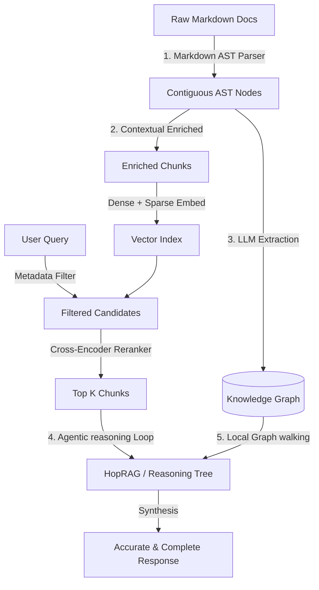

# **Reference Evaluation: Semantic Understanding of Long Prose Documents**

---

## **1. Problem Statement**
The goal is to achieve **deep semantic understanding of textual prose** inside a large corpus (thousands of files) of long markdown documents (each containing thousands of lines of English text). Within this corpus, critical relationships may exist between text chunks that are far apart within the same document (intra-document) or across different files (inter-document).

### **Why the Current KnowCode Architecture Fails**
KnowCode was designed as a code intelligence system, making it structurally and parser-wise incompatible with this use-case in its current implementation:
1. **Shallow Parser:** `MarkdownParser` (`src/knowcode/parsers/markdown_parser.py`) only parses heading hierarchies and captures a 500-character description for the document. The actual body prose of the headings is completely ignored and never stored in the semantic graph.
2. **Brittle Code-Centric Chunker:** In `Chunker` (`src/knowcode/indexing/chunker.py`), any line starting with `import `, `from `, `class `, or `def ` (common in documentation code blocks) prematurely truncates the file chunk, discarding the remaining prose. Furthermore, large files are not split into logical overlapping paragraphs, resulting in massive, single-vector chunks that lose semantic density or exceed embedding limits.
3. **Graph Resolution Mismatch:** The chunker tags monolithic document chunks with a hardcoded `f"{file_path}::module"` ID. However, the graph database stores the document as `f"{file_path}::{doc_name}"`. In `RetrievalOrchestrator` (`src/knowcode/retrieval/orchestrator.py`), this mismatch causes a silent lookup failure, and the actual document prose is never returned to the context bundle.

### **General Technical & Non-Technical Challenges**
* **Semi-Structured Noise:** Flattening markdown tables destroys row-column relationships. Incomplete code block chunking leads to syntax errors, and LaTeX math formulas get corrupted.
* **Context Fragmentation & Anaphora:** Chunks lose referential context when pronouns (*"it"*, *"they"*, *"this component"*) are severed from their nouns pages earlier.
* **Temporal and Version Drift:** Overwriting older guidelines with new documentation releases causes the LLM to retrieve deprecated data and hallucinate.
* **Chronological Incoherence:** Dense retrieval processes chunks out of order, rendering cause-and-effect reasoning impossible for narrative prose.
* **Document-Level Retrieval Mismatch (DRM):** In legal or boilerplate documents, structurally identical text causes the retriever to retrieve the right clause from the wrong client's document.

---

## **2. Solution Alternatives**

We evaluate four primary architectures designed to solve these challenges:

### **Alternative A: Knowledge Graph RAG (GraphRAG / SOTA 2026)**
* **Paradigms:** **OMD-GraphRAG** (Ontology-Guided Extraction) and **EHRAG** (Hypergraph RAG).
* **Concept:** Uses LLMs to extract entities and relations into a unified Knowledge Graph, which is clustered into hierarchical communities.

### **Alternative B: Recursive Abstractive Trees (RAPTOR)**
* **Concept:** Recursively clusters text chunks using semantic embeddings and generates abstractive summaries for each cluster, forming a multi-layer tree index.

### **Alternative C: Agentic Iterative Retrieval (HopRAG / CS-RAG)**
* **Concept:** Employs an LLM agent in a reasoning loop to decompose queries and retrieve documents step-by-step, validating intermediate facts.

### **Alternative D: Contextual AST Chunking (Anthropic Contextual Retrieval + Markdown AST)**
* **Concept:** Parses markdown into an Abstract Syntax Tree (preserving tables and equations) and pre-pends a localized context header to every chunk before embedding.

---

## **3. Pros and Cons of Alternatives**

| Alternative | Pros | Cons |
| :--- | :--- | :--- |
| **A. GraphRAG** | • Resolves cross-document relations. • Excellent for multi-hop questions. • Disambiguates entities (resolves homonyms). | • High indexing costs and LLM extraction overhead. • Slow query times if graph clustering is naive. |
| **B. RAPTOR** | • Retains overarching document themes. • Bridges high-level and low-level questions. • Low runtime latency. | • Requires recursive summary generation at indexing time. • Can miss exact entity-to-entity paths. |
| **C. Agentic RAG** | • Reconstructs chronological timelines. • High accuracy via step-by-step verification. • Deconstructs complex queries. | • High query latency and token consumption. • Prone to agent loop failures or infinite loops. |
| **D. Contextual AST** | • Zero pronoun/anaphora reference loss. • Preserves tables, code, and LaTeX math intact. • Low complexity and setup overhead. | • Cannot perform complex multi-hop reasoning alone. • Large index footprint (extended text per chunk). |

---

## **4. Ranking by Effectiveness**

1. **Rank 1: GraphRAG (SOTA 2026 - OMD/EHRAG)** — Indispensable for discovering hidden connections across thousands of documents.
2. **Rank 2: Agentic Multi-Hop Retrieval (HopRAG / CS-RAG)** — Best for temporal timelines, chronological events, and high-accuracy verification.
3. **Rank 3: Recursive Summarization Trees (RAPTOR)** — Best for high-level document summarization and avoiding context window dilution.
4. **Rank 4: Contextual AST Chunking** — Crucial foundational layer to fix local chunk context, tables, and pronoun references.

---

## **5. Final Recommendations**

To build a premium, state-of-the-art solution, a **stacked multi-layered architecture** is recommended:

### **Roadmap for Implementation**
* **Short-Term (Foundational):** Replace the parser with a Markdown AST parser, resolve the `f"{file_path}::module"` ID mismatch in KnowCode, and implement **Contextual Chunking** to preserve tables and pronouns.
* **Medium-Term (Reasoning):** Integrate an **Agentic multi-hop retrieval loop** to handle chronological timeline verification and complex multi-document questions.
* **Long-Term (Relational):** Implement a lightweight **Hypergraph RAG (EHRAG)** layer to index entities and extract semantic connections across the corpus.
