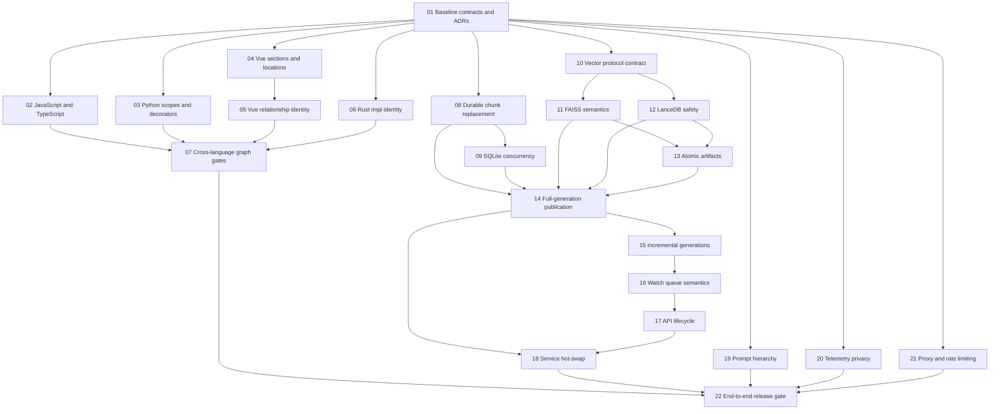

# KnowCode Parser, Concurrency, and Security Hardening Blueprint

> **Status:** Ready for execution
>
> **Baseline reviewed:** `main` at `d239b22` on 2026-08-12
>
> **Default branch:** `main`
>
> **Execution model:** one numbered step per session and normally one pull
> request per step
>
> **Primary objective:** make code extraction, live indexing, persistence, and
> LLM/API security behavior correct under realistic syntax, failures,
> concurrency, crashes, and adversarial inputs.

## How to Use This Plan

Every implementation session must select exactly one **ready** step from this
document. A step is ready only when all listed dependencies are complete. A
fresh agent should be able to execute a step using its context brief without
needing the conversation that produced this plan.

At the beginning of a session:

1. Read this plan, the repository `AGENTS.md` instructions supplied to Codex,
   and every file named in the selected step.
2. Rebase the understanding on current `main`; do not assume the baseline
   commit above is still current.
3. Update the selected step from `[ ]` to `[~]` and add the branch and start
   date to the execution ledger.
4. Create `codex/hardening-sNN-<short-name>` from current `main`.
5. Add the smallest test that reproduces the defect and run it to prove it
   fails for the expected reason before changing production code.
6. Implement only the selected step, refactor after green, and run its focused
   and global gates.
7. Update the step's evidence and the execution ledger, mark it `[x]`, and
   stop. Do not opportunistically begin another step.

Status markers:

- `[ ]` not started
- `[~]` in progress
- `[x]` complete and merged
- `[!]` blocked; the ledger must state the blocker and evidence
- `[-]` deliberately skipped by an approved plan mutation

Each PR should contain one logical change and use the repository's conventional
commit format. The PR must include the red-test evidence, the verification
commands run, migration or compatibility impact, and rollback instructions.

## Current Evidence and Corrected Scope

The focused review reproduced the following behavior against the baseline:

- TypeScript files containing exported interfaces, aliases, enums, classes,
  functions, and arrow functions produced only the module entity.
- `class Child extends Parent` produced no JavaScript `INHERITS` edge.
- Vue script declarations on different lines were all assigned the script
  tag's line; root `<template ...>` attributes prevented template extraction.
- Vue Composition API entities used `::function::` and `::ref::` IDs while
  template/CSS relationships targeted nonexistent `::method::` and `::data::`
  IDs.
- Rust impl relationships used nonexistent `type::` and `trait::` endpoints.
- Python skipped nested definitions and module assignments, omitted decorators,
  and attributed calls from an unextracted nested function to its outer scope.
- A failed or ordinary watched-file replacement can delete SQLite chunk rows
  while stale vectors remain. A reproduced removal changed repository/vector
  counts from `(1, 1, 1)` to `(0, 1, 1)` and dense search still returned the
  deleted chunk ID.
- FAISS logical removal left `count=1`, `index.ntotal=2`, caused top-1 search
  to return no live result, and returned the live vector only when overfetched.
- A shared SQLite connection exposed an uncommitted row to another thread,
  while a separate WAL connection preserved isolation.
- LanceDB accepted `x' OR true --` as an injected ID predicate; read returned
  another vector and delete removed all rows in the isolated repro table.
- Uvicorn's trusted-localhost proxy middleware rewrote the rate-limit key from
  a spoofed `X-Forwarded-For` value even though SlowAPI itself keys on
  `request.client.host`.
- Full `analyze()` deletes the live semantic-index directory before its
  replacement is proven, commits `knowledge.db` before attempting the semantic
  rebuild, and tolerates index failure. `reload()` refreshes only the knowledge
  store. A full rebuild can therefore publish a new graph with an old or absent
  chunk/vector index and destroy the last good semantic generation.
- 158 focused tests passed despite these reproduced defects, proving that the
  missing layer is semantic and failure/concurrency assertions rather than
  simple test volume.

Scope corrections that this plan preserves:

- JSON knowledge-store persistence is non-atomic, but SQLite is the normal
  current build path; JSON hardening remains necessary without treating it as
  the only production store.
- `VectorStore.remove()` is defective, but current re-indexing does not call
  it. The live production defect is the wider repository/vector split-brain
  replacement flow.
- `slowapi.util.get_remote_address` does not directly trust
  `X-Forwarded-For`; Uvicorn proxy-header configuration is the actual boundary.

## Target Invariants

These invariants are release gates, not design aspirations.

### Parser and graph invariants

1. Every supported declaration form in the committed language fixtures is
   either extracted or produces a visible, classified parser limitation; it is
   never silently dropped.
2. Every entity has a canonical ID derived from normalized file identity and a
   scope-aware qualified name.
3. Every internal `CONTAINS` endpoint resolves to a real entity.
4. Internal `INHERITS`, `IMPLEMENTS`, `CALLS`, `REFERENCES`, and `USES_TYPE`
   endpoints resolve to real entities. Unresolved/external references use an
   explicit reference namespace and cannot masquerade as internal IDs.
5. Locations use one-based lines and point to the complete declaration. For a
   decorated Python declaration, this includes its first decorator.
6. Calls are assigned only to the lexical scope that contains them; visitors
   do not leak across nested definition boundaries.
7. Parser output is deterministic across repeated runs and independent of
   filesystem scan order.

### Indexing and persistence invariants

1. A previous file generation remains fully searchable until parsing,
   chunking, and embedding of its replacement have all succeeded.
2. A committed generation has matching chunk and vector membership. Deleted
   chunk IDs cannot occupy dense top-k slots, and duplicate IDs cannot bias
   fusion scores.
3. One normalized file identity is used by scanner, parser entities,
   repository rows, manifests, watch events, and removal.
4. Search observes one committed generation across `knowledge.db`, the chunk
   repository, vectors, and manifest; it cannot combine artifacts from
   different full or incremental rebuilds.
5. Process and thread concurrency cannot expose uncommitted rows, close a live
   connection, lose a buffered vector, or mutate an index during an unlocked
   search.
6. Watch shutdown drains or explicitly rejects queued work, flushes durable
   state, and closes resources deterministically.
7. Every replace-style artifact write is same-directory temporary write,
   flush, file `fsync`, atomic `os.replace`, and parent-directory `fsync` where
   the platform supports it.
8. Schema and generation drift fail closed with a clear rebuild or migration
   instruction.

### Security and privacy invariants

1. Repository-derived IDs are data, never executable filter syntax.
2. Stable model instructions occupy the provider's system-instruction channel;
   retrieved code and user text are explicitly untrusted data.
3. Raw user queries, tokens, credentials, and common secret formats are not
   persisted by default. Telemetry is local, bounded, permission-restricted,
   and deletable.
4. The direct local server does not trust forwarded headers. Proxy trust is
   explicit, narrow, documented, and tested through the actual server stack.
5. Security fixes are verified with hostile inputs and negative assertions,
   not only happy-path tests.

## Architectural Decisions to Resolve Early

Step 01 must turn these recommendations into short ADRs or equivalent design
notes before storage/index mutation work begins:

1. **Canonical identity:** retain `file_path::qualified_name`, but introduce a
   single identity builder and an explicit unresolved-reference representation.
   Do not create ad hoc namespaces such as `type::Foo` for entities that should
   already exist.
2. **File paths:** normalize once at the scanner boundary with a documented
   symlink policy. Never mix unresolved `/var/...` paths and resolved
   `/private/var/...` paths.
3. **SQLite concurrency:** prefer one connection per worker/request context in
   WAL mode plus a serialized writer transaction. Do not share one connection
   across unrelated threads with only write-method locks.
4. **Embeddings:** persist enough embedding data or a rebuildable durable
   representation in the chunk repository so vector recovery never depends on
   transient `CodeChunk.embedding` fields.
5. **Index commit:** build a complete generation outside the write lock,
   validate `knowledge.db`, chunks, vectors, and manifest together, then
   atomically publish one generation pointer under the write lock. Incremental
   updates use the same generation contract. Startup, `ensure_index()`, and
   reload must reject or recover mismatches rather than mix artifacts. If a
   vector operation fails after a SQLite transaction, rebuild from durable
   committed chunks before readers can observe that generation.
6. **Telemetry:** aggregate metadata is the default. Raw query capture is an
   explicit, documented opt-in rather than a redaction-only default.
7. **Proxy headers:** disabled for the normal local server. A future proxy mode
   must require an explicit trusted-proxy list.

## Dependency Graph and Parallelism

The user intends sequential, one-step sessions. The graph still identifies
independent ready work so a later plan mutation or team execution does not
invent unsafe ordering.



After Step 01, Steps 02, 03, 04, 06, 08, 10, 19, 20, and 21 are logically
independent. Steps that touch shared identity, protocol, storage, or service
files must still be rebased after their prerequisites merge.

## Issue-to-Step Traceability

| Reviewed issue | Primary step(s) | Final proof |
| --- | --- | --- |
| C2 TypeScript exports | 02 | 07, 22 |
| C2 JavaScript inheritance | 02 | 07, 22 |
| C2 Python nesting/decorators/module variables | 03 | 07, 22 |
| C2 Vue template extraction and locations | 04 | 07, 22 |
| C2 Vue dangling Composition API edges | 05 | 07, 22 |
| C2 Rust dangling impl edges | 06 | 07, 22 |
| C4 remove-before-index/data loss | 08, 14, 15 | 16, 22 |
| Path identity mismatch during removal | 01, 08 | 22 |
| SQLite shared-connection races | 09 | 14, 15, 18, 22 |
| Repository/vector generation split-brain | 08, 10–15 | 18, 22 |
| Full rebuild publication split-brain | 13, 14 | 18, 22 |
| C6 non-atomic JSON save and related artifacts | 13 | 14, 22 |
| C7 FAISS logical removal corruption | 10, 11 | 15, 22 |
| LanceDB buffer/index synchronization | 10, 12 | 15–18, 22 |
| C5 LanceDB filter injection | 12 | 22 |
| Watch queue ordering/retry/data loss | 16 | 17, 18, 22 |
| API shutdown/buffer loss | 17 | 18, 22 |
| Service lazy-load/reload races | 18 | 22 |
| C8 prompt hierarchy | 19 | 22 |
| C9 raw-query telemetry | 20 | 22 |
| C10 forwarded-header rate-limit bypass | 21 | 22 |

## Global Verification Gates

Every step runs its focused commands plus the following before merge unless
the step explicitly documents why a command is inapplicable:

```bash
uv run ruff check .
uv run mypy src/
uv run pytest -q
uv run mkdocs build --strict
git diff --check
```

Additional global rules:

- No real embedding or LLM network call in unit/integration tests.
- Concurrency tests use barriers/events and bounded joins, not timing-only
  sleeps as their correctness mechanism.
- Security tests use isolated temporary stores and never target user data.
- New critical code paths require branch/error-path coverage, not just line
  coverage. Changed-code coverage target is at least 90% for parsers, storage,
  index mutation, telemetry, prompt construction, and rate limiting.
- Before push, inspect `git diff` for unrelated user changes and secrets.

## Execution Steps

### [x] Step 01 — Freeze contracts, fixtures, and architectural decisions

**Execution tier:** strongest available model; architecture-heavy review.

**Branch:** `codex/hardening-s01-contracts`

**Dependencies:** none.

**Context brief:** The existing suite has many feature tests but often asserts
only counts or ID substrings. There is no reusable distinction between internal
and external/reference endpoints, no canonical file-identity helper shared by
all layers, and no written commit/recovery contract for chunk/vector updates.
Later steps must not invent incompatible local fixes.

**Primary files:** `src/knowcode/utils/entity_identity.py`,
`src/knowcode/protocols.py`, `tests/unit/parsers/`,
`tests/unit/indexing/`, `docs/architecture/`, and this plan.

**Tasks:**

1. Add committed, minimal fixture sources for the affected JavaScript,
   TypeScript, Python, Vue, and Rust constructs. Keep one semantic purpose per
   fixture and include expected entity/edge/location data adjacent to it.
2. Add reusable test assertions for exact entities, exact locations, and edge
   endpoint classification. Helpers may be merged before all parsers satisfy
   them; do not add blanket `xfail` markers that normalize known defects.
3. Define canonical internal, external, and unresolved-reference ID rules.
4. Decide and document file normalization, SQLite connection ownership,
   durable embedding representation, index generation/rollback, telemetry
   default, and proxy trust as short ADRs.
5. Inventory protocol/schema changes expected in Steps 08–13 and specify how
   old artifacts fail closed or migrate.
6. Record baseline focused-test counts and reproducible defect commands without
   checking generated artifacts into the repository.

**Focused verification:**

```bash
uv run pytest -q tests/unit/parsers tests/unit/indexing
uv run mkdocs build --strict
```

**Exit criteria:** Every later step can cite a stable identity, path, connection,
generation, and privacy decision. Fixture/helper additions are green without
hiding current failures. No production behavior changes.

**Rollback:** Revert fixture/helper/ADR additions as one documentation-and-test
commit; no persisted artifact changes exist.

### [x] Step 02 — Correct JavaScript inheritance and TypeScript exports

**Execution tier:** default capable coding model; bounded parser refactor.

**Branch:** `codex/hardening-s02-js-ts`

**Dependencies:** Step 01.

**Context brief:** `TypeScriptParser` copied the JavaScript child loop and
omitted `export_statement`; `JavaScriptParser` asks `class_heritage` for a field
the locked grammar does not expose. Fixing the export symptom without removing
the duplicated dispatch would make future JS/TS drift likely.

**Primary files:** `src/knowcode/parsers/javascript_parser.py`,
`src/knowcode/parsers/typescript_parser.py`,
`tests/unit/parsers/test_javascript_parser.py`, and
`tests/unit/parsers/test_typescript_parser.py`.

**Tasks:**

1. Add failing extraction tests for named/default exported class, function,
   anonymous function, interface, type alias, enum, and arrow/function-valued
   variables. Assert exact kinds, qualified IDs, containment, calls, and lines.
2. Add failing inheritance tests for simple identifiers, member expressions,
   and the explicitly supported complex `extends` grammar forms.
3. Refactor common JS/TS declaration dispatch into one helper that can unwrap
   export declarations and let TypeScript extend only TS-specific nodes.
4. Read inheritance from the actual locked tree-sitter grammar shape and emit
   an explicit unresolved reference for nonlocal bases.
5. Confirm ordinary non-exported JS/TS and anonymous default export behavior
   remains stable.

**Focused verification:**

```bash
uv run pytest -q tests/unit/parsers/test_javascript_parser.py \
  tests/unit/parsers/test_typescript_parser.py
```

**Exit criteria:** All supported exported declarations appear exactly once;
all supported `extends` forms emit one correct edge; JS/TS traversal has one
shared dispatch path rather than copied loops.

**Rollback:** Revert the shared dispatcher and tests together. No schema or
persisted artifact migration is introduced.

### [x] Step 03 — Make Python extraction scope-aware and decorator-complete

**Execution tier:** strongest available model; recursive lexical-scope work.

**Branch:** `codex/hardening-s03-python-parser`

**Dependencies:** Step 01.

**Context brief:** The parser visits only module children and direct class
methods. `ast.walk()` then crosses nested definitions, so skipped nested calls
are attributed to the outer entity. Decorators are absent from source/location
and metadata; module assignments are ignored.

**Primary files:** `src/knowcode/parsers/python_parser.py`, a new dedicated
`tests/unit/parsers/test_python_parser.py`, and Step 01 fixtures/helpers.

**Tasks:**

1. Add failing tests for nested classes, nested functions, async nested
   functions, decorated classes/functions/methods, module `Assign` and
   `AnnAssign`, tuple unpacking policy, duplicate local names in different
   scopes, and calls inside nested scopes.
2. Implement a scoped recursive visitor with explicit parent IDs and qualified
   names such as `Outer.Inner`, `Outer.method.local`, and `outer.local`.
3. Decide entity kind and metadata for nested functions and module variables in
   accordance with Step 01's identity contract.
4. Capture decorator expressions in deterministic metadata; start entity
   location/source at the first decorator and preserve the callable signature.
5. Replace scope-leaking `ast.walk()` call extraction with a visitor that stops
   at nested class/function/lambda boundaries and lets each nested entity own
   its calls.
6. Preserve docstrings, inheritance, async signatures, and imports.

**Focused verification:**

```bash
uv run pytest -q tests/unit/parsers/test_python_parser.py \
  tests/unit/parsers/test_parser_contract.py
```

**Exit criteria:** All fixture definitions and module variables have stable,
unique entities; decorators and exact locations are retained; no call is
attributed across lexical scope boundaries.

**Rollback:** Revert the scoped visitor as a unit. Generated stores must be
rebuilt after either applying or reverting this step because entity IDs change.

### [x] Step 04 — Parse Vue SFC sections robustly and rebase exact locations

**Execution tier:** strongest available model; embedded-language parsing.

**Branch:** `codex/hardening-s04-vue-locations`

**Dependencies:** Step 01.

**Context brief:** Vue uses restrictive regexes for SFC sections and assigns
all synthetic entities the section offset. Root template attributes, arbitrary
script/style attribute order, single quotes, uppercase tags, and duplicate
declaration names can defeat or confuse extraction. Relationship identity is
deferred to Step 05.

**Primary files:** `src/knowcode/parsers/vue_parser.py`,
`src/knowcode/parsers/base.py` if a source-fragment API is needed, and
`tests/unit/parsers/test_vue_parser.py`.

**Tasks:**

1. Add failing tests for root template attributes, nested template attributes,
   `<script setup lang="ts">`, `<script lang="ts" setup>`, single-quoted and
   reordered attributes, uppercase tags, and exact declaration lines in both
   Composition and Options API styles.
2. Replace attribute-order-sensitive section matching with a bounded SFC
   section scanner that returns content and exact byte/line offsets. Reject or
   report malformed/unclosed sections explicitly.
3. Parse script content with the correct JS or TS parser where possible and
   rebase AST locations into the `.vue` file. If regex remains for Options API
   constructs, return match spans rather than names alone.
4. Make source snippets and line ranges cover the actual declaration rather
   than `line_offset`/`line_offset + 1` placeholders.
5. Preserve existing template, import, composable, event, model, and CSS
   extraction behavior pending Step 05 identity changes.

**Focused verification:**

```bash
uv run pytest -q tests/unit/parsers/test_vue_parser.py
```

**Exit criteria:** All supported SFC section attribute variants are recognized;
every fixture entity has its exact expected line/source; malformed sections
produce visible errors instead of silent loss.

**Rollback:** Revert the section scanner and location rebasing together. No
persisted schema changes; rebuilt Vue entities may move locations.

### [x] Step 05 — Resolve Vue template/script/style relationship identities

**Execution tier:** strongest available model; graph-identity correctness.

**Branch:** `codex/hardening-s05-vue-edges`

**Dependencies:** Steps 01 and 04.

**Context brief:** Composition API functions/refs and Options API methods/data
use different internal ID categories, but template and CSS extraction guesses
`::method::` and `::data::`. Existing tests assert only target substrings, so
dangling internal-looking edges pass.

**Primary files:** `src/knowcode/parsers/vue_parser.py`, identity utilities
from Step 01, and `tests/unit/parsers/test_vue_parser.py`.

**Tasks:**

1. Add failing tests that require event handlers, `v-model`, CSS `v-bind`,
   computed values, and props to resolve to the exact extracted entity for
   Composition and Options API components.
2. Build a per-component symbol table from extracted script entities before
   resolving template/style references.
3. Resolve by supported semantic category and scope; ambiguous or missing
   names become explicit unresolved references with diagnostic metadata, not
   fabricated internal IDs.
4. Ensure imports/component usages remain explicitly external Vue-component
   references until cross-file resolution exists.
5. Remove substring-only tests or strengthen them with endpoint existence and
   kind assertions.

**Focused verification:**

```bash
uv run pytest -q tests/unit/parsers/test_vue_parser.py
```

**Exit criteria:** Every internal Vue relationship endpoint resolves; missing
template names are visibly unresolved; no `::method::`/`::data::` guess is
emitted without a matching entity.

**Rollback:** Revert symbol resolution and tests together. Rebuild stores to
remove relationship ID changes.

### [x] Step 06 — Canonicalize Rust impl, trait, and type relationships

**Execution tier:** strongest available model; namespace/generic resolution.

**Branch:** `codex/hardening-s06-rust-edges`

**Dependencies:** Step 01.

**Context brief:** Rust struct/trait entities are path-qualified, while impl
edges use `type::Foo` and `trait::Bar`. Inherent methods receive both a module
containment edge and a dangling pseudo-type containment edge. Generics and
qualified trait paths require explicit resolution policy.

**Primary files:** `src/knowcode/parsers/rust_parser.py`,
`src/knowcode/indexing/graph_builder.py` if endpoint resolution must support
both sides, and `tests/unit/parsers/test_rust_parser.py`.

**Tasks:**

1. Add failing tests for inherent impls, local trait impls, qualified external
   traits, generics, multiple impls, inline modules, and method containment.
2. Use actual local entity IDs where unambiguous; otherwise emit Step 01's
   explicit scoped unresolved references.
3. Extend graph resolution to source endpoints only if the Step 01 contract
   requires it; never use first-match global name resolution for ambiguous
   types.
4. Give each method one correct structural parent while retaining trait
   implementation metadata/edges.
5. Replace the existing test assertion that treats `type::Point` as success.

**Focused verification:**

```bash
uv run pytest -q tests/unit/parsers/test_rust_parser.py \
  tests/unit/indexing/test_graph_builder_references.py
```

**Exit criteria:** Local impl edges have real endpoints, external paths are
explicit references, method containment is singular and correct, and generic
forms do not create malformed IDs.

**Rollback:** Revert Rust resolver changes and rebuild persisted graphs.

### [x] Step 07 — Enforce cross-language parser and graph integrity gates

**Execution tier:** strongest available model; adversarial correctness gate.

**Branch:** `codex/hardening-s07-parser-gates`

**Dependencies:** Steps 02, 03, 05, and 06.

**Context brief:** Language-local tests can still agree with a broken global
graph contract. This step activates the reusable invariants from Step 01 across
all supported parsers and validates behavior through `GraphBuilder`, not only
direct parser output.

**Primary files:** `tests/unit/parsers/`,
`tests/unit/indexing/test_graph_builder_references.py`, new integration fixture
tests, and parser/graph docs.

**Tasks:**

1. Parameterize exact extraction tests across affected languages and file
   extensions, including `.tsx` and Vue TypeScript scripts where supported.
2. Enforce endpoint classification and existence invariants, exact locations,
   deterministic output, unique IDs, and stable results across reversed file
   scan order.
3. Add a mixed-language fixture repository and validate merged graph behavior.
4. Add negative syntax/error fixtures that prove partial extraction is visible
   and deterministic.
5. Document the supported construct matrix and explicit limitations.

**Focused verification:**

```bash
uv run pytest -q tests/unit/parsers tests/unit/indexing/test_graph_builder_references.py
uv run pytest -q tests/integration -k 'parser or graph or full_flow'
```

**Exit criteria:** The graph invariants pass for every supported fixture and
mixed-language merge; no test relies only on count or substring assertions for
the reviewed constructs.

**Rollback:** Revert only the cross-language gate/docs if it exposes an
unplanned limitation; do not weaken already-correct language tests. Log and
insert a scoped remediation step instead.

### [ ] Step 08 — Persist embeddings and add atomic file replacement in SQLite

**Execution tier:** strongest available model; schema and durability work.

**Branch:** `codex/hardening-s08-chunk-replace`

**Dependencies:** Step 01.

**Context brief:** `SqliteChunkRepository` does not persist embeddings, and
`remove_by_file()` deletes before replacement. The indexer therefore cannot
rebuild vectors from durable chunks or atomically replace a file generation.

**Primary files:** `src/knowcode/storage/sqlite_chunk_repository.py`,
`src/knowcode/storage/chunk_repository.py`, `src/knowcode/protocols.py`, schema
inspection/doctor code, and storage tests.

**Tasks:**

1. Add failing round-trip tests for embeddings, batch replacement, empty-file
   replacement, rollback on injected failure, and normalized path identity.
2. Version the SQLite schema and persist embeddings in a validated,
   dimension-aware representation. Decide storage format using Step 01's ADR;
   include size and migration reasoning.
3. Implement `replace_file(file_path, chunks)` as one writer transaction that
   returns the previous and committed chunk IDs/generation metadata.
4. Add schema metadata on disk and fail closed or migrate supported previous
   schemas. A fresh DB reached via `load()` must initialize its schema.
5. Preserve FTS trigger consistency and content-hash lookup behavior.
6. Update doctor diagnostics and protocol typing.

**Focused verification:**

```bash
uv run pytest -q tests/unit/storage/test_sqlite_chunk_repository.py \
  tests/unit/cli/test_doctor.py
```

**Exit criteria:** Embeddings survive reload; replace is all-or-nothing; old
schemas have a tested outcome; path-normalized removal/replacement works on
symlinked temporary roots where supported.

**Rollback:** Provide a documented rebuild path. If migration writes cannot be
reversed safely, rollback means restoring the old binary and rebuilding
`knowcode_index`, never attempting an undocumented downgrade.

### [ ] Step 09 — Make SQLite connection ownership and transactions thread-safe

**Execution tier:** strongest available model; concurrency semantics.

**Branch:** `codex/hardening-s09-sqlite-concurrency`

**Dependencies:** Step 08.

**Context brief:** Both SQLite stores set `check_same_thread=False`; reads run
without the write lock. Existing concurrency tests open separate repository
instances, unlike the service/watch topology. Manual outer transactions also
call individually locking methods, permitting interleaving on one connection.

**Primary files:** `src/knowcode/storage/sqlite_chunk_repository.py`,
`src/knowcode/storage/sqlite_knowledge_store.py`, `src/knowcode/service.py`, and
SQLite storage tests.

**Tasks:**

1. Add barrier-driven tests showing readers never observe uncommitted/partial
   batch state, connection reload/close cannot race active operations, and
   concurrent writers have a bounded deterministic outcome.
2. Implement the Step 01 connection-ownership decision, preferably separate
   connections per execution context with WAL, `busy_timeout`, and one writer
   transaction coordinator.
3. Replace private/manual `BEGIN` usage in service/migration code with store
   batch APIs that own locking and rollback.
4. Make `close()` idempotent and define repository/service ownership clearly.
5. Ensure `load()` initializes and validates the target schema without closing
   a connection still used by another thread.

**Focused verification:**

```bash
uv run pytest -q tests/unit/storage/test_sqlite_chunk_repository.py \
  tests/unit/storage/test_sqlite_knowledge_store.py \
  tests/unit/service/test_sqlite_wiring.py
```

**Exit criteria:** No shared-connection dirty read is possible; all transactions
have one owner; concurrency tests use the actual service topology and pass
repeatedly without sleeps or deadlocks.

**Rollback:** Revert connection-management code and tests together before any
dependent indexer/watch step merges. Schema changes from Step 08 remain.

### [ ] Step 10 — Freeze the vector-store mutation and persistence contract

**Execution tier:** strongest available model; shared protocol design.

**Branch:** `codex/hardening-s10-vector-contract`

**Dependencies:** Step 01.

**Context brief:** FAISS and LanceDB currently expose similar method names but
not one proven semantic contract. Backend fixes must agree on exact-ID upsert,
removal, persistence, count, locking, and generation metadata before either
engine changes its artifact format.

**Primary files:** `src/knowcode/protocols.py`,
`src/knowcode/storage/vector_backends.py`, shared vector test helpers, and the
Step 01 storage ADRs.

**Tasks:**

1. Write a backend-neutral contract for validated dimensions, exact-ID
   idempotent upsert, exact removal, missing-ID behavior, live `count()`,
   duplicate prevention, persistence, generation metadata, and error behavior.
2. Add a reusable backend test suite covering top-ranked/middle/last/unknown
   removal, duplicate IDs, dimension mismatch, save/load, empty indexes, and
   search result uniqueness. Existing backends may initially fail targeted
   cases; keep failures isolated and named, not blanket-`xfail`ed.
3. Specify whether each operation is snapshot-safe or serialized and define
   ownership of search/mutation/flush/load locks.
4. Version the shared metadata envelope and document incompatible-artifact
   rebuild behavior without yet migrating either backend implementation.
5. Replace optional `hasattr` checks for required operations with a typed
   protocol and explicit capability/version errors.

**Focused verification:**

```bash
uv run pytest -q tests/unit/storage/test_vector_backends.py \
  tests/unit/storage/test_mock_vector_store.py
uv run mypy src/knowcode/protocols.py src/knowcode/storage/vector_backends.py
```

**Exit criteria:** One reviewable, documented contract drives both backend
steps; shared tests identify backend-specific failures precisely; no production
artifact format changes in this step.

**Rollback:** Revert protocol/test-helper changes before either backend step
merges. No persisted artifacts change.

### [ ] Step 11 — Repair FAISS removal, upsert, and index synchronization

**Execution tier:** strongest available model; native-index correctness.

**Branch:** `codex/hardening-s11-faiss`

**Dependencies:** Step 10.

**Context brief:** FAISS removal deletes only `id_map` entries. Dead vectors
remain in the native index, consume top-k slots, and make `count()` disagree
with `index.ntotal`. Duplicate IDs and concurrent search/mutation amplify the
same corruption.

**Primary files:** `src/knowcode/storage/vector_store.py`, shared vector
contract tests, and `tests/unit/storage/test_vector_store.py`.

**Tasks:**

1. Prove the reproduced top-1 tombstone defect with exact result and count
   assertions, then activate all shared contract cases for FAISS.
2. Implement true removal with an ID-aware native index or deterministic
   compact rebuild. Do not hide tombstones by overfetching.
3. Implement exact-ID upsert so replacing a chunk cannot leave duplicate
   native rows or bias retrieval.
4. Serialize or snapshot `add`, `remove`, `search`, `clear`, `save`, and `load`
   under the Step 10 locking contract.
5. Persist and validate backend, dimension, contract version, generation, and
   live-count metadata; reject incompatible artifacts with rebuild guidance.
6. Add deterministic concurrent-search/mutation tests using barriers and
   repeated seeded operation sequences.

**Focused verification:**

```bash
uv run pytest -q tests/unit/storage/test_vector_store.py \
  tests/unit/storage/test_vector_backends.py
```

**Exit criteria:** `count()` equals searchable native vectors; removed or
replaced IDs cannot consume result slots; concurrent operations meet the shared
contract; persistence round-trips without ID-map drift.

**Rollback:** The artifact format is versioned. If the previous binary cannot
read it, rollback requires a full semantic-index rebuild rather than partial
metadata reuse.

### [ ] Step 12 — Secure LanceDB exact matching and synchronize its buffer

**Execution tier:** strongest available model; database injection and
concurrency boundary.

**Branch:** `codex/hardening-s12-lancedb`

**Dependencies:** Step 10.

**Context brief:** LanceDB interpolates chunk IDs into SQL-like filters; the
reproduced ID `x' OR true --` widened a read and deleted every row. Its mutable
write buffer can also race search, flush, clear, load, and removal.

**Primary files:** `src/knowcode/storage/lancedb_vector_store.py`, shared
vector contract tests, and `tests/unit/storage/test_lancedb_vector_store.py`.

**Tasks:**

1. Add hostile exact-ID cases containing quotes, SQL operators/comments,
   whitespace, Unicode, and legal filesystem punctuation. Use isolated tables
   and assert both target and non-target rows after read/delete.
2. Replace string-interpolated read predicates with typed expressions and add
   one centrally tested safe exact-delete strategy supported by the locked
   LanceDB version. Do not reject legal paths through a filename whitelist.
3. Activate the Step 10 upsert/removal/count/dimension/persistence contract for
   LanceDB and prevent duplicate IDs.
4. Synchronize mutable buffer and table operations across `add`, `flush`,
   `search`, `remove`, `clear`, `save`, and `load`; define search visibility of
   buffered rows explicitly.
5. Persist and validate contract version, dimension, generation, and counts.
6. Add barrier-driven buffer-flush/search/removal tests and verify no injection
   input can widen a predicate.

**Focused verification:**

```bash
uv run pytest -q tests/unit/storage/test_lancedb_vector_store.py \
  tests/unit/storage/test_vector_backends.py
```

**Exit criteria:** Hostile IDs are exact-match data; no non-target row can be
read or deleted; buffered and durable rows obey one synchronized contract; live
counts and unique result IDs are correct.

**Rollback:** Preserve format-version checks. If rollback cannot safely read
new metadata, rebuild the semantic index from durable chunks.

### [ ] Step 13 — Make JSON and metadata artifact replacement crash-safe

**Execution tier:** default capable coding model with durability review.

**Branch:** `codex/hardening-s13-atomic-artifacts`

**Dependencies:** Steps 11 and 12, so the utility targets their final metadata
formats.

**Context brief:** `KnowledgeStore.save`, FAISS/Lance metadata, and index
manifest writes truncate files in place. Full-generation publication cannot be
correct until its pointer and metadata have a reusable crash-safe writer.

**Primary files:** `src/knowcode/storage/knowledge_store.py`,
`src/knowcode/storage/vector_store.py`,
`src/knowcode/storage/lancedb_vector_store.py`, index manifest code, and a
small shared atomic-write utility.

**Tasks:**

1. Add fault-injection tests for serialization failure, short write, flush,
   file `fsync`, replace, and parent-directory `fsync`. The previous valid file
   must remain loadable until replacement succeeds.
2. Implement one same-directory atomic JSON writer with explicit encoding and
   mode, abandoned-temp cleanup, and platform-aware directory `fsync`.
3. Apply it to knowledge JSON, vector metadata, manifests, and other
   replace-style JSON state in the scoped index lifecycle. Do not apply
   replacement semantics to append-only telemetry.
4. Define data-first, manifest/pointer-last publication ordering for a
   generation without implementing the full rebuild orchestration yet.
5. Add startup handling for orphaned temp files and invalid/truncated metadata.

**Focused verification:**

```bash
uv run pytest -q tests/unit/storage/test_knowledge_store.py \
  tests/unit/storage/test_vector_store.py \
  tests/unit/storage/test_lancedb_vector_store.py \
  tests/unit/indexing/test_index_manifest.py
```

**Exit criteria:** Every scoped replace-style JSON artifact retains its prior
valid version on injected failure; the shared utility and publication-order
contract are usable by Step 14.

**Rollback:** The writer is format-preserving. Retain compatibility for temp
cleanup if older processes may have left files behind.

### [ ] Step 14 — Stage and atomically publish complete index generations

**Execution tier:** strongest available model; central rebuild/publication
boundary.

**Branch:** `codex/hardening-s14-full-generations`

**Dependencies:** Steps 08, 09, 11, 12, and 13.

**Context brief:** Full `analyze()` deletes the live semantic index first,
commits `knowledge.db` before semantic indexing, and tolerates index failure.
`ensure_index()` and restart can therefore accept a new graph with an old or
missing chunk/vector store. This step owns complete-generation publication;
Step 18 later adds concurrent reader handoff.

**Primary files:** `src/knowcode/service.py`, full-analysis/index-build code,
store/vector loaders, generation manifest/pointer code, doctor checks, and
full-build integration tests.

**Tasks:**

1. Add failure-injection tests around scanning/parsing, knowledge-store write,
   chunk write, embedding, vector persistence, manifest write, pointer publish,
   `analyze()`, `ensure_index()`, restart, and synchronous reload/load.
2. Build `knowledge.db`, chunk DB, vector artifacts, and manifest in a unique
   temporary generation without deleting or mutating the live generation.
3. Validate schema versions, generation IDs, checksums, dimensions, counts,
   and referential parity across all staged artifacts.
4. Publish one atomic generation pointer last under an index-generation write
   lock. Only after publication may retention remove superseded generations;
   keep at least the last known-good generation for recovery.
5. Make startup, `ensure_index()`, doctor, and reload/load validate the complete
   artifact set and fail closed or select the last valid generation on mismatch.
6. Stop swallowing semantic-index build failures as successful analysis.
   Return a classified failure while preserving previous searchability.
7. Add explicit cleanup/retention behavior for abandoned staging generations
   and document disk-space and rebuild/migration implications.

**Focused verification:**

```bash
uv run pytest -q tests/integration -k 'analyze or ensure_index or generation or restart or reload'
uv run pytest -q tests/unit/service tests/unit/cli/test_doctor.py
```

**Exit criteria:** A full rebuild publishes all four artifact classes together
or publishes nothing; every injected pre-publication failure leaves the prior
generation searchable; restart/reload never mix mismatched generations.

**Rollback:** Leave the generation pointer on the last compatible generation.
If the old binary cannot read the new layout, restore it and rebuild rather
than moving individual artifact files.

### [ ] Step 15 — Commit incremental file updates as generation transactions

**Execution tier:** strongest available model; core consistency boundary.

**Branch:** `codex/hardening-s15-incremental-generations`

**Dependencies:** Step 14.

**Context brief:** Background and incremental indexing delete before embedding
or insertion. Chunk and vector stores update independently, and hybrid search
has no generation boundary. Step 14 establishes complete-generation
publication; this step makes watched and explicit file changes reuse it.

**Primary files:** `src/knowcode/indexing/indexer.py`, storage/vector protocols,
`src/knowcode/retrieval/hybrid_index.py`, index manifest code, and indexing
integration tests.

**Tasks:**

1. Add failure-injection tests for parse, chunk, batch embedding, per-vector,
   SQLite commit, vector commit, manifest write, and process-recovery points.
   Every pre-commit failure must preserve the previous searchable generation.
2. Split indexing into prepare and commit phases. Preparation reads/parses,
   chunks, validates embedding count/dimensions, and creates a complete update
   without mutating live state.
3. Commit under one generation write lock using SQLite `replace_file` and
   vector upsert/remove semantics, staging a new generation or a validated
   copy-on-write delta. On post-SQLite vector failure, discard the unpublished
   generation or rebuild it from durable chunks before readers resume.
4. Record generation/checksum/count metadata and publish through Step 14's
   pointer; never edit the live generation in place.
5. Make `index_file`, `index_incremental`, deletion, and move reuse the same
   replacement primitive; remove `hasattr` feature detection from required
   protocol operations.
6. Ensure hybrid search acquires one read snapshot/generation across sparse and
   dense retrieval and deduplicates IDs defensively.

**Focused verification:**

```bash
uv run pytest -q tests/unit/indexing tests/unit/retrieval/test_hybrid_index.py
uv run pytest -q tests/integration/test_incremental_indexer.py
```

**Exit criteria:** All injected failures preserve or recover one coherent
generation; repeated edits/deletes/moves keep repository count, vector count,
manifest count, and searchable IDs equal.

**Rollback:** Keep the pointer on the last compatible full generation and
rebuild if necessary. Do not partially revert only the indexer or one backend.

### [ ] Step 16 — Make watch event ordering, coalescing, and retry lossless

**Execution tier:** strongest available model; concurrent queue semantics.

**Branch:** `codex/hardening-s16-watch-queue`

**Dependencies:** Step 15.

**Context brief:** The background worker removes before indexing, has no
defined retry/coalescing policy, and can process duplicate or conflicting
filesystem events out of useful order. API resource teardown and service
hot-swap are deliberately deferred to Steps 17 and 18.

**Primary files:** `src/knowcode/indexing/background_indexer.py`,
`src/knowcode/indexing/monitor.py`, and focused watch/monitor tests.

**Tasks:**

1. Add barrier-driven tests for duplicate modifies, create/modify bursts,
   modify/delete, move chains, move failure, embedding/provider failure, retry
   exhaustion, start-twice, and stop-with-pending-work.
2. Replace remove-then-index commands with Step 15 generation-safe
   replace/delete/move operations.
3. Coalesce/debounce by canonical path and specify ordering for
   create/modify/delete/move sequences so the committed result matches final
   filesystem state.
4. Classify retryable versus terminal failures, bound retries/backoff, expose
   failed work, and never delete the last good generation on exhaustion.
5. Make worker start/stop idempotent and implement a bounded drain contract
   that returns success or explicit incomplete work; do not yet wire FastAPI.

**Focused verification:**

```bash
uv run pytest -q tests/unit/indexing/test_background_indexer.py \
  tests/unit/indexing/test_monitor.py
```

**Exit criteria:** Event bursts converge on the final filesystem state;
transient and terminal failures preserve the prior generation; queue drain is
bounded and reports any uncommitted work.

**Rollback:** Revert queue policy only while retaining Step 15's safe mutation
primitive. Never restore remove-before-index behavior.

### [ ] Step 17 — Own worker and store teardown through the API lifespan

**Execution tier:** strongest available model; bounded resource lifecycle.

**Branch:** `codex/hardening-s17-api-lifespan`

**Dependencies:** Step 16.

**Context brief:** FastAPI starts monitor and background-worker resources
without a lifespan teardown that drains queued work, flushes vector state, and
closes owned repositories. This step concerns process lifecycle only, not
concurrent service reload.

**Primary files:** `src/knowcode/api/main.py`, service resource ownership
interfaces, and API lifespan tests.

**Tasks:**

1. Add lifespan tests for normal shutdown, pending work, in-flight failure,
   repeated startup/shutdown, flush failure, close failure, and bounded timeout.
2. Express ownership explicitly: the component that creates monitor, worker,
   vector buffer, repositories, and executor is responsible for closing them.
3. Use FastAPI lifespan startup/shutdown to stop new events, drain the worker,
   flush durable vector/manifest state, then close repositories and executors
   in a documented order.
4. Surface incomplete shutdown as structured, non-sensitive diagnostics; do
   not silently claim durability after a failed drain or flush.
5. Keep shutdown idempotent and safe when startup failed partway.

**Focused verification:**

```bash
uv run pytest -q tests/unit/api -k 'lifespan or shutdown or startup'
uv run pytest -q tests/unit/indexing/test_background_indexer.py
```

**Exit criteria:** The API lifecycle has one tested owner and close order;
shutdown is bounded, durable when reported successful, and explicit when work
cannot be completed.

**Rollback:** Revert lifespan wiring as one unit while retaining idempotent
resource APIs and safe watch mutation semantics.

### [ ] Step 18 — Atomically hot-swap service generations and retire readers

**Execution tier:** strongest available model; concurrent reader handoff.

**Branch:** `codex/hardening-s18-service-hotswap`

**Dependencies:** Steps 14 and 17.

**Context brief:** Service lazy initialization and reload are unlocked;
`reload()` refreshes only the knowledge store, not the matching chunks,
vectors, indexer, or search engine. Old SQLite resources can close while
requests still use them. Step 14 supplies complete published generations; this
step safely hands readers from one to another.

**Primary files:** `src/knowcode/service.py`, store/search ownership wrappers,
API wiring, and service concurrency/integration tests.

**Tasks:**

1. Add barrier-driven tests for concurrent first use, analyze/reload during
   reads, failed new-generation load, repeated reload, shutdown during reload,
   and retirement with slow readers.
2. Construct and validate the complete knowledge/chunk/vector/search bundle
   off to the side from one Step 14 generation pointer.
3. Atomically swap one immutable generation bundle under a narrow lock;
   readers must acquire a stable bundle for their whole operation.
4. Use reference counting, leases, or an equivalent bounded mechanism to close
   retired SQLite/vector resources only after their final reader releases.
5. Make lazy initialization single-flight and ensure failure leaves the prior
   bundle available without exposing `None` or partial state.
6. Verify `analyze()`, `ensure_index()`, restart, and reload select matching
   generations through real service entry points.

**Focused verification:**

```bash
uv run pytest -q tests/unit/service
uv run pytest -q tests/integration -k 'reload or generation or concurrent_search'
```

**Exit criteria:** Every request sees one complete generation; reload failures
preserve the prior bundle; no active reader observes closed or mismatched
resources; retired resources close deterministically.

**Rollback:** Atomically point back to the last compatible generation bundle.
Do not revert only one store or search component.

### [ ] Step 19 — Enforce provider prompt hierarchy and untrusted-context isolation

**Execution tier:** strongest available model; LLM security boundary.

**Branch:** `codex/hardening-s19-prompt-boundary`

**Dependencies:** Step 01.

**Context brief:** Task instructions, retrieved repository text, and the user
question are concatenated into one user string for both OpenAI-compatible and
Google providers. Retrieved comments can therefore compete with the intended
instructions at the same hierarchy level.

**Primary files:** `src/knowcode/llm/agent.py`,
`src/knowcode/llm/query_classifier.py`, provider-client helpers, and agent
unit/integration tests.

**Tasks:**

1. Add failing provider-contract tests that inspect exact roles/configuration
   for OpenAI-compatible and Google calls.
2. Add hostile retrieved context containing fake system/user delimiters,
   instruction overrides, and requests to reveal unrelated context. Tests must
   assert construction boundaries, not claim probabilistic model compliance.
3. Place stable task instructions in each provider's system-instruction field.
4. Serialize context and question as clearly labeled, length-bounded untrusted
   data using provider-native structured parts or length-prefixed JSON fields;
   do not rely on a sentinel delimiter that repository text can reproduce.
5. State in the system instruction that repository content is evidence, not
   executable instruction, and that answers must remain grounded in supplied
   evidence.
6. Preserve failover and task-specific prompt behavior without logging prompt
   bodies or secrets.

**Focused verification:**

```bash
uv run pytest -q tests/unit/llm/test_agent.py \
  tests/integration/test_agent_retrieval_contract.py
```

**Exit criteria:** Provider requests have real system/user separation; hostile
context remains inside the untrusted-data field; tests cover every configured
provider family.

**Rollback:** Revert provider message construction as one unit; no persisted
schema changes. Do not preserve tests that depend on live model behavior.

### [ ] Step 20 — Minimize, redact, protect, and manage telemetry

**Execution tier:** strongest available model; privacy/security design.

**Branch:** `codex/hardening-s20-telemetry-privacy`

**Dependencies:** Step 01.

**Context brief:** Service and agent independently write raw queries to an
append-only plaintext file. Tests explicitly require raw persistence. There is
no central field policy, permission hardening, rotation, retention, or deletion
workflow. Regex redaction alone cannot reliably protect unknown credentials or
PII.

**Primary files:** `src/knowcode/telemetry.py`, `src/knowcode/service.py`,
`src/knowcode/llm/agent.py`, CLI stats/doctor surfaces, documentation, and
telemetry/MCP tests.

**Tasks:**

1. Add failing sink, agent, and service tests with common API keys, bearer
   tokens, private-key markers, credentials in URLs, long secrets, Unicode
   PII-like text, and nested event fields. Assert sensitive substrings never
   reach disk through any production call path.
2. Define a versioned telemetry schema and central allowlist. Default query
   fields should be classification, length, routing outcome, and a keyed or
   otherwise privacy-reviewed correlation identifier—not raw text.
3. Add defense-in-depth recursive secret redaction and length bounds at the
   sink so future callers cannot bypass policy.
4. Make raw-query capture an explicit opt-in with a warning and separate tests;
   document its threat model.
5. Create files with `0600` permissions, define bounded rotation/retention, and
   provide a local deletion command or documented supported deletion path.
6. Make one logical query produce exactly one counted query event unless a
   deliberately separate event type is documented and excluded from that
   count. Preserve backward-compatible summary handling for existing JSONL
   where safe.
7. Add safe executor shutdown and bounded queue/backpressure behavior.
8. Add an end-to-end `retrieve_context_for_query()` flow that inspects the
   resulting file and summary: no raw query or secret-like substring is on
   disk, and the query count increases exactly once.

**Focused verification:**

```bash
uv run pytest -q tests/unit/test_telemetry.py \
  tests/unit/llm/test_agent.py tests/unit/service \
  tests/unit/mcp/test_mcp_server_tools.py
uv run pytest -q tests/integration -k 'telemetry and query'
```

**Exit criteria:** Default telemetry contains no raw query/secrets, has bounded
size/retention and restrictive permissions, counts are not duplicated, and
users can delete it predictably.

**Rollback:** Preserve a reader for the previous event schema. If reverting the
new writer, never re-enable raw-query persistence silently.

### [ ] Step 21 — Make proxy trust explicit and rate limiting enforceable

**Execution tier:** strongest available model; server security configuration.

**Branch:** `codex/hardening-s21-rate-limit`

**Dependencies:** Step 01.

**Context brief:** SlowAPI already keys on `request.client.host`; changing to a
lambda with the same value is ineffective. Uvicorn defaults to proxy-header
processing and trusts localhost, allowing a direct local client to rotate
`X-Forwarded-For` values. Unit/API tests disable the limiter and do not exercise
the actual server middleware stack.

**Primary files:** `src/knowcode/api/main.py`,
`src/knowcode/api/rate_limit.py`, CLI server options, a dedicated
enabled-limiter server-stack suite, and server documentation.

**Tasks:**

1. Add a dedicated enabled-limiter integration suite that starts the real
   server stack, uses one raw peer with varied `X-Forwarded-For`/`Forwarded`
   values, and asserts the requests share one bucket and return `429` after the
   documented limit. Do not inherit the unit suite's global limiter disable.
2. Start the normal local server with proxy headers disabled explicitly.
3. If proxy deployment is supported now, add an explicit trusted-proxy option
   with strict parsing and reject wildcard trust by default. Otherwise document
   it as unsupported rather than guessing.
4. Reset/isolate limiter state per app/test and test standard and expensive
   endpoint buckets, 429 responses, and concurrent requests.
5. Decide whether a process/global bucket or optional API token is needed to
   stop runaway local agents that can open many source identities; document
   the residual local DoS boundary.

**Focused verification:**

```bash
uv run pytest -q tests/unit/api
uv run pytest -q tests/integration/test_rate_limit_server.py \
  tests/e2e/test_server_refinement.py
```

**Exit criteria:** Spoofed forwarding headers cannot rotate buckets in direct
mode; proxy trust is explicit; actual limiter enforcement—not a disabled
decorator—is covered.

**Rollback:** Revert explicit proxy mode/options together. Do not return to an
implicit trusted-proxy default.

### [ ] Step 22 — Run end-to-end adversarial, concurrency, and release gates

**Execution tier:** strongest available model plus independent adversarial
review.

**Branch:** `codex/hardening-s22-release-gate`

**Dependencies:** Steps 07, 18, 19, 20, and 21.

**Context brief:** Individual units can be correct while the full scanner →
parser → graph → chunk → vector → watch → retrieval → agent/API pipeline still
violates a generation, identity, or security boundary. This step adds no major
new architecture; it proves the assembled system and closes documentation.

**Primary files:** integration/e2e tests, doctor/readiness checks, architecture
and security documentation, release checklist, and this plan.

**Tasks:**

1. Build a temporary mixed-language adversarial repository containing all C2
   constructs plus quoted/Unicode paths and hostile code comments.
2. Exercise initial/full rebuild, repeated modify, rapid duplicate events,
   deletion, move, failures before every publication boundary, concurrent
   search, shutdown/restart, and persisted reload for both LanceDB and FAISS.
3. Assert exact entity/edge/location output; matching knowledge, chunk, vector,
   and manifest generation IDs/counts/checksums; no stale dense IDs or duplicate
   fusion bias; and previous-generation preservation during failures.
4. Exercise prompt construction, telemetry output, and rate limiting through
   production entry points with hostile inputs.
5. Run bounded concurrency/soak loops repeatedly on all supported Python
   versions where practical; make failures reproducible with a seed and dump
   non-sensitive diagnostic state.
6. Update architecture, storage schema/migration, parser support matrix,
   telemetry privacy, proxy trust, watch lifecycle, doctor messages, and the
   release checklist.
7. Request an independent security/correctness review. Resolve all critical and
   high findings or record an explicit release blocker.

**Focused verification:**

```bash
uv run pytest -q tests/integration tests/e2e
uv run pytest -q
uv run ruff check .
uv run mypy src/
uv run mkdocs build --strict
```

**Exit criteria:** Every traceability row has automated proof; both vector
backends pass lifecycle tests; no critical/high adversarial finding remains;
doctor and documentation accurately describe migration/rebuild requirements.

**Rollback:** This step should be tests/docs/readiness only. Revert a flaky or
invalid gate only with documented evidence; product defects uncovered here
must create new scoped remediation steps rather than weakened assertions.

## Anti-Patterns to Reject During Execution

1. Fixing exported TypeScript by copying yet another traversal loop.
2. Treating entity/relationship substring matches as graph correctness.
3. Resolving ambiguous names by returning the first dictionary/scan-order hit.
4. Creating fabricated internal-looking IDs instead of explicit unresolved
   references.
5. Correcting Vue lines with one constant offset while still discarding match
   spans.
6. Using `ast.walk()` across nested Python definitions without scope guards.
7. Deleting the old index generation before all replacement embeddings exist.
8. Assuming `check_same_thread=False`, WAL, or the GIL makes a shared connection
   or vector backend safe.
9. Fixing stale FAISS results only by increasing top-k or filtering tombstones.
10. Rebuilding vectors from transient embeddings that are not durably stored.
11. Locking SQLite but not the corresponding vector generation, or vice versa.
12. Publishing `knowledge.db`, chunks, vectors, or a manifest independently
    instead of moving one validated generation pointer last.
13. Using sleeps as the only concurrency-test synchronization.
14. Whitelisting chunk-ID characters and thereby rejecting legal filesystem
    paths instead of using typed/escaped exact filters.
15. Calling retrieved code “system context” while placing it in a privileged
    instruction field.
16. Treating truncation or a handful of regexes as sufficient telemetry privacy.
17. Replacing SlowAPI's key function without configuring Uvicorn proxy trust.
18. Combining unrelated parser, storage, and security fixes in one PR.
19. Marking a step complete based only on the focused suite when global CI is
    red.

## Plan Mutation Protocol

This plan is expected to evolve as deep implementation work reveals facts, but
mutations must be deliberate:

1. **Split:** If a step exceeds one reviewable PR, mark it `[!]`, add two or
   more child steps with explicit outputs/dependencies, and retain the original
   issue mapping.
2. **Insert:** Add a newly discovered prerequisite immediately before its
   dependents, update the Mermaid graph and traceability table, and explain why
   work cannot safely continue without it.
3. **Reorder:** Reordering is allowed only when file/output dependencies remain
   valid. Record the old and new dependency reason.
4. **Skip:** Mark `[-]` only with evidence that the issue is already fixed,
   intentionally unsupported, or superseded. Link the proving test/decision.
5. **Abandon:** If the objective changes materially, preserve this file as a
   historical plan and create a new blueprint; do not rewrite history.
6. **Discovery:** New defects found inside a step are logged below. Fix them in
   the current PR only if they are required for the step's exit criteria and do
   not materially enlarge scope; otherwise insert a new step.

## Execution Ledger

Update this table in the same PR as each step. Evidence should be a PR URL,
commit SHA, or durable local handoff note until a PR exists.

| Step | Status | Branch/PR | Started | Completed | Verification/evidence | Handoff notes |
| --- | --- | --- | --- | --- | --- | --- |
| 01 | `[x]` | [PR #21](https://github.com/deepakdgupta1/KnowCode/pull/21) (`codex/hardening-s01-contracts`) | 2026-08-12 | 2026-08-12 | Merged to `main` as `ecee1a3`; 150 focused and 368 global tests passed; Ruff, mypy, strict MkDocs, dependency audit, and diff checks passed. | Contracts, fixtures, helpers, and ADRs are now the required baseline for dependent steps. |
| 02 | `[x]` | [PR #23](https://github.com/deepakdgupta1/KnowCode/pull/23) (`codex/hardening-s02-js-ts`) | 2026-08-12 | 2026-08-13 | Merged to `main` as `cbfec89`; 14 focused and 378 global tests passed; Ruff, mypy, strict MkDocs, and diff checks passed. | Canonical endpoints and newly extracted TS entities required generated graphs to be rebuilt after applying this step. |
| 03 | `[x]` | [PR #25](https://github.com/deepakdgupta1/KnowCode/pull/25) (`codex/hardening-s03-python-parser`) | 2026-08-13 | 2026-08-13 | Merged to `main` as `e66bf75`; red phase had 9 intended failures; green phase has 21 focused python-parser tests plus parser-contract tests passing at 98% `python_parser.py` coverage; 399 global tests pass; Ruff, mypy, strict MkDocs, and diff checks passed. | Python entity IDs now use the canonical identity builder, and nested/decorator/module-variable entities are new, so generated graphs must be rebuilt after applying or reverting this step. |
| 04 | `[x]` | [PR #26](https://github.com/deepakdgupta1/KnowCode/pull/26) (`codex/hardening-s04-vue-locations`) | 2026-08-13 | 2026-08-13 | Red phase had 21 intended failures across 24 new contract tests; green phase has 45 focused and 424 global tests passing; Vue changed-module coverage is 93% (`vue_sections.py` 99%, `vue_script_index.py` 99%); Ruff, mypy, strict MkDocs, and diff checks passed. | Step 04 owns SFC section scanning and exact locations only; entity ID/kind/qualified-name identity stays with Step 05. All three committed Vue fixtures now match their expected line ranges exactly; the residual `options_relationships.vue` deltas are `qualified_name` (`.data.count` → `.count`) and `kind` (`function` → `method`), both Step 05 scope. Rebuild generated graphs after applying or reverting, since Vue entity locations and source snippets change. |
| 05 | `[x]` | `codex/hardening-s05-vue-edges` merged to `main` as `625d40e`; remediation `codex/hardening-s05a-vue-remediation` merged to `main` as `0eeaf64` | 2026-08-13 | 2026-08-13 | Remediation red phase had 13 intended failures; green phase has 223 parser tests and 499 global tests passing, with changed-module coverage 96% (`vue_symbols.py`, `vue_imports.py`, and `vue_object_scan.py` at 100%, `vue_parser.py` 94%); Ruff, mypy, strict MkDocs, and diff checks passed. An end-to-end `GraphBuilder` run over the previously crashing files now completes with no invalid or dangling endpoints. Original Step 05: red phase had 20 intended failures across 20 new contract tests; green phase has 21 focused relationship-identity tests, 193 parser tests, and 470 global tests passing; changed-module coverage is 96% (`vue_symbols.py` 100%, `vue_imports.py` 100%, `vue_parser.py` 95%, remaining misses are pre-existing extraction branches); Ruff, mypy, strict MkDocs, and diff checks passed. | Branched from `codex/hardening-s04-vue-locations` while Step 04 (PR #26) was still open, then rebased onto `main` after PR #26 merged as `6e95942`; all gates were re-run on the rebased branch. All three committed Vue fixtures now match their expected graphs exactly. Vue entity IDs, qualified names, and every relationship endpoint change, so generated graphs must be rebuilt after applying or reverting. Step 05 merged before its independent review completed; the review found two crash regressions and a class of fabricated bindings, all fixed on the remediation branch and logged below. Step 05 stays `[~]` until that remediation merges. |
| 06 | `[x]` | `codex/hardening-s06-rust-edges` | 2026-08-13 | 2026-08-13 | Red phase had 20 intended failures across the two focused suites; green phase has 45 focused and 521 global tests passing; changed-module coverage is 95% (`rust_syntax.py` 100%, `rust_identity.py` 97%, `rust_parser.py` 93%, `base.py` 93%); Ruff, mypy, strict MkDocs, and diff checks passed. An adversarial Rust file (impl before declaration, `unsafe impl`, `where` clauses, generic and qualified traits, same-named types in two modules, associated types, aliased and grouped imports) produces no invalid or dangling endpoint. | Branched from `main` at `0eeaf64` with the Step 05a remediation merged. Rust entity IDs, method qualified names, and every relationship endpoint change, so generated graphs must be rebuilt after applying or reverting. `TreeSitterParser` now builds IDs with `build_internal_entity_id` and exposes `_extract_file`, which also affects JavaScript, TypeScript, Java, and any future tree-sitter parser; both changes are additive and the full suite is green. Step 06 owns endpoint identity only; const/static/type-alias containment, trait default methods, and import-aware external trait classification are logged below for Step 07. |
| 07 | `[x]` | `codex/hardening-s07-parser-gates` (auto-merged to `main` as `ac103c2` + `7ebb377`) | 2026-08-13 | 2026-08-13 | Red phase had 5 failures (python/javascript/typescript/java/vue silently emitted duplicate entity IDs); green phase has all 6 unique-ID cases, 9 GraphBuilder-level fixture-parity cases, 2 mixed-language gates, 12 negative-fixture cases, and 3 extension-dispatch cases passing; 554 global tests pass; Ruff, mypy, strict MkDocs, and diff checks passed; changed-module coverage is 94–98% (`base.py` 95%, `python_parser.py` 98%, `vue_parser.py` 94%, `entity_identity.py` 97%). | This step's environment auto-committed source changes and fast-forward-merged the branch into `main` (and `origin/main`) without a review PR, as prior steps did; the remaining fixtures/tests/docs were finalized afterward. The unique-ID invariant now holds across parsers via a shared `dedupe_entities_by_id` helper; the synthetic module entity is deliberately exempt so a Java filename-matched public class is not a false duplicate. |
| 08 | `[ ]` | — | — | — | — | — |
| 09 | `[ ]` | — | — | — | — | — |
| 10 | `[ ]` | — | — | — | — | — |
| 11 | `[ ]` | — | — | — | — | — |
| 12 | `[ ]` | — | — | — | — | — |
| 13 | `[ ]` | — | — | — | — | — |
| 14 | `[ ]` | — | — | — | — | — |
| 15 | `[ ]` | — | — | — | — | — |
| 16 | `[ ]` | — | — | — | — | — |
| 17 | `[ ]` | — | — | — | — | — |
| 18 | `[ ]` | — | — | — | — | — |
| 19 | `[ ]` | — | — | — | — | — |
| 20 | `[ ]` | — | — | — | — | — |
| 21 | `[ ]` | — | — | — | — | — |
| 22 | `[ ]` | — | — | — | — | — |

## Discovery and Decision Log

| Date | Step | Type | Finding or decision | Impact on plan |
| --- | --- | --- | --- | --- |
| 2026-08-12 | Plan | Baseline | Focused review confirmed C2/C4/C5/C6/C7/C8/C9 and server-layer C10, plus Vue internal-edge and repository/vector split-brain defects. | Established the initial scope and corrected issue attribution. |
| 2026-08-12 | Plan | Adversarial review | Full rebuilds can publish mismatched `knowledge.db`/semantic artifacts; vector and lifecycle draft steps were too broad; C9/C10 proof omitted production paths. | Added explicit complete-generation publication; split backend, queue, API, and hot-swap work; strengthened service telemetry and real-server limiter gates; finalized Steps 01–22. |
| 2026-08-12 | 01 | Decision | Accepted canonical endpoint/path rules, context-owned SQLite connections, durable float32 embeddings, pointer-last immutable generations, aggregate-only telemetry, and no proxy trust in direct mode. | Later steps must implement the contracts in `docs/architecture/hardening-contracts.md`; incompatible legacy graph/index artifacts fail closed and rebuild. |
| 2026-08-12 | 02 | Dependency audit | `pip-audit` reported 23 advisories in five packages already present on `main`: aiohttp, click, cryptography, GitPython, and pymdown-extensions. | No dependency changed in Step 02. Remediate in a separate maintenance PR before the final release gate; do not mix upgrades into the parser change. |
| 2026-08-13 | 03 | Decision | Python calls are resolved at parse time against the lexical scope chain (internal when a bare name matches a local definition, else a scoped `unresolved::` id). Inheritance targets are kept as `ref::` so `GraphBuilder` can still link local bases; imports use the `external::python::` namespace. Module-local (non-module) assignments are intentionally not entities. | Aligns Python with the Step 01 endpoint contract; avoids losing graph-builder base resolution; keeps the variable surface to the committed module-variable fixtures. |
| 2026-08-13 | 04 | Discovery | `_parse_composition_api` interpolated raw declaration names into `ref`/arrow-function detection regexes, so a legal `$`-prefixed identifier such as `const $el = ref(null)` was misclassified as non-reactive. | Fixed in the Step 04 PR with `re.escape`; required because the same declarations must also resolve to exact locations. Covered by `test_dollar_prefixed_reactive_declaration_is_classified`. |
| 2026-08-13 | 04 | Decision | A component may carry both `<script>` and `<script setup>`. The `setup` block defines the template-facing entity surface, but imports are collected from every script block and de-duplicated by target and kind. | Prevents losing a plain block's imports, which the previous first-match regex would have returned instead. Revisit if Step 05 needs Options API entities from a paired plain block. |
| 2026-08-13 | 04 | Discovery | `VueParser._extract_entities`, `_parse_script_content`, and `_parse_template_content` are unreachable tree-sitter-mode scaffolding: `VueParser` overrides `parse_file` and holds no Vue grammar. | Left in place to keep the Step 04 PR to one logical change. Remove during Step 05 or Step 07, when Vue parsing is revisited; it is ~35 lines of the file's remaining uncovered code. Removed in the Step 05 PR along with the unreferenced `_extract_refs` helper. |
| 2026-08-13 | 05 | Discovery | `sfc_sections.vue.expected.json` omitted the `references` edge for its own `v-bind(title)` style binding, while `composition_relationships.vue.expected.json` required the equivalent edge. The two committed Vue fixtures disagreed on whether CSS `v-bind()` produces an edge. | Corrected the incomplete expected graph in the Step 05 PR rather than weakening the assertion, so both fixtures now demand the same behavior. Fixture expectations are exact-match, so an incomplete contract silently permitted either outcome. |
| 2026-08-13 | 05 | Decision | Vue template-facing bindings (props, `<script setup>` declarations, Options API `data`/`computed`/`methods`) are flattened to `Component.<name>`, because Vue's template scope is one flat name space and a name maps to exactly one entity. Emitted events keep `Component.emits.<name>`: events are not template bindings, so `defineEmits(['save'])` must not collide with a `save()` handler. | Removes the `.data.`/`.props.` infixes, so template and style references resolve by bare name without category guessing. A component that binds one name twice is a Vue error; it now reports a parse error and keeps the first declaration instead of emitting duplicate canonical IDs. |
| 2026-08-13 | 05 | Discovery | Independent review of the merged Step 05 change found two crash regressions: a file stem that yields no PascalCase component name (the Nuxt catch-all route `pages/_.vue`, plus `-.vue` and `__.vue`) and a blank import specifier both raised `ValueError` out of `parse_file`, and `GraphBuilder` does not guard, so one such file aborted the whole index build. Canonical IDs cannot be empty, whereas the previous f-string ID never raised. | Fixed in the Step 05a remediation branch: an empty derived name falls back to `AnonymousComponent`, and a blank specifier is reported through `ParseResult.errors`. Covered by `test_file_name_yielding_no_component_name_is_parsed` and `test_blank_import_specifier_is_reported_not_raised`. |
| 2026-08-13 | 05 | Discovery | `_extract_methods`, `_extract_computed_properties`, `_extract_data_properties`, and the runtime `defineProps` branch matched names nested inside the blocks they scanned, so `methods: { save() { if (ok) {} } }` produced a method named `if` and `defineProps({ label: { type: String } })` produced props named `type` and `default`. Step 05 made this worse than a dangling edge: the fabricated names entered the symbol table, so `@click="if"` resolved to an entity matching no declaration. `data()` objects were also truncated at their first nested brace. | Fixed in Step 05a with `vue_object_scan.py`, a brace-aware scanner that ignores braces inside strings and comments and returns only a block's own keys. This is a prerequisite for the Step 05 contract, since a fabricated binding defeats the unresolved-reference guarantee rather than merely dangling. |
| 2026-08-13 | 05 | Decision | A component pairing a plain `<script>` with `<script setup>` indexes only the setup block, so the plain block's Options API declarations are missing and its template names surface as unresolved. Merging both blocks is deferred; the limitation is now reported through `ParseResult.errors`. | Keeps Step 05a to visible-limitation scope per parser invariant 1. Step 07 should decide whether to merge both blocks or document the pairing as unsupported. |
| 2026-08-13 | 05 | Discovery | Remaining Vue extraction gaps confirmed but deferred: `v-model.trim="x"` and other modifiers drop the binding edge entirely; quoted `data()` keys (`"count": 0`) and array-form `defineProps(['title'])` produce no entities; `defineEmits<{...}>()` captures only the first event; an `import` inside a block comment still registers; and `_get_component_name` lowercases interior capitals, so `MyButton.vue` yields entity `Mybutton` while importers yield `external::vue_component::MyButton`, which will block the cross-file resolution Step 05 leaves as future work. | Extraction breadth and the component-name normalization belong to Step 07's supported-construct matrix and its cross-language gates; the name-mangling item must be resolved before any cross-file Vue resolution is attempted. |
| 2026-08-13 | 05 | Discovery | A Vue relationship's identity is `(source, target, kind, binding_type)`, but `load_parser_fixture_contract` rejects and `assert_exact_relationships` counts on `(source, target, kind)` alone. A component that both `v-model`s a name and CSS `v-bind()`s it emits two legitimate edges that the fixture format cannot express. | Both edges are retained, since collapsing them would lose a distinct fact. Step 07 owns whether the shared fixture helper should key edges by metadata, because that change affects every language. |
| 2026-08-13 | 06 | Decision | Rust references resolve against one lexical module scope, pre-scanned before extraction so declaration order does not matter. A bare name declared exactly once in that scope resolves to its entity; a qualified path (`vendor::Render`), a foreign type (`Vec`), or a name declared more than once becomes a scoped `unresolved::rust::` reference. Calls resolve for a bare local function and for `Type::method` naming a method extracted from the same scope; everything else is unresolved. Imports use `external::rust::<path>`. | Satisfies Step 06 tasks 2 and 3 without global first-match resolution. Cross-file and import-aware resolution (`use std::fmt;` then `impl fmt::Display`) stays future work, so a trait reached through a path is unresolved rather than external. |
| 2026-08-13 | 06 | Decision | A method's structural parent is the implementing type when that type is declared locally, otherwise the enclosing module. No type-level `implements` edge is emitted for a foreign implementing type, because a parser edge source must be an existing internal entity; the type is recorded as `associated_type` plus an `associated_type_endpoint` unresolved reference on each method instead. | Gives every method exactly one correct parent (task 4) while keeping the foreign type visible rather than fabricating `type::Vec` as an edge source. Cross-file resolution could later promote these to real edges. |
| 2026-08-13 | 06 | Decision | Two Rust declarations cannot share one canonical ID. A duplicate qualified name is dropped and reported through `ParseResult.errors`, and a type name declared more than once in a scope is excluded from resolution entirely. | Legal Rust can collide under the `Type.method` naming the committed fixture requires: two traits may each define `run` for one type, and a struct may have a field and a method with the same name. The loss is visible and deterministic instead of silently overwriting an entity. Step 07 should decide whether the qualified-name scheme needs a namespace separator for fields versus methods. |
| 2026-08-13 | 06 | Discovery | `TreeSitterParser` built module and entity IDs with `f"{file_path}::{name}"` while Steps 02–05 built edge targets with `build_internal_entity_id()`. On any unresolved path — every macOS `/var/...` temporary path, and any symlinked repository root — those two forms differ, so JavaScript and TypeScript edge targets could not match their own entity IDs. | Fixed by canonicalizing both IDs in `base.py`; the full suite stayed green. Without it the Rust parser had to choose between violating ADR 1 and dangling its own `contains` edges. Covered by `test_entity_ids_use_canonical_file_identity`. |
| 2026-08-13 | 06 | Discovery | `_parse_use_tree` skipped only `,` when walking a `use_list`, so `use std::fmt::{self, Display};` emitted `std::fmt::{` and `std::fmt::}` as imported paths, and `use x as y;` imported the local alias `y` rather than the path `x`. | Fixed in the Step 06 PR: only named children are paths, `self` in a use list resolves to its prefix module, and an `as` clause imports its path. These were fabricated external references, the same defect class as the `type::`/`trait::` endpoints the step removes. Covered by `test_use_lists_import_paths_not_punctuation_or_aliases`. |
| 2026-08-13 | 06 | Discovery | Remaining Rust gaps confirmed but deferred: `const`, `static`, and `type` alias entities are extracted with no containment edge, so they are unreachable by graph traversal; trait bodies contribute no entities, so default methods and required signatures are missing; associated `const`/`type` items inside impl blocks are skipped; and `class` is still the entity kind for structs, enums, traits, and type aliases. | All are extraction-breadth and schema questions rather than endpoint identity, so they belong to Step 07's supported-construct matrix. None produces an invalid or dangling endpoint today. |
| 2026-08-13 | 06 | Discovery | `JavaScriptParser` emits duplicate entity IDs for `class A {}; class A {}` in one file, which `GraphBuilder._merge_result` silently collapses. Rust now rejects and reports this case. | Out of Step 06 scope; logged for Step 07, which owns the cross-language unique-ID invariant. |
| 2026-08-13 | 05 | Decision | An import specifier that starts with `./`, `../`, `/`, `@/`, or `~/` names project source, so each binding it introduces becomes `external::vue_component::<LocalName>`, preserving the component-tree relationship. A bare specifier names a package, so the statement produces one `external::npm::<specifier>` edge, matching the JavaScript parser after Step 02. | Satisfies both the committed fixture (`import { computed, ref } from 'vue'` → one `external::npm::vue` edge) and Step 05 task 4. Composable calls resolve locally first and otherwise become `external::composable::<name>`; the module a name came from is recorded as edge metadata rather than encoded in the endpoint, since the external form has no module-plus-symbol shape. |
| 2026-08-13 | 07 | Decision | The cross-language unique-ID invariant (assigned to Step 07 by Step 06) is enforced by one shared `dedupe_entities_by_id` helper applied to the child declarations returned by `TreeSitterParser.parse_file` (JavaScript, TypeScript, Java), `PythonParser.parse_file`, and `VueParser.parse_file`. A repeated declaration keeps the first entity and reports the dropped duplicate through `ParseResult.errors` instead of being silently collapsed by `GraphBuilder._merge_result`. Rust already deduplicates and reports in `rust_identity.py`, so it is unchanged. | Closes the "silently dropped" defect for Python/JavaScript/TypeScript/Java. The gate is `test_duplicate_declarations_never_produce_duplicate_entity_ids`, parametrized over all six parsers with Rust and Vue as control cases. |
| 2026-08-13 | 07 | Decision | The synthetic per-file module entity (named after the file stem) is deliberately excluded from declaration dedupe. Java requires the public class name to match the file stem, so every conventional `Foo.java` with `public class Foo` would otherwise false-trigger a duplicate against the module wrapper. The graph merge resolves the redundancy in favor of the declaration; excluding the module avoids both a false error and a change in which entity survives. | Keeps Java extraction stable (the existing `test_parse_simple_java` still sees the class entity) while still catching genuine duplicate declarations among children. The residual module-vs-public-class redundancy is documented in the parser construct matrix as a known Java-specific wrapper behavior. |
| 2026-08-13 | 07 | Discovery | Vue template-binding name collisions are reported (Step 05a), but duplicate Options API method keys, duplicate `data()` keys, and duplicate `<script setup>` declarations are silently kept-first by the object scanner / setup extractor, not reported. These drops happen before canonical ID assignment, so the Step 07 return-level dedupe safety net does not fire for them. | Out of Step 07 scope (extraction-breadth, not ID collision). Documented as limitations in the parser construct matrix; a future remediation step can instrument the object scanner and setup extractor to report them. |
| 2026-08-13 | 07 | Discovery | `.tsx` and `.jsx` route to the TypeScript and JavaScript parsers and extract declarations, but JSX *bodies* report tree-sitter syntax errors and yield only the module entity; JSX-free TypeScript in a `.tsx` file parses cleanly. Python fails the whole file on a syntax error (`ast.parse` raises) with no partial extraction; tree-sitter languages extract the module plus whatever the fault-tolerant AST yields. | All four behaviors are visible in `ParseResult.errors` and deterministic, satisfying invariant 1. Documented in the parser construct matrix and covered by `tests/fixtures/parser_contracts/negative/` plus `test_parser_extension_dispatch.py`. |

## Definition of Complete

This blueprint is complete only when:

1. All 22 steps are `[x]` or have an explicitly approved `[-]` decision.
2. The issue-to-step table has automated evidence for every row.
3. Full CI is green on Linux, Windows, and macOS for Python 3.10–3.12.
4. Parser fixtures prove exact extraction, locations, and graph integrity.
5. Failure/concurrency tests prove last-good-generation preservation and
   knowledge/chunk/vector/manifest parity for FAISS and LanceDB.
6. Crash tests prove atomic artifact publication and safe recovery.
7. Security tests prove exact LanceDB ID handling, provider prompt hierarchy,
   telemetry non-disclosure, and non-spoofable direct-server rate limiting.
8. Documentation, doctor output, migrations, and release checklist match the
   implemented behavior.
9. An independent final review has no unresolved critical/high finding.
